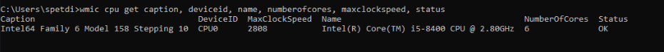
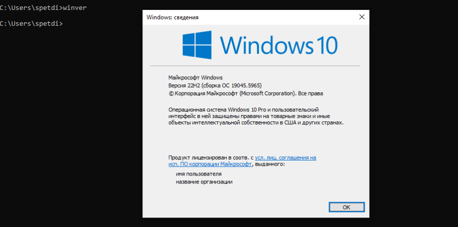
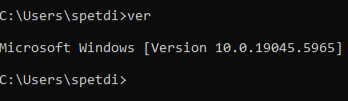
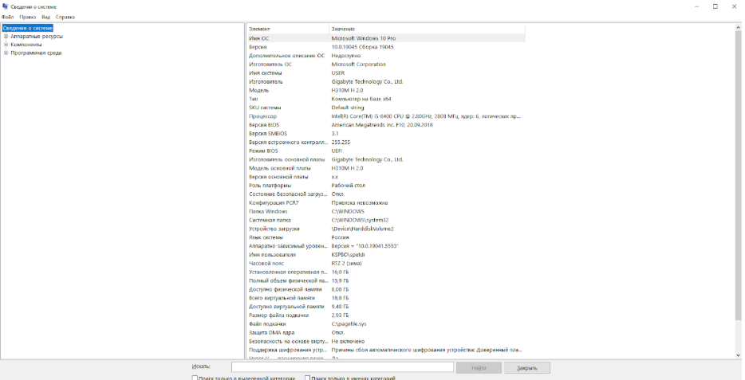
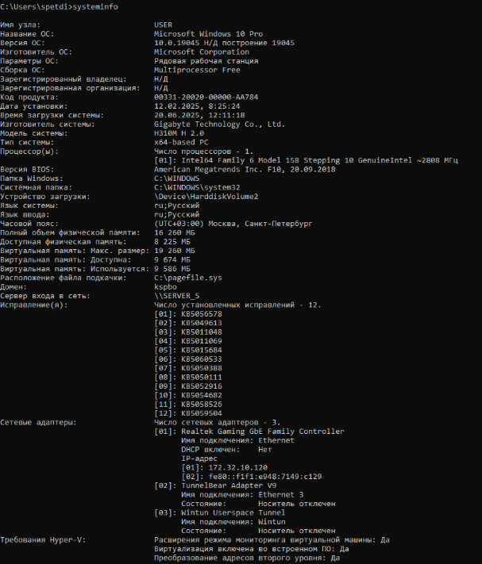

# Домашнее задание к занятию "Архитектура компьютера. Операционная система"

- wmic cpu get caption, deviceid, name, numberofcores, maxclockspeed, status

- winver

- ver 

- выполните msinfo32

- systeminfo
