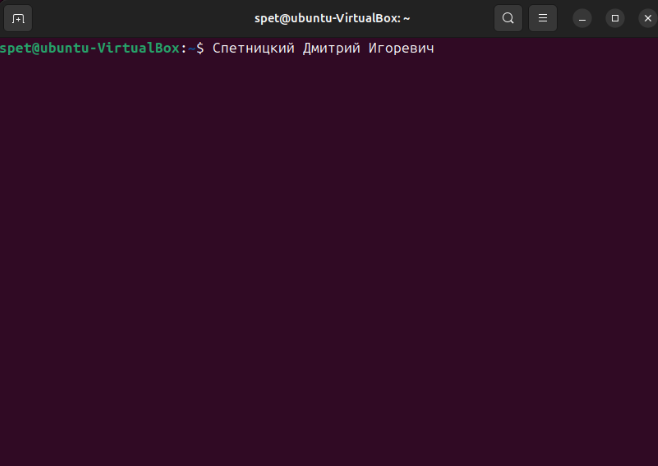
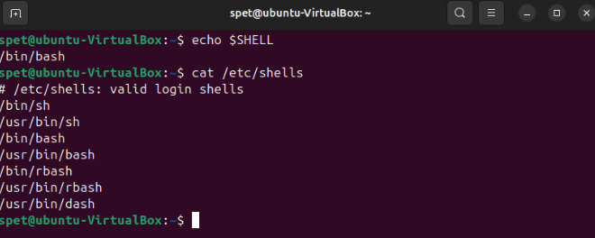
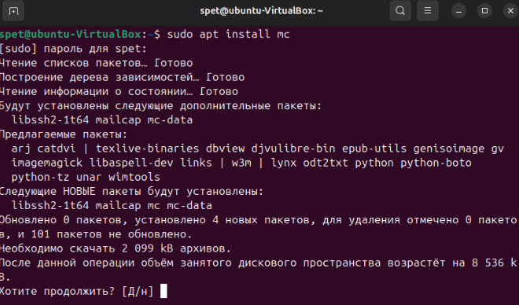
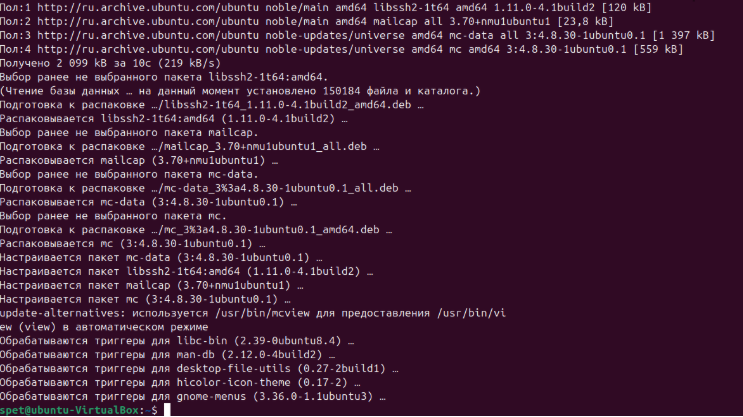
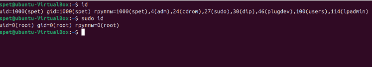

# Домашнее задание к занятию  «Знакомство с операционной системой Linux» - Спетницкий Д.И.

## Задание 1 

Подготовьте рабочее пространство:
Скачайте с сайта VirtualBox и установите на свой компьютер
Создайте новую виртуальную машину
Скачайте Ubuntu
Установите Ubuntu на вашу виртуальную машину
Примечание: Если у вас операционная система macOS или Linux, воспользуйтесь инструкцией.

Сделайте скриншот консоли, где в строке ввода будет ваше ФИО.

---

------
## Решение 1

## Задание 2
Запустите терминал и выполните команды:

echo $SHELL
cat /etc/shells
Ответ приведите в виде снимка экрана и прокомментируйте в свободной форме результаты выполнения указанных команд

---

## Решение 2
Команда echo $SHELL выводит путь к текущей оболочке, которая используется по умолчанию текущим пользователем. $SHELL это переменная окружения, хранящая путь к интерпретатору командной строки. 

Команда cat /etc/shells выводит список допустимых оболочек, которые могут быть назначены пользователю. Файл /etc/shells содержит список путей к shell-интерпретаторам.

## Задание 3
Установите при помощи утилиты apt файловый менеджер mc.

Решение приведите в виде последовательности команд или снимка экрана

---

## Решение 3

## Задание 4*
Его выполнение необязательное и не влияет на получение зачёта по домашнему заданию. Можете его решить, если хотите лучше разобраться в материале.

Выполните следующие команды:

- id
- sudo id
Объясните, почему вывод одной и той же команды отличается в этих случаях.

---

## Решение 4
Команда id выводит информацию о текущем пользователе, в то время как sudo id выполняет туже команду но от имени суперпользователя. Использование команды sudo временно дает права root.

