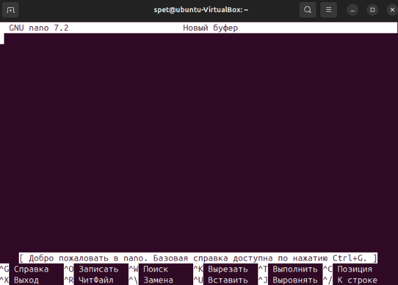
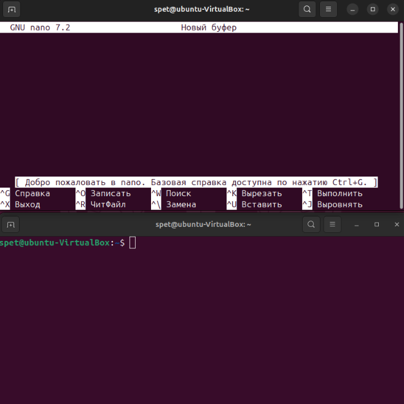
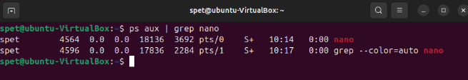
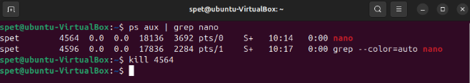
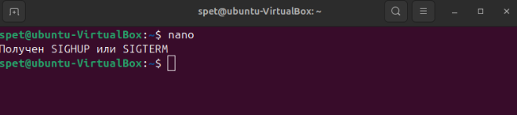
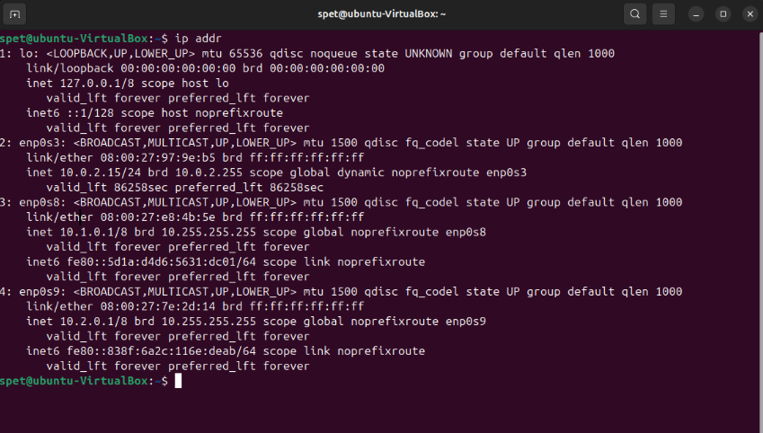
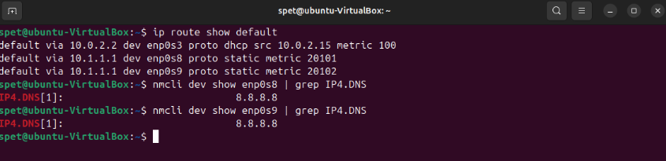
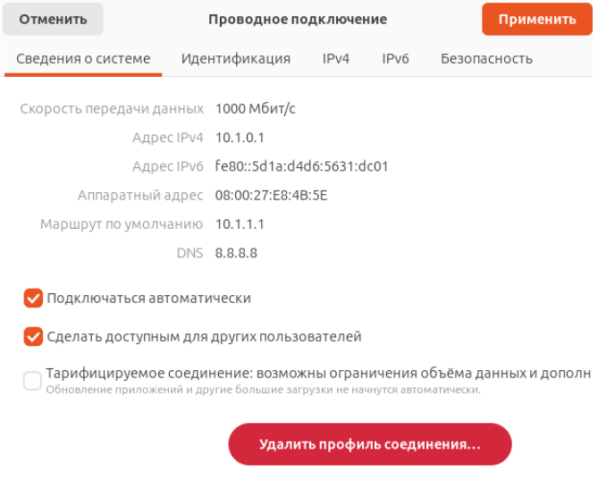
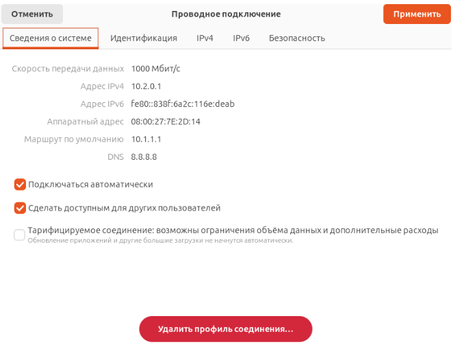

# Домашнее задание к занятию  «Основы работы в терминалe ОС Linux» - Спетницкий Д.И.

## Задание 1 

Запустите текстовый редактор nano
Откройте ещё одно окно терминала
С помощью команды ps определите PID запущенного процесса
Выполните команду kill PID
Что произошло в терминале с nano?

Ответ приведите в виде последовательности команд и снимка экрана

---

## Решение 1
Команда nano

CTRL+ALT+T

ps aux | grep nano

kill 4564

В окне терминала, где работал nano, появилось сообщение:
Получен SIGHUP или SIGTERM
Это означает, что nano получил сигнал SIGTERM, который используется для завершения работы процесса.
После этого редактор закрылся, и мы вернулись в командную строку.
SIGTERM — это стандартный сигнал, отправляемый процессу для его корректного завершения.
SIGHUP — сигнал, который обычно посылается при закрытии терминала или утере соединения.
Команда kill без дополнительных параметров по умолчанию отправляет SIGTERM.

---

## Задание 2
Установите утилиту htop
С помощью htop ответьте на вопросы:
Какие процессы занимают больше всего памяти?
Какие процессы занимают больше всего процессорного времени?
Приведите ответ в виде снимков экрана

---

## Решение 2
Какие процессы занимают больше всего памяти?

Какие процессы занимают больше всего процессорного времени?

---

## Задание 3
- Добавьте в виртуальную машину два дополнительных сетевых адаптера с внутренней (internal) сетью
- Настройте на первом из них адрес 10.1.0.1 маску подсети 255.0.0.0
- Настройте на втором из них адрес 10.2.0.1 маску подсети 255.0.0.0
- На обоих интерфейсах настройте адрес dns-сервера как 8.8.8.8 и шлюз по умолчанию 10.1.1.1
- Выполните команду ip addr
- Приведите ответ в виде снимка экрана с выполненной командой ip addr

## Решение 3

---

