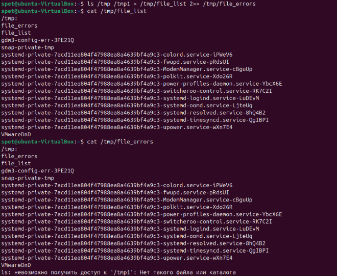
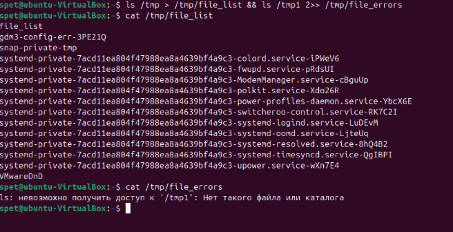
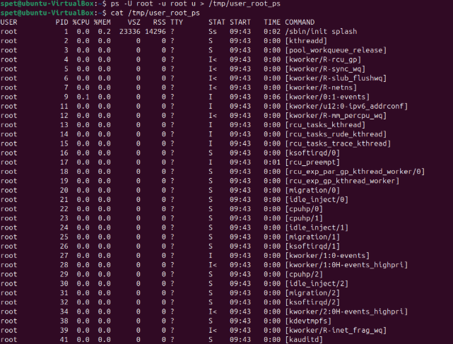
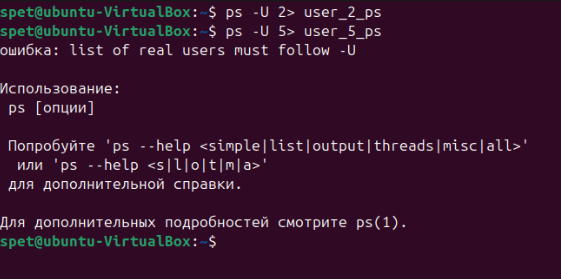
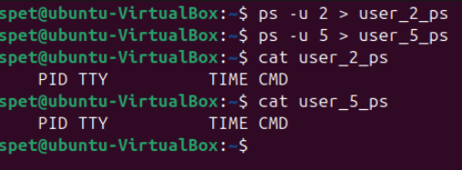

# Домашнее задание к занятию  «Процессы, управление процессами» - Спетницкий Д.И.

## Задание 1 

Измените команду ls /tmp /tmp1так, чтобы:

Результат работы (список файлов) для текущего запуска команды выводился в файл /tmp/file_list.
Ошибки для каждого запуска добавлялись в файл /tmp/file_errors.
Примечание к заданию:

Создавать /tmp1 не требуется. Директория должна отсутствовать для генерации вывода stderr.
Задание необходимо выполнить одной командой.
В качестве решения пришлите полученную команду и скриншот терминала с выводом содержимого созданных файлов

---

## Решение 1
ls /tmp /tmp1 > /tmp/file_list 2>> /tmp/file_errors

или лучше использовать разделение команды ls: 
ls /tmp > /tmp/file_list && ls /tmp1 2>> /tmp/file_errors

Тогда значения /tmp не попадают в file_errors. В первом случае я так понимаю, что происходит ситуация, которая зависит от реализации ls (например, в некоторых версиях GNU ls заголовки каталогов направляются в stderr, если есть ошибки).

---

## Задание 2

Напишите команду, которая выводит все запущенные процессы пользователя root в файл "user_root_ps".

---

## Решение 2

- ps -U root -u root u > /tmp/user_root_ps

- -U root — выбирает процессы, принадлежащие пользователю root.
- -u root — выводит их в удобочитаемом формате (включая использование CPU, память и т.д.).
- u — детализированный вывод

---
## Задание 3
Начинающий администратор захотел вывести все запущенные процессы пользователя с логином "2" в файл "user_2_ps".

Для этого он набрал команду:

ps -U 2> user_2_ps
Затем, он аналогично повторил для пользователя с логином "5" вывод в файл "user_5_ps":

ps -U 5> user_5_ps
Вопрос:

Почему вывод этих команд и содержимое файлов сильно отличаются друг от друга? Как должны выглядеть правильные команды?

Примечание:

Если у вас в системе нет пользователей "2" и/или "5" (это нормальная ситуация), то утилита ps выводит только одну строку:

 PID TTY          TIME CMD     
Ответ приведите в виде снимка экрана с комментариями в свободной форме.

---

## Решение 3

Тут несколько ошибок во первых отсутствует пробел после 2 и 5, что получается.
 2> — это оператор перенаправления стандартной ошибки (stderr) в файл user_2_ps.
 5> — это неправильное перенаправление , так как поток с номером 5 не существует.
Во вторых использование -U это поиск по UID, чтобы использовать поиск по логину необходимо ввести -u

Правильные команды для того чтобы вывести все запущенные процессы пользователя с логином "2" в файл "user_2_ps" и для пользователя с логином "5" вывод в файл "user_5_ps"

---