# Домашнее задание к занятию  «Дисковые системы» - Спетницкий Д.И.

## Задание 1

Какие виды RAID увеличивают производительность дисковой системы?

Приведите ответ в свободной форме.

---

## Решение 1
Виды RAID, которые увеличивают производительность дисковой системы, в основном за счёт распределения данных (striping) между несколькими дисками, позволяя одновременно читать и записывать данные. К таким уровням RAID относятся:

- RAID 0 — обеспечивает максимальное увеличение производительности за счёт чередования данных по двум или более дискам. Однако он не предоставляет избыточности, то есть при выходе из строя одного диска все данные теряются.
- RAID 5 — комбинирует чередование данных и распределённую четность, что позволяет ускорить операции чтения и немного повысить отказоустойчивость. Производительность записи может быть ниже из-за необходимости вычисления информации о чётности.
- RAID 6 — похож на RAID 5, но использует две области чётности, что повышает отказоустойчивость за счёт некоторого снижения скорости записи. Чтение, как правило, остаётся достаточно быстрым.
- RAID 10 (1+0) — сочетание зеркалирования и чередования. Обеспечивает высокую производительность, особенно при чтении и случайном доступе, а также хорошую отказоустойчивость. Требует минимум 4 диска.

Таким образом, для повышения производительности чаще всего используются RAID 0 , RAID 5 , RAID 6 и RAID 10 , причём выбор конкретного уровня зависит от баланса между скоростью, надёжностью и стоимостью.

---

## Задание 2

Назовите преимущества использования VFS. Используется ли VFS при работе с tmpfs? Почему?

Приведите развернутый ответ в свободной форме.

---

## Решение 2

- VFS — это такой промежуточный слой в ядре операционной системы, который помогает взаимодействовать с разными типами файловых систем. То есть, допустим, у нас есть ext4, XFS или даже сетевые файловые системы, VFS позволяет работать с ними через один и тот же интерфейс. Это удобно, потому что программам не нужно знать, с какой именно ФС они сейчас имеют дело.

- -  Преимущества:
- - - Универсальность: Программы могут обращаться к разным ФС одинаково, через одни и те же системные вызовы, например, open или read.
- - - Поддержка множества ФС: Можно монтировать разные диски и устройства, даже если они используют разные форматы.
- - - Простота добавления новых ФС: Разработчики могут создавать новые файловые системы, не переписывая всё с нуля, достаточно подключиться к VFS.
- - - Кэширование и оптимизация: VFS управляет кэшем данных и метаданных, что ускоряет работу всех файловых систем.
- - - Контроль прав доступа: Проверка прав на файлы тоже происходит на уровне VFS, а не каждой ФС отдельно.

- tmpfs — это виртуальная файловая система, которая хранит данные в оперативной памяти, а не на диске, она всё равно использует VFS для своей работы. То есть все системные вызовы обрабатываются через VFS, как и у других ФС.

То есть получается, что даже такая "виртуальная" файловая система, как tmpfs, полностью интегрирована в общую архитектуру и активно использует возможности VFS.

В общем, VFS нужен, чтобы унифицировать работу с любыми файловыми системами, а tmpfs — просто одна из них.

---
## Задание 3
Подключите к виртуальной машине 2 новых диска.

На первом диске создайте таблицу разделов MBR, создайте 4 раздела: первый раздел на 50% диска, остальные диски любого размера на ваше усмотрение. Хотя бы один из разделов должен быть логическим.

На втором диске создайте таблицу разделов GPT. Создайте 4 раздела: первый раздел на 50% диска, остальные любого размера на ваше усмотрение.

В качестве ответа приложите скриншоты, на которых будет видно разметку диска (например, командами lsblk -a; fdisk -l)

---

## Решение 3

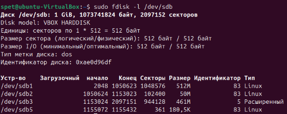

Раздел sdb1 занимает 50% от размера диска.
Расширенный раздел sdb3 занимает сектора 1153024–2097151 .
Логический раздел sdb5 занимает сектора 1155072–1155432 , которые полностью входят в диапазон sdb3.

#### отображение через fdisk

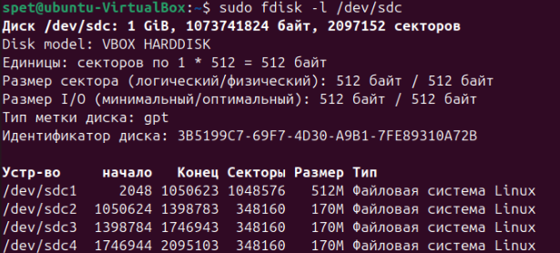

#### отображение через gdisk

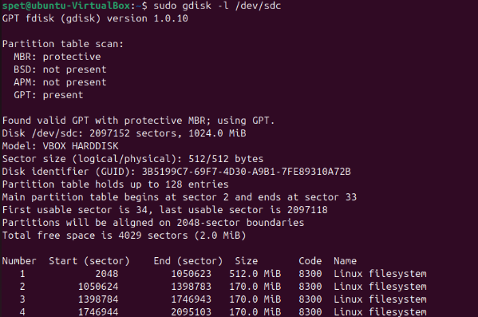

Раздел sdс1 занимает 50% от размера диска.

---

## Задание 4
Создайте программный RAID 1 в вашей ОС, используя программу mdadm.

Объем RAID неважен.

В качестве ответа приложите скриншот вывода команды mdadm -D /dev/md0, где md0 - это название вашего рейд массива (может быть любым).

---

## Решение 4

Создаем raid:
- sudo mdadm --create /dev/md0 --level=1 --raid-devices=2 /dev/sdb /dev/sdc

- /dev/md0 — имя нового массива.
- --level=1 — уровень RAID.
- --raid-devices=2 — количество дисков в массиве.

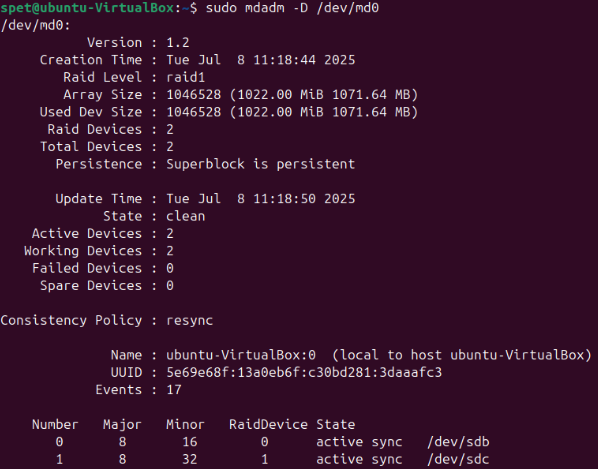

---

## Задание 5*

Влияет ли количество операций ввода-вывода на параметр load average?

Приведите развернутый ответ в свободной форме.

---

## Решение 5*

Да, количество операций ввода-вывода (IOPS) может влиять на load average, но как я понял это косвенное влияние.

Load average показывает, сколько процессов сейчас работают или ждут ресурсов (процессора, диска, сети). Например, если цифры растут, значит система перегружена.

Когда программа читает или пишет данные на диск (например, база данных или копирование файлов), она ждёт, пока диск ответит. Если диск медленный (HDD), или запросов слишком много, процессы начинают толпиться в очереди. Это похоже на пробку: все хотят пройти через узкий мост (диск), и они ждут. Такие «ждущие» процессы учитываются в load average, и он растёт.

---

## Задание 6*
Сделайте скриншоты вывода комманд df -h, pvs, lvs, vgs.
Подключите к ОС 2 новых диска.
Создайте новую VG, добавьте в него 1 диск.
Создайте 2 LV, распределите доступное пространство между ними поровну.
Создайте на обоих томах файловую систему xfs.
Создайте две точки монтирования и смонтируйте каждый из томов.
Сделайте скриншот вывода комманд df -h.
Добавьте в VG второй оставшийся диск.
Расширьте первый LV на объем нового диска.
Расширьте файловую систему на размер нового доступного пространства.
Сделайте скриншоты вывода комманд df -h, pvs, lvs, vgs.
В качестве ответа приложите созданные скриншоты и скриншоты выполнения.

---

## Решение 6*

#### Сделайте скриншоты вывода комманд df -h, pvs, lvs, vgs.
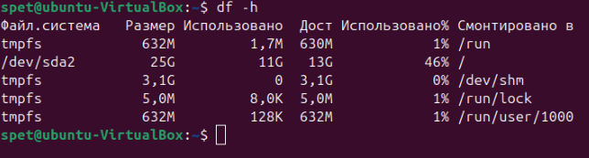

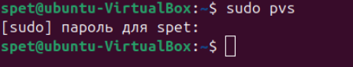

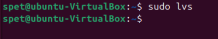

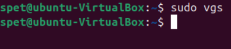

##### Создайте новую VG, добавьте в него 1 диск.

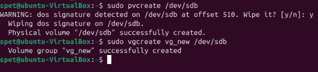

#### Создайте 2 LV, распределите доступное пространство между ними поровну
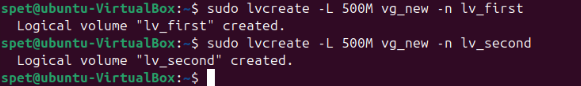

#### Создайте на обоих томах файловую систему xfs.
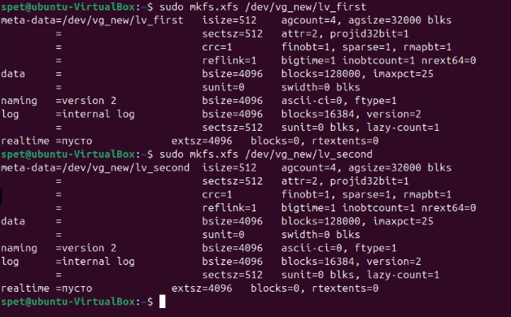

#### Создайте две точки монтирования и смонтируйте каждый из томов.

#### Сделайте скриншот вывода команды df -h.
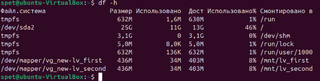

#### Добавьте в VG второй оставшийся диск.
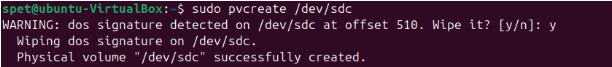
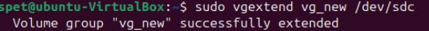

#### Расширьте первый LV на объем нового диска.
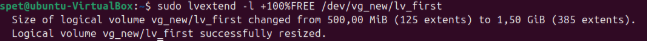

#### Расширьте файловую систему на размер нового доступного пространства.

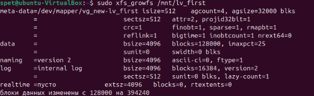

#### Сделайте скриншоты вывода комманд df -h, pvs, lvs, vgs.
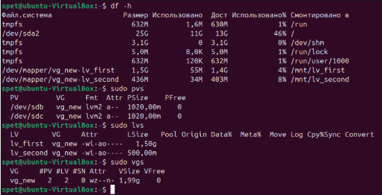

---