# Домашнее задание к занятию  «Файловые системы» - Спетницкий Д.И.


## Задание 1 

Создайте каталог ~/test и в нём файл test_123 с любым содержимым.
Создайте символическую ссылку на каталог ~/test по пути /tmp/soft_link.
Используя ссылку /tmp/soft_link, скопируйте файл test_123 в каталог /tmp с тем же именем. Создайте жёсткую ссылку на файл /tmp/test_123 с именем /tmp/hard_link.

- Вопрос 1. Файл ~/test и /tmp/test_123 — это один и тот же файл (одинаковые inode)?

- Вопрос 2. Файл /tmp/soft_link и /tmp/hard_link — это один и тот же файл (одинаковые inode)?

- Вопрос 3. Файл /tmp/test_123 и /tmp/hard_link — это один и тот же файл (одинаковые inode)?

- Вопрос 4. Докажите, что одна из ссылок символическая, а другая жёсткая. Обязательно приложите к ответу скриншоты команд, которые иллюстрируют различия ссылок разного типа, или, если не уверены, ход решения задания.


---

## Решение 1
Создание каталога и файла
mkdir ~/test
touch ~/test/test_123

Создание символической ссылки
ln -s ~/test /tmp/soft_link

Копирование файла через символическую ссылку
cp /tmp/soft_link/test_123 /tmp/

Создание жёсткой ссылки
ln /tmp/test_123 /tmp/hard_link

- Ответ 1
Нет, это разные файлы. Команда cp создаёт копию файла, которая имеет новый inode. 

ls -i – отображает номер индекса inode, в которой хранится этот файл

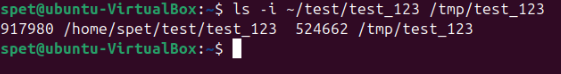

Inode отличаются → файлы разные.

- Ответ 2

Нет, это разные файлы. Типы файлов разные, поэтому inode не совпадают.

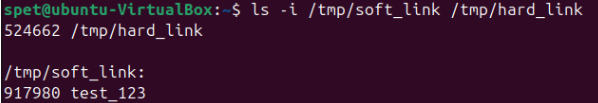

- Ответ 3

Да, это один и тот же файл.Жёсткая ссылка (/tmp/hard_link) указывает на тот же inode, что и /tmp/test_123. 

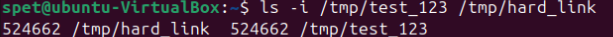

- Ответ 4

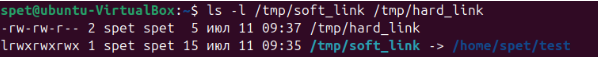

-rw-rw-r-- → обычный файл с жёсткой ссылкой. Счётчик ссылок равен 2 (указывает на количество жёстких ссылок).

lrwxrwxrwx → символическая ссылка (l означает "link").

Или так

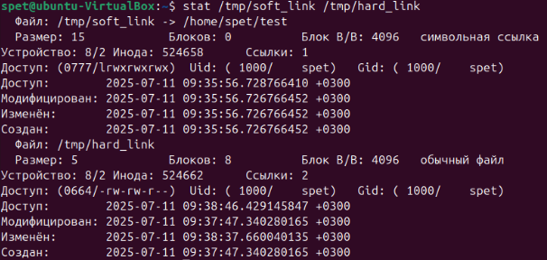

---

## Задание 2

Создайте файл ~/netology.

Создайте каталог ~/netology/.

Поместите файл netology в каталог netology.

Какое или какие из трёх действий невозможно выполнить? Почему?


---

## Решение 2

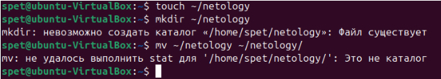

Файл ~/netology уже существует, и имя каталога совпадает с именем файла. В Linux нельзя создать каталог с тем же именем, что и у существующего файла в одной директории. 
Соответственно, помещение файла netology в каталог netology. Ошибка, так как каталог ~/netology не был создан на предыдущем шаге.  
Т.е. нельзя выполнить шаги 2 и 3. 
	
Можно вот так

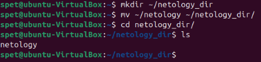

---

## Задание 3

Как посмотреть количество inodes?

В каких файловых системах не может возникнуть проблемы нехватки inodes?

Запишите ответ в свободной форме.


---

## Решение 3

Чтобы проверить количество доступных и использованных inodes в файловой системе
df -i

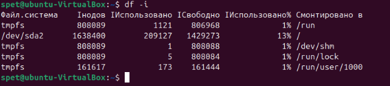

В каких файловых системах не может возникнуть проблемы нехватки inodes?

Проблема нехватки inodes возникает в файловых системах с фиксированным количеством inodes, заданным при создании ФС (например, ext3/ext4 ). Однако в некоторых современных файловых системах inodes выделяются динамически, и теоретически нехватка невозможна:

#### Btrfs
Inodes создаются динамически при необходимости.
Не требует предварительного резервирования места под inodes.
#### XFS
Использует динамическое распределение inodes.
Поддерживает очень большие объемы данных и высокую масштабируемость.
#### ZFS
Inodes (и другие метаданные) выделяются автоматически.
Интегрированная система управления данными и метаданными.
#### F2FS (Flash-Friendly File System)
Оптимизирован для SSD, поддерживает динамическое управление inodes.


---

## Задание 4

Задание не предполагает использования LVM.

Подключите к системе новый диск 3 Гб.

Создайте на диске один раздел размером 2 Гб.

Разметьте раздел как xfs.

Смонтируйте раздел по пути /mnt. Создайте любой файл на смонтированной файловой системе. Сделайте скриншот вывода команды df -hT.

Увеличьте раздел до 3 Гб.

Расширьте файловую систему на новое свободное пространство.

Убедитесь, что после всех манипуляций созданный вами файл остался внутри раздела и файловой системы.

Сделайте скриншот вывода команды df -hT.

В качестве ответа приложите два сделанных скриншота.

---

## Решение 4

Создание раздела

``` fdisk /dev/sdb ```

Форматирование в XFS

``` mkfs.xfs /dev/sdb1 ``` 

Монтирование

```mount /dev/sdb1 /mnt ```

Расширение XFS

```xfs_growfs /mnt ```

#### Создание файла

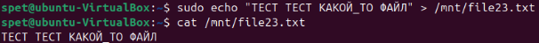

#### df -hT

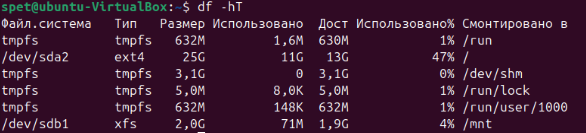

#### После увеличения раздела файл доступен

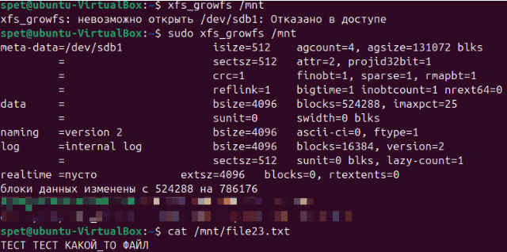

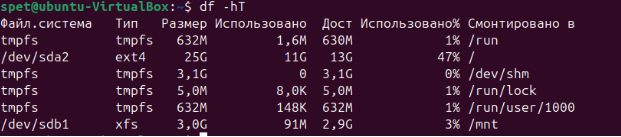

после всех манипуляций созданный файл остался внутри раздела и файловой системы.

---

## Задание 5*

Создайте файловую систему Btrfs на двух дисках по 5 Гб каждый.

Сколько места будет доступно для работы с файлами? Сколько места займут метаданные?


---

## Решение 5*

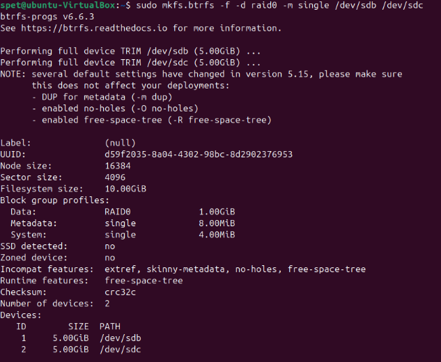
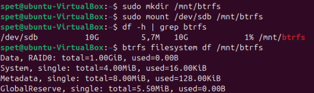

Общий объем файловой системы:
10Гб
​
Фактически доступно для файлов:
10Гб−метаданные и системные данные≈9.98Гб .
В текущем состоянии используется только 5.7Мб

Пространство, занимаемое метаданными
Метаданные:
8.00Мб
​
(общий размер).
Из них использовано:
128.00Кб

Системные данные:
4.00Мб (общий размер).
Использовано: 16.00Кб .
Резервное пространство (GlobalReserve):
5.50Мб .
Итого метаданные + системные данные + резерв:
8.00Мб+4.00Мб+5.50Мб=17.50Мб .


---


