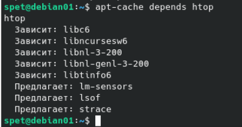
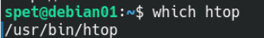
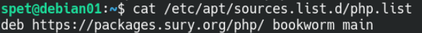
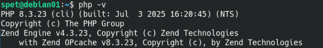
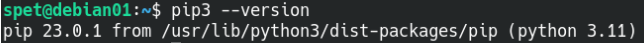
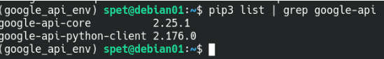
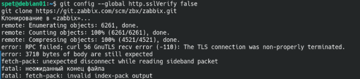
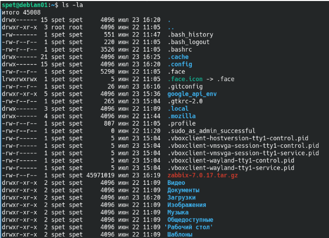
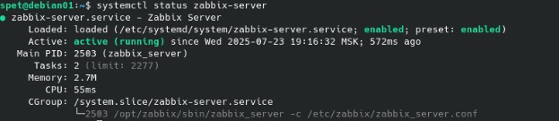

# Домашнее задание к занятию  «Управление пакетами» - Спетницкий Д.И.


## Задание 1 

Опишите достоинства и недостатки работы с пакетным менеджером и репозиторием.

Напишите ответ в свободной форме.


---

## Решение 1
Достоинства работы с пакетным менеджером и репозиторием:

Автоматизация процессов: Пакетные менеджеры упрощают установку, обновление и удаление программ. Не нужно вручную скачивать и настраивать каждую библиотеку — зависимости подхватываются автоматически.

Управление зависимостями: Менеджер сам решает, какие библиотеки и версии требуются для работы программы, избегая «dependency hell» (конфликтов версий).

Безопасность: Пакеты из официальных репозиториев проверяются сообществом или разработчиками ОС, что снижает риск вредоносного ПО.

Актуальность: Репозитории регулярно обновляются, предоставляя последние версии программ и исправления уязвимостей.

Совместимость: Пакеты тестируются под конкретную ОС, что уменьшает шансы конфликтов между компонентами.

Недостатки:

Ограниченный выбор: В официальных репозиториях может не быть редких или экспериментальных программ. Приходится использовать сторонние репозитории, которые менее надежны.

Задержки с обновлениями: Иногда пакеты в репозитории устаревают, так как администраторы тестируют их перед выпуском.

Конфликты зависимостей: Несмотря на автоматизацию, в редких случаях разные пакеты требуют противоречивых версий библиотек.

Зависимость от интернета: Для установки новых пакетов нужен доступ к репозиторию. Если он временно недоступен, процесс останавливается.

Риск сторонних репозиториев: Установка из неофициальных источников (например, PPA в Ubuntu) может привести к нестабильности или уязвимостям.


---

## Задание 2
Ответьте на вопросы:

какие действия надо выполнить при подключении стороннего репозитория,
в чём опасность такого способа распространения ПО и как это решить.
Напишите ответ в свободной форме.


---

## Решение 2
Действия при подключении стороннего репозитория:

Добавление репозитория — через команду (например, add-apt-repository в Ubuntu/Debian) или вручную в файлы /etc/apt/sources.list или /etc/apt/sources.list.d/.

Установка GPG-ключа — чтобы система могла проверять подпись пакетов и убедиться в их подлинности (например, через apt-key add или указание ключа в команде добавления репозитория).

Обновление списка пакетов — выполнение apt update (или аналога в своей ОС), чтобы система узнала о новых пакетах.

Установка ПО — после подключения можно устанавливать программы из репозитория через обычные команды (apt install, yum install и т.д.).

Опасности сторонних репозиториев и способы решения:

Риск вредоносного ПО: Сторонний репозиторий может содержать вирусы или шпионское ПО.

Решение: Добавлять только проверенные источники (например, официальные PPA от разработчиков) и проверять репутацию репозитория через форумы или документацию.

Конфликты зависимостей: Пакеты из стороннего репозитория могут сломать систему, заменив критические библиотеки на несовместимые версии.

Решение: Использовать инструменты вроде aptitude для анализа зависимостей или устанавливать ПО в изолированное окружение (например, через контейнеры Docker или виртуальные машины).

Неподдерживаемые обновления: Репозиторий может перестать обновляться, оставив уязвимости в ПО.

Решение: Регулярно проверять актуальность репозитория и удалять его, если он больше не нужен.

Несовместимость с ОС: Пакеты могут быть собраны под другую версию ОС, что приведет к сбоям.
Решение: Перед установкой убедиться, что репозиторий предназначен именно для вашей ОС и её версии.

Сторонние репозитории — мощный инструмент, но требуют осторожности. Лучше использовать их только для программ, недоступных в официальных источниках, и всегда проверять их надёжность.


---

## Задание 3
Запустите свою виртуальную машину.
Найдите в репозиториях и установите пакет htop. Какие зависимости требует htop?
Ответ приведите в виде текста команды, которой вы это выполнили, а также приложите скриншот места расположения исполняемых файлов установленного ПО.


---

## Решение 3
```
sudo apt install htop 
apt-cache depends htop 

```



---

## Задание 4

Подключите репозиторий PHP и установите PHP 8.0. В зависимости от вашего дистрибутива, если эта версия у вас уже есть, то установите более свежую версию.
Приложите скриншот содержимого файла, в котором записан адрес репозитория.

При помощи команды php -v убедитесь, что поставлена корректная версия PHP.
Приложите к ответу скриншот версии.


---

## Решение 4
```
sudo apt install apt-transport-https lsb-release ca-certificates wget -y  
sudo wget -O /etc/apt/trusted.gpg.d/php.gpg https://packages.sury.org/php/apt.gpg  
echo "deb https://packages.sury.org/php/ $(lsb_release -sc) main" | sudo tee /etc/apt/sources.list.d/php.list  

```



``` 
sudo apt install php8.3-cli 

```


---

## Задание 5

Ваш коллега-программист просит вас установить модуль google-api-python-client на сервер, который необходим для программы, работающей с Google API.

Установите этот пакет при помощи менеджера пакетов pip.

- Примечание №1: для установки может понадобиться пакет python-distutils, проверьте его наличие в системе.

- Примечание №2: не забудьте выдать права на исполнение скачанному файлу. Возможно, будет ошибка при установки при помощи Python версии 2, в таком случае воспользуйтесь командой python3.

Приложите скриншоты с установленным пакетом python-distutils, с версией Pip и установленными модулями, они должны быть видимы.


---

## Решение 5


```
sudo apt install python3 python3-pip python3-distutils python3-venv -y  

```



```
pip install google-api-python-client


pip3 list | grep google-api  


```


---

## Задание 6*

Перечислите менеджеры пакетов, кроме тех, о которых говорилось на лекции. В каких дистрибутивах они работают?
Есть ли альтернативные менеджеры для тех, которые разбирались на лекции?
Напишите ответ в свободной форме.


---

## Решение 6*
Кроме apt (Debian/Ubuntu) и yum (RHEL/CentOS), существуют и другие пакетные менеджеры, которые используются в разных дистрибутивах. Вот основные из них:

Менеджеры пакетов, о которых не говорили на лекции:

pacman
Дистрибутивы: Arch Linux, Manjaro.
Простой и быстрый менеджер с поддержкой AUR (Arch User Repository).
Примеры команд: pacman -S имя_пакета, pacman -Syu (обновление).

zypper
Дистрибутивы: openSUSE, SUSE Linux Enterprise.
Похож на yum, но с расширенными функциями (например, управление патчами).
Примеры команд: zypper install имя_пакета, zypper update.

Portage
Дистрибутив: Gentoo.
Работает с исходными кодами (ebuilds), позволяет гибко настраивать сборку пакетов.
Примеры команд: emerge имя_пакета, emerge --sync (обновление репозитория).
pkg
Дистрибутивы: FreeBSD, pfSense.
Управляет бинарными пакетами в BSD-системах.
Примеры команд: pkg install имя_пакета, pkg update.

apk
Дистрибутив: Alpine Linux.
Минималистичный менеджер для легковесных систем.
Примеры команд: apk add имя_пакета, apk upgrade.

xbps
Дистрибутив: Void Linux.
Быстрый и простой менеджер с поддержкой транзакций.
Примеры команд: xbps-install -S имя_пакета, xbps-upgrade.

nix
Дистрибутив: NixOS.
Уникальный функциональный подход к управлению пакетами (изоляция версий).
Примеры команд: nix-env -i имя_пакета, nix-channel --update.

Альтернативы для apt и yum:

Для apt:
aptitude : Более продвинутый интерфейс с графическим режимом и улучшенным решением зависимостей.

apt-fast : Ускоряет загрузку пакетов через многопоточность (использует aria2 или axel).

synaptic : Графический интерфейс для управления пакетами в Debian/Ubuntu.

Для yum:
dnf : Современная замена yum (используется в Fedora, RHEL 8+). Быстрее и лучше управляет зависимостями.

yumex : Графический интерфейс для yum/dnf.

Универсальные альтернативы (не привязаны к дистрибутивам):

flatpak : Устанавливает приложения в изолированной среде (работает на любой Linux-системе).

snap : Универсальный формат пакетов от Canonical (поддерживается в Ubuntu, Debian, Arch и др.).

AppImage : Самостоятельные исполняемые файлы, не требующие установки через менеджер пакетов.


---

## Задание 7*

Скачайте исходники Zabbix и соберите Zabbix Agent для того дистрибутива, на котором вы работаете. Выбирайте любой дистрибутив на ваш вкус.
Установите его при помощи менеджера пакетов.
Ответ приведите в виде скриншота


---

## Решение 7*

```
sudo apt install -y build-essential cmake git libssl-dev libcurl4-openssl-dev 

git clone https://git.zabbix.com/scm/zbx/zabbix.git 


```

К сожалению у меня гит репозиторий никаким образом не хотел клонироваться скачал с офф сайта архив с исходными файлами




```
tar -xzvf zabbix-7.0.17.tar.gz
sudo apt install -y libpcre3-dev libpcre2-dev
./configure --prefix=/opt/zabbix --enable-agent --with-openssl
make
sudo make install

```


---


## Задание 8*
Скачайте исходники Zabbix и соберите Zabbix Server для того дистрибутива, на котором вы работаете.
Установите его при помощи менеджера пакетов.
Ответ приведите в виде скриншота


---

## Решение 8*

```
sudo apt install -y postgresql postgresql-contrib  
sudo systemctl enable --now postgresql  

sudo -u postgres psql -c "CREATE DATABASE zabbix;"  
sudo -u postgres psql -c "CREATE USER zabbix WITH PASSWORD 'password';"  
sudo -u postgres psql -c "GRANT ALL PRIVILEGES ON DATABASE zabbix TO zabbix;"  


sudo apt install -y libpq-dev
sudo apt install -y libxml2-dev
./configure \
    --prefix=/opt/zabbix \
    --enable-server \
    --with-postgresql \
    --with-libxml2 \
    --with-libcurl \
    --with-openssl

make
sudo make install


```



---


