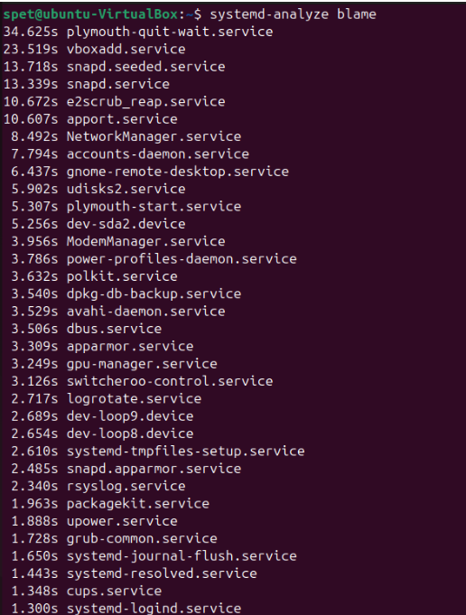
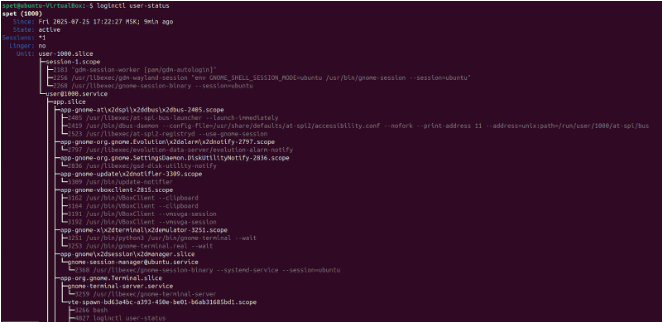
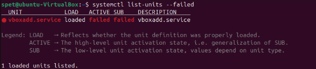
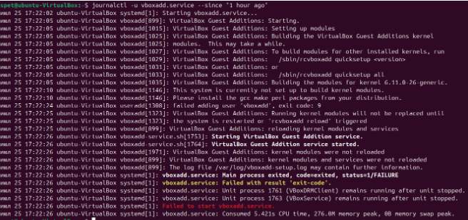
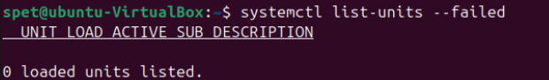

# Домашнее задание к занятию  «Инициализация системы. Systemd, init-v» - Спетницкий Д.И.


## Задание 1 

Выполните systemd-analyze blame. Эта команда покажет сколько времени было потрачено на загрузку того или иного сервиса.
Укажите, какие модули загружаются дольше всего.


---

## Решение 1



plymouth-quit-wait.service — 34.625 секунд.
Этот сервис связан с графическим интерфейсом загрузки (Plymouth). Он ожидает завершения работы Plymouth после того, как система полностью загружена.

vboxadd.service — 23.519 секунд.
Это служба для поддержки гостевых добавок VirtualBox.

snapd.seeded.service — 13.718 секунд.
Связан с системой пакетов Snap. Этот сервис проверяет и устанавливает базовые snap-пакеты при первоначальной загрузке системы.

snapd.service — 13.339 секунд.
Основной сервис Snap, который управляет всеми snap-приложениями в системе.

e2scrub_reap.service — 10.672 секунд.
Утилита для очистки журнала файловой системы ext4.

apport.service — 10.607 секунд.
Сервис для сбора отчетов об ошибках в Ubuntu.


---

## Задание 2

Какой командой вы посмотрите ошибки ядра, произошедшие начиная со вчерашнего дня?
Напишите ответ в свободной форме.


---

## Решение 2

Чтобы посмотреть ошибки ядра, произошедшие начиная со вчерашнего дня, я воспользуюсь командой dmesg, отфильтровав вывод по времени.

journalctl --dmesg --since yesterday

Эта команда покажет все сообщения ядра, начиная со вчерашнего дня, включая ошибки, предупреждения и информационные сообщения. Чтобы выделить только ошибки, можно добавить фильтр по уровню:

journalctl --dmesg --since yesterday -p err

где -p err означает — показывать сообщения с приоритетом "error" и выше (err, crit, alert, emerg).


---

## Задание 3
Запустите команду loginctl user-status.
Напишите, что выполняет и для чего предназначена эта утилита.


---

## Решение 3



Команда loginctl user-status отображает текущее состояние пользователя в системе, управляемого сервисом systemd-logind. Она показывает:

Имя пользователя и UID
Статус входа (активен, неактивен)
Список сессий пользователя (графические, текстовые)
Время входа и с какого терминала/дисплея
Состояние сессий (онлайн, завершается и т.д.)
Информацию о потреблении ресурсов (в некоторых системах)
Активные процессы пользователя

---

## Задание 4

Есть ли у вас на машине службы, которые не смогли запуститься? Как вы это определили?
Приведите ответ в свободной форме.

Примечание: обычно все сервисы запускаются и всё работает хорошо, но вы можете смоделировать ситуацию когда не все сервисы запускаются, для этого вы можете установить сервер JX и сломать его конфигурационный файл, просто удалив оттуда случайную строчку с фигурной скобкой.


---

## Решение 4

Команда systemctl list-units --failed показывает все сервисы, сокеты или другие юниты, которые завершились с ошибкой



```
journalctl -u vboxadd.service --since "1 hour ago"

```


Скорее всего служба vboxadd не смогла собрать и загрузить модули ядра из-за отсутствия пакетов gcc, make, perl.
```

sudo apt install gcc make perl

```



---

## Задание 5

Можно ли с помощью systemd отмонтировать раздел или устройство?
Приведите ответ в свободной форме.


---

## Решение 5
Да, с помощью systemd можно отмонтировать раздел или устройство, но не напрямую через отдельную команду, а через управление юнитами типа .mount.

Как это работает:
Юниты .mount в systemd
Systemd динамически создаёт юниты для каждого смонтированного раздела (например, /mnt/data.mount). Эти юниты отвечают за состояние монтирования. Чтобы отмонтировать раздел, достаточно остановить соответствующий юнит:

systemctl stop /mnt/data.mount
Здесь /mnt/data — точка монтирования раздела. Systemd автоматически вызовет umount для этого пути.
Пример
Если раздел /dev/sdb1 смонтирован в /backup, выполните:

systemctl stop /backup.mount
Это эквивалентно команде:

umount /backup
Автоматическое управление

Если раздел указан в /etc/fstab, systemd создаёт для него юнит .mount при загрузке. Управление таким разделом (включая отмонтирование) происходит через этот юнит.

Важные нюансы:
Не все разделы управляются systemd
Если раздел был смонтирован вручную через mount (без участия systemd), для его отмонтирования нужно использовать стандартную команду umount, так как systemd не знает о таком юните.

Ошибки при отмонтировании
Если раздел используется (открыты файлы, запущены процессы), systemd, как и umount, откажется его отмонтировать:

Failed to stop /backup.mount: Unit /backup.mount is not loaded.
или
umount: /backup: target is busy.

Временные разделы
Для временных разделов (например, tmpfs) отмонтирование через systemctl stop также работает, но после перезагрузки раздел будет создан заново.
Альтернатива: стандартная команда umount
Хотя systemd предоставляет свой механизм, традиционная команда umount остаётся основным способом отмонтирования:

umount /backup
Это проще и универсальнее, особенно если раздел не управляется systemd.

Итог:
Systemd позволяет отмонтировать раздел через остановку юнита .mount, но это не замена umount, а альтернативный подход для разделов, управляемых systemd. Для большинства задач проще и надёжнее использовать стандартные команды mount/umount. Systemd интегрируется с ними, но не дублирует их функционал.

---