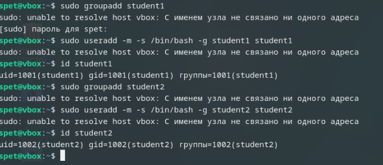
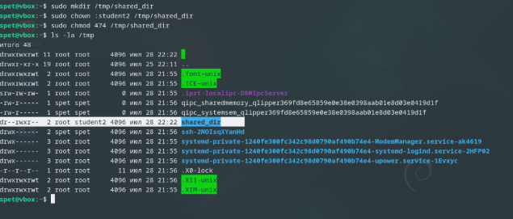
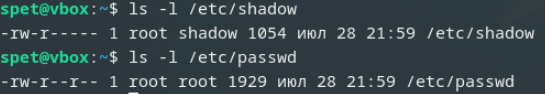
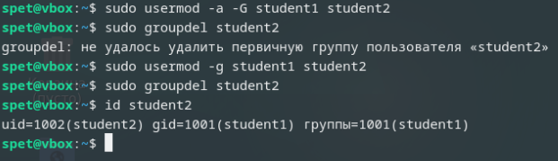
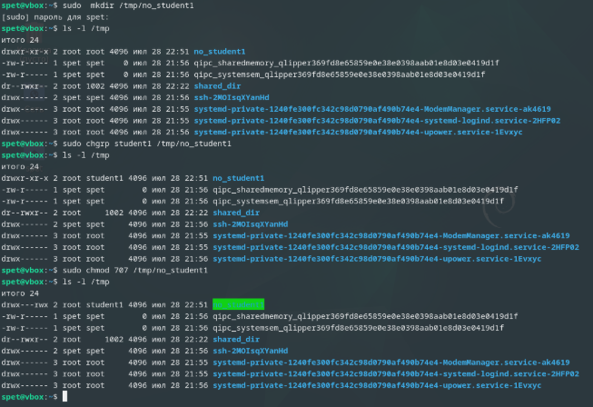
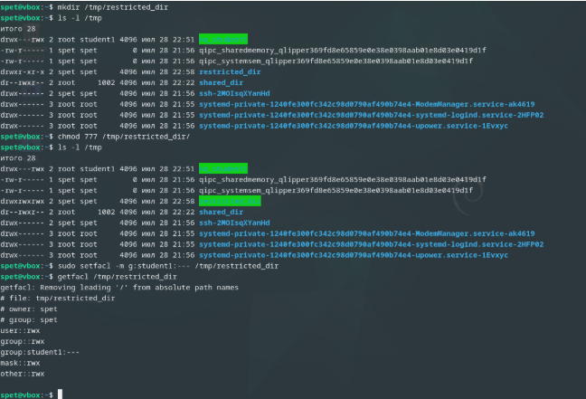

# Домашнее задание к занятию  «Управление пользователями» - Спетницкий Д.И.


## Задание 1 

Создайте пользователя student1 с оболочкой bash, входящего в группу student1.

Создайте пользователя student2, входящего в группу student2.

Приведите своё решение в виде снимков экрана.


---

## Решение 1




---

## Задание 2
Создайте в общем каталоге (например, /tmp) директорию и назначьте для неё полный доступ со стороны группы student2 и доступ на чтение всем остальным.

Приведите своё решение в виде снимков экрана.

---

## Решение 2

```

sudo mkdir /tmp/shared_dir
sudo chown :student2 /tmp/shared_dir
sudo chmod 474 /tmp/shared_dir


```


---

## Задание 3
Какой режим доступа установлен для файлов /etc/passwd и /etc/shadow?

Объясните, зачем понадобилось именно два файла.

Приведите ответ в свободной форме.


---

## Решение 3



Когда я проверяю права доступа к файлам /etc/passwd и /etc/shadow через команду ls -l, вижу следующее:

Для /etc/passwd права -rw-r--r-- (644). То есть владелец (root) может читать и писать, группа (root) и все остальные — только читать.
Для /etc/shadow права строже: -rw-r----- (640). Владелец (root) — полный доступ, группа  shadow — только чтение, а остальные вообще ничего не могут.
Зачем два файла?

Раньше вся информация о пользователях, включая пароли, хранилась в одном файле — /etc/passwd. Но это было небезопасно. Дело в том, что этот файл нужен системе для работы (например, чтобы отобразить имя пользователя вместо UID), поэтому его должны читать все процессы и пользователи. А пароли в открытом виде или даже в виде хэшей нельзя было так просто раздавать — злоумышленник мог скачать хэши и пытаться взломать их через брутфорс.

Чтобы решить эту проблему, придумали разделить данные:

/etc/passwd остался общедоступным, но теперь в нём только безопасная информация: логины, UID, оболочки, домашние каталоги.
/etc/shadow — закрытый файл, куда переместили хэши паролей. Доступ к нему есть только у root и специальной группы shadow, что защищает пароли от несанкционированного чтения.

Получается, два файла — это компромисс между функциональностью (система должна видеть данные пользователей) и безопасностью (пароли нельзя светить всем подряд). Если бы оставили всё в одном файле, пришлось бы либо запретить доступ к /etc/passwd (и сломать систему), либо рисковать утечкой паролей.


---

## Задание 4
Удалите группу student2, а пользователя student2 добавьте в группу student1.

Приведите своё решение в виде снимков экрана.


---

## Решение 4

```
sudo usermod -a -G student1 student2
sudo usermod -g student1 student2
sudo groupdel student2
id student2

```


---

## Задание 5
Напишите своими словами, как происходит сложение и вычитание прав доступа к файлам и папкам.

Приведите ответ в свободной форме.


---

## Решение 5
 Сложение прав (+)
Представим, что у файла сейчас права rw-r--r-- (644). Это значит:

Владелец: чтение + запись (но не выполнение),
Группа и остальные: только чтение.
Если я хочу добавить группе право на запись, я пишу:

chmod g+w файл

Система «складывает» текущие права группы (r--) и новое право (w), получая rw-. Теперь группа может не только читать, но и редактировать файл.

Права — это суммы чисел: r=4, w=2, x=1.
Было 4 (только чтение), добавили 2 (запись) → 4+2=6 (rw-). 
Вычитание прав (-)
Теперь уберём у «остальных» право на чтение. Было rw-rw-r-- (664), делаем:

chmod o-r файл

Система «вычитает» r из прав остальных (r-- → ---). Теперь другие пользователи вообще ничего не могут сделать с файлом. Итог: rw-rw---- (660).

Права хранятся как биты (0 или 1).

r = 4 → бит 100,
w = 2 → бит 010,
x = 1 → бит 001.
Когда мы пишем chmod g+w, система включает бит записи для группы (логическое ИЛИ).
Когда пишем chmod o-r, выключает бит чтения для остальных (логическое И с инверсией).


---

## Задание 6*
Создайте в общем каталоге (например, /tmp) директорию и назначьте для неё полный доступ для всех, кроме группы student1. Группа student1 не должна иметь доступа к содержимому этого каталога.

Приведите своё решение в виде снимков экрана.


---

## Решение 6*



Но как я понял правильнее это делать через ACL




---