# Домашнее задание к занятию  «Производительность системы» - Спетницкий Д.И.


## Задание 1 

Выполните проверку системы при помощи команды top.

Выведите сортировку процессов по:

памяти,

времени работы,

номеру,

уровню потребления ресурсов.

Приведите ответ в виде снимков экрана.


---

## Решение 1

#### памяти

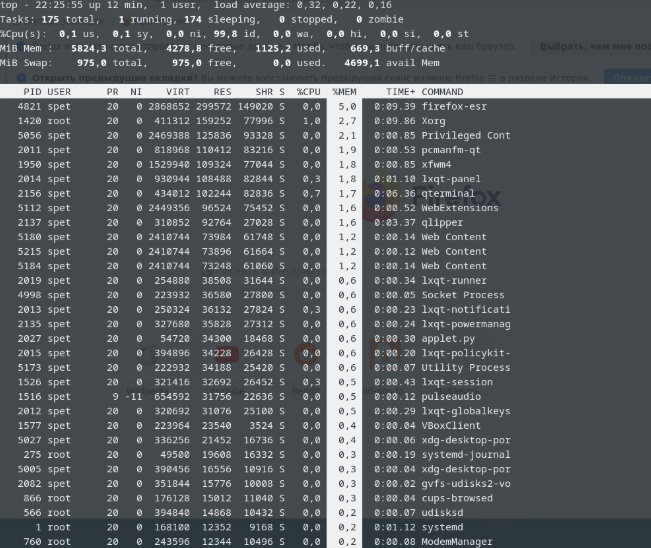

#### времени работы

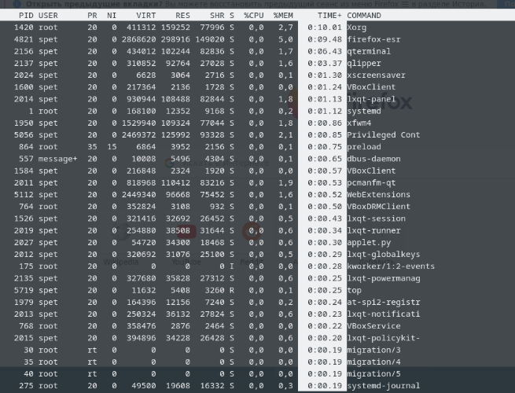

#### номеру

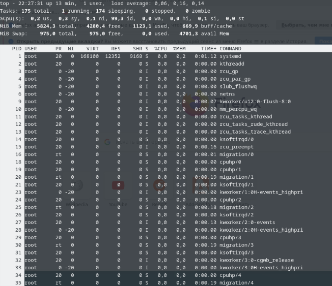

#### уровню потребления ресурсов

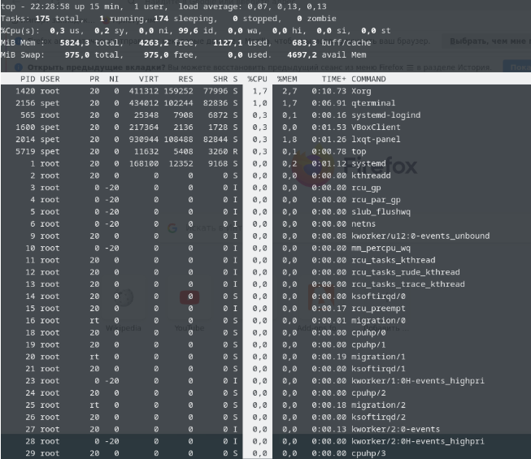

---

## Задание 2
Выполните проверку системы при помощи команды atop и atopsar.

Выведите сортировку процессов по:

общей нагрузке — минимум по трём параметрам;

загруженности HDD or SSD за указанный временной отрезок — 10 минут;

загруженности RAM за указанный временной отрезок — 10 минут.

Сконфигурировать файл настроек atop — делать снимок памяти каждые полчаса.

Приведите ответ в виде снимков экрана.


---

## Решение 2
- общей нагрузке — минимум по трём параметрам
#### по памяти

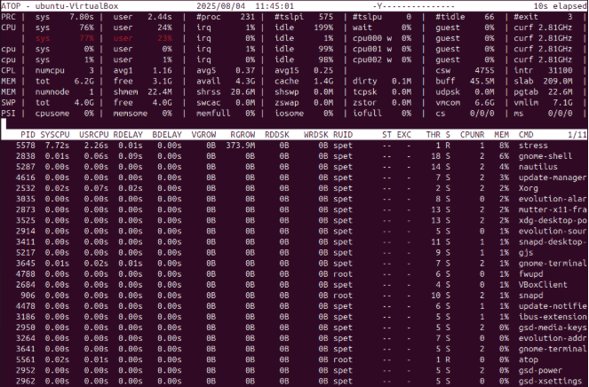

#### по дискам

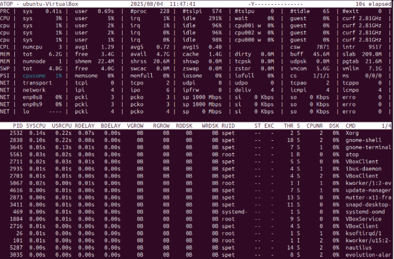

#### по процессору

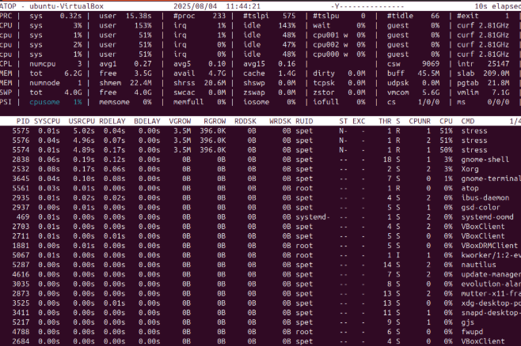

- загруженности HDD or SSD за указанный временной отрезок — 10 минут

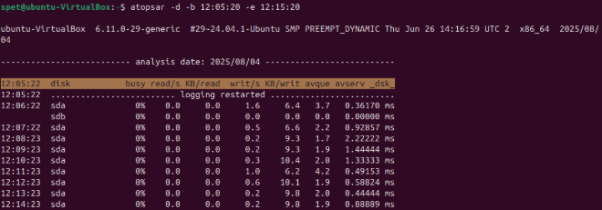

- загруженности RAM за указанный временной отрезок — 10 минут.

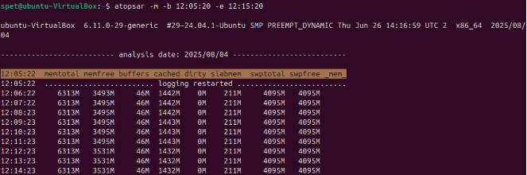

- Сконфигурировать файл настроек atop — делать снимок памяти каждые полчаса

```
sudo nano /etc/default/atop
INTERVAL=1800
```
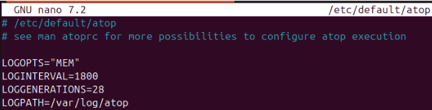

---

## Задание 3

При помощи команды mpstat и ключа P выведите информацию по:

определённому процессору,
всем процессорам.
Приведите ответ в виде снимков экрана.


---

## Решение 3

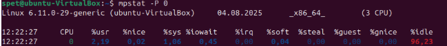

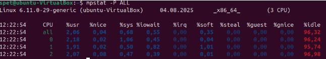

---

## Задание 4
Выполните проверку системы при помощи команды pidstat.

Выведите статистику по эффективности на основе имени процесса.

Выведите полный путь процесса.

Приведите ответ в виде снимков экрана.


---

## Решение 4

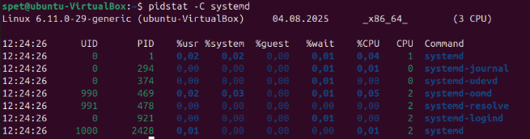

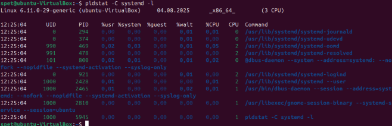


---

## Задание 5
Просмотрите каталог /proc, выполните любую команду для просмотра процессов. Сделайте сравнение вывода команды и содержания папки по:

взаимосвязи объектов,
времени создания.
Этапы выполнения:

Создайте два окна терминала (вкладку или терминала CLI через комбинацию cntrl+alt+f'x');

На одном запустите любое приложение (команду) в активное использование или в фон при помощь связки & (например, ping 127.0.0.1 &);

Определите pid процесса;

Просмотрите каталог /proc и найдите папку с номером pid процесса;

Просмотрите директории при помощи ls -la;

Просмотрите внутреннее устройство директории;

Ответьте на вопрос, какую информацию содержит:

- cmdline
- cwd
- environ
- exe
- fd
- maps
- root
- status

Приведите ответ в виде снимков экрана.


---

## Решение 5
cmdline хранит исполняемый файл и аргументы, переданные процессу при запуске.

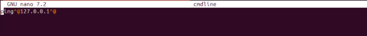

cwd символическая ссылка на текущий рабочий каталог процесса

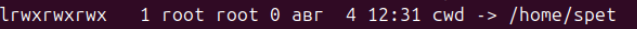

environ содержит переменные окружения процесса

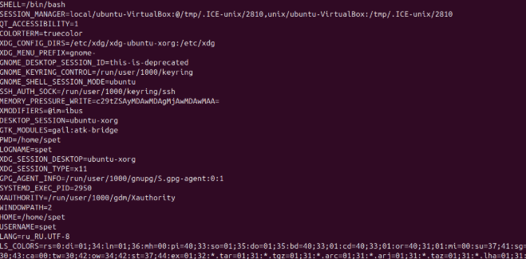

exe символическая ссылка на исполняемый файл

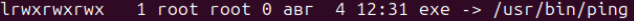

fd каталог, содержащий символические ссылки на все открытые файловые дескрипторы процесса

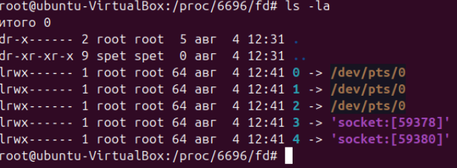

maps содержит детальную информацию о сегментах памяти процесса


root символическая ссылка на корневой каталог процесса


status содержит основные характеристики процесса

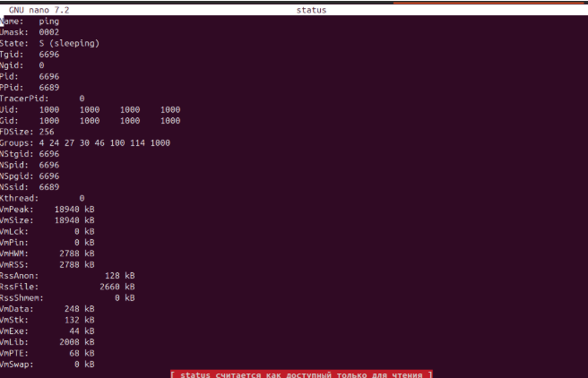


---

