# Домашнее задание к занятию  «Производительность системы. Часть 2» - Спетницкий Д.И.


## Задание 1 

Составьте задание через утилиту cron на проверку объёма кеш-обновлений еженедельно.

Кеш-обновления — это обновления, которые остаются после выполнения apt update, apt upgrade.

Приведите ответ в виде команды.


---

## Решение 1

Создадим скрипт ~/scripts/check_apt_cache.sh

[check_apt_cache.sh](check_apt_cache.sh)

сделаем запись в кроне

```
sudo crontab -e

0 0 * * 0 ~/scripts/check_apt_cache.sh

```
У нас раз в неделю будет делаться запись вида:

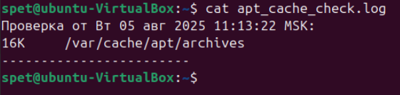


---

## Задание 2

Запустите процесс копирования большого файла (1 Гб) на жёсткий диск.

Запустите команду iostat.

Запустите iotop.

Какие процессы влияют на данные команды?

Приведите развёрнутый ответ и приложите снимки экрана.


---

## Решение 2

Мы видим что, для диска sda tps = 21,24: 21 транзакция в секунду.
kB_wrtn/s = 3479,18: Высокая скорость записи данных (~3,4 МБ/с).

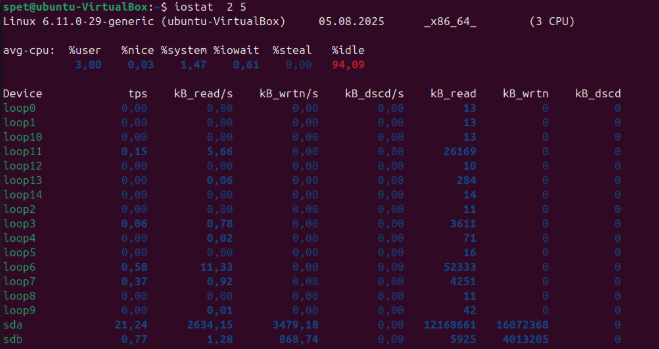

Процесс cp (PID 5607) 

Нагрузка на диск:

Чтение: 634,25 M/s.

Запись: 655,50 M/s.

Команда: Копирование файла largefile в директорию /home/spet/test/

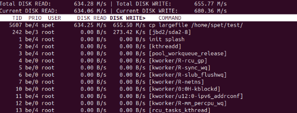

---

## Задание 3
Настройте приоритет использования swap в пропорции:

30/70,

50/50,

70/30.

Запустите браузер и нагрузите память:

сделайте скриншот терминала с выводом команды free -h;

открывайте закладки браузера, к примеру, Rutube;

мониторьте использование swap командой free -h;

при увеличении swap сделайте скриншот free -h;

продолжайте открывать закладки до близкого к полному исчерпанию оперативной памяти;

сделайте скриншот free -h;

сбросьте swap или перезагрузите машину;

повторите всё сначала в следующем режиме.

Проанализируйте результат.

Приведите развёрнутый ответ и приложите снимки экрана.


---

## Решение 3

30/70

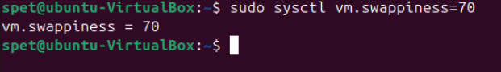
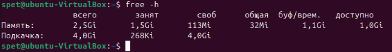


70/30
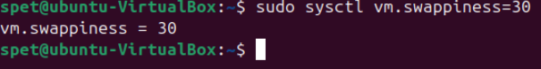
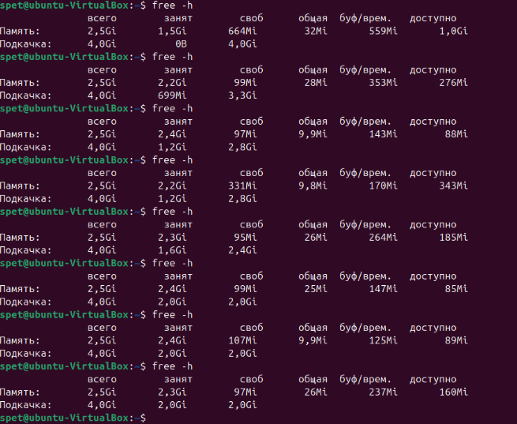

При vm.swappiness=70 (30/70): Система активно использует swap уже на ранних этапах нагрузки
Видно, что при использовании 2.4Gi из 2.5Gi оперативной памяти, swap занят на 2.5Gi из 4.0Gi (62.5%)
Система "рано" начинает перемещать данные в swap
При vm.swappiness=50 (50/50): Умеренное использование swap
При аналогичной нагрузке на RAM (2.4Gi из 2.5Gi) swap занят на 2.1Gi из 4.0Gi (52.5%)
Баланс между использованием RAM и swap более сбалансированный
При vm.swappiness=30 (70/30): Система избегает использования swap до последнего
При использовании 2.4Gi из 2.5Gi оперативной памяти swap занят всего на 1.2-2.0Gi из 4.0Gi (30-50%)
В некоторых случаях видно, что при почти полной загрузке RAM (2.3Gi из 2.5Gi), swap используется всего на 1.6Gi (40%)

Эксперимент наглядно показывает, что настройка параметра vm.swappiness является эффективным инструментом управления балансом между использованием оперативной памяти и swap. Правильная настройка этого параметра позволяет оптимизировать производительность системы в зависимости от ее конфигурации и рабочих нагрузок.

---

## Задание 5*
Cron — ортодоксальный планировщик задач, но мы живём в 21 веке. Составьте задание на проверку объёма кеш-обновлений с помощью systemd-timers. В качестве подсказки используйте материалы.

Прикрепите тест сервиса.


---

## Решение 5*
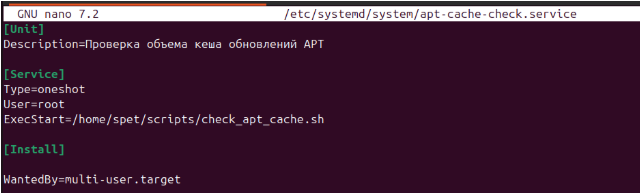
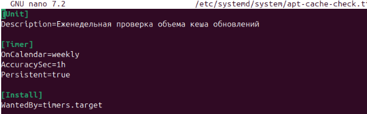
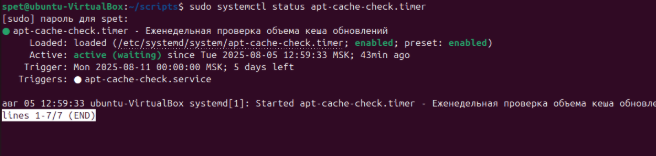
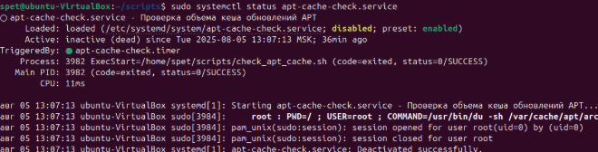

---

