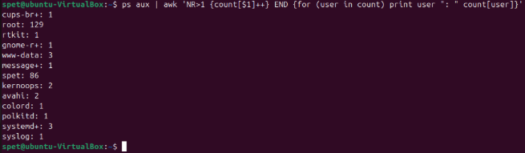
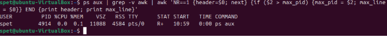
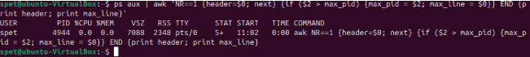
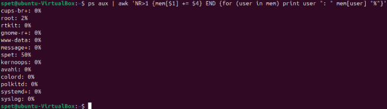
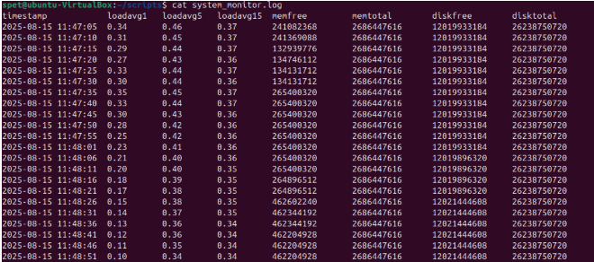
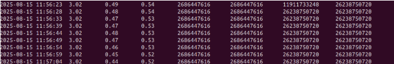
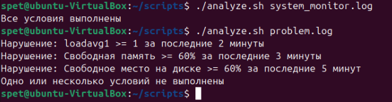

# Домашнее задание к занятию  «Regexp и их использование для синтаксического анализа» - Спетницкий Д.И.


## Задание 1 

Напишите регулярное выражение для проверки является ли строка IPv4 адресом.

Для тестов можно использовать файл со следующим содержимым, фильтруя вывод с помощью команды grep -E:

192.168.0.1

127.0.0.1

84.345.23.11

88.3A.56.76

224.12.76

999.999.999.999

355.255.255.257

0.0.0.0

Пришлите получившееся выражение в качестве ответа.


---

## Решение 1
```
grep -E '^((25[0-5]|2[0-4][0-9]|1[0-9]{2}|[1-9]?[0-9])\.){3}(25[0-5]|2[0-4][0-9]|1[0-9]{2}|[1-9]?[0-9])$' file.txt
```


((25[0-5]|2[0-4][0-9]|1[0-9]{2}|[1-9]?[0-9])\.){3}

Это первая большая группа, которая повторяется 3 раза {3}

Внутри этой группы:
(25[0-5]|2[0-4][0-9]|1[0-9]{2}|[1-9]?[0-9]) - это одно число от 0 до 255
\. - это точка 
Как работает проверка числа (25[0-5]|2[0-4][0-9]|1[0-9]{2}|[1-9]?[0-9]):
| означает "ИЛИ" - подходит любой из этих вариантов:

Вариант 1: 25[0-5]
25 + цифра от 0 до 5
Ловит числа: 250,
251, 252, 253, 254, 255

Вариант 2: 2[0-4][0-9]
2 + цифра от 0 до 4 + любая цифра от 0 до 9
Ловит числа: 200-249 (например: 200, 215, 249)

Вариант 3: 1[0-9]{2}
1 + две любые цифры от 0 до 9
Ловит числа: 100-199 (например: 100, 156, 199)


Вариант 4: [1-9]?[0-9]
[1-9]? = необязательная цифра от 1 до 9 (может не быть)
[0-9] = обязательная цифра от 0 до 9
Ловит числа: 0-99
Исключает ведущие нули

(25[0-5]|2[0-4][0-9]|1[0-9]{2}|[1-9]?[0-9]) - четвертое число
То же самое, но без точки в конце (последнее число в адресе)

---

## Задание 2

В Вашей конфигурации Nginx скопилось много неиспользуемых сегментов и становится сложно его читать.

Используя sed удалите все пустые строки и комментарии в конфигурации Nginx.

Попробуйте сделать это одним запуском.

Файл расположен по ссылке

Пришлите получившуюся команду в качестве ответа

---

## Решение 2
```
sed -e 's/#.*$//' -e '/^\s*$/d' nginx.conf
```
- -e 's/#.*$//': Первая команда редактирования:

- s/ Команда замены

- #.*  Ищет символ # и всё, что следует за ним (.*) до конца строки ($)
- //  Заменяет найденное на пустоту 

- -e '/^\s*$/d'  Вторая команда редактирования:

- /^\s*$/ Ищет строки, которые либо пустые (^$), либо содержат только пробельные символы (\s*)

- d Команда удаления найденных строк.


---

## Задание 3
Используя awk и ps aux соберите информацию о:

количестве процессов для каждого пользователя;

процессе с самым большим PID;

(дополнительное задание со звездочкой*) суммарном использовании памяти различными пользователями.

Пришлите скриншоты со скриптами и демонстрацией их работы


---

## Решение 3
Количество процессов для каждого пользователя:
```
ps aux | awk 'NR>1 {count[$1]++} END {for (user in count) print user ": " count[user]}'
```


Процесс с самым большим PID:
```
ps aux | grep -v awk | awk 'NR==1 {header=$0; next} {if ($2 > max_pid) {max_pid = $2; max_line = $0}} END {print header; print max_line}'
```
- grep -v awk — убирает из вывода все строки, содержащие слово awk.



Иначе было бы, что попадает сам процесс awk, который  только что запустили. И у этого процесса awk оказывается самый большой PID среди всех текущих процессов (потому что это самый свежий процесс)



Суммарное использование памяти по пользователям:

```
ps aux | awk 'NR>1 {mem[$1] += $4} END {for (user in mem) print user ": " mem[user] "%"}'
```



---

## Задание 4
Напишите bash-скрипт который собирает информацию о системе и пишет ее в лог каждые 5 секунд.

Используемые параметры:

loadavg[1,5,15] средний показатель загрузки ЦПУ за последние 1 5 и 15 минут. Примечание: хранится в /proc/loadavg.
memfree количество свободной оперативной памяти в байтах. Примечание: используем утилиту free.
memtotal количество всей оперативной памяти в байтах. Примечание: используем утилиту free.
diskfree свободное место на диске подключенного к /. Примечание: используем утилиту df.
disktotal общий объем диска подключенного к /. Примечание: используем утилиту df.
Формат записи: timestamp loadavg1 loadavg5 loadavg15 memfree memtotal diskfree disktotal

Пособирайте данные в течении 5-10 минут.

Анализируя этот лог с помощью awk напишите скрипт проверки состояния системы с заданными условиями:

loadavg1 < 1 в течении последних 2 минут;
memfree / memtotal < 60% в течении последних 3 минут;
diskfree / disktotal < 60% в течении последних 5 минут.
Скрипт должен возвращать 0 код ответа, если все условия выполняются, и любой другой в случае невыполнения.

В консоль также необходимо выводить, какое именно из условий не выполняется.

Пришлите получившиеся скрипты в качестве ответа.


---

## Решение 4

[monitor.sh](monitor.sh)

[analyze.sh](analyze.sh)

И так….
Есть лог system_monitor.log и он же но слегка подправленный в конце, чтобы посмотреть на ошибки problem.log все это вида:

#### system_monitor.log


#### problem.log



### Ну и собственно результат



---

