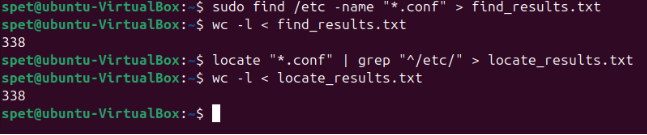
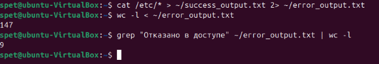
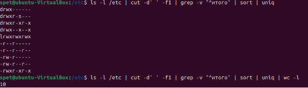
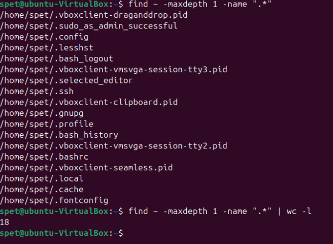

# Домашнее задание к занятию  «Работа с текстовыми утилитами» - Спетницкий Д.И.


## Задание 1

Найдите все файлы с расширением .conf в /etc сначала с помощью команды find, а потом с помощью команды locate;
Перенаправьте результаты работы каждой команды в разные файлы;
Подсчитайте количество найденных файлов в каждом случае с помощью wc.


---

## Решение 1
```
sudo find /etc -name "*.conf" > find_results.txt

wc -l < find_results.txt

locate "*.conf" | grep "^/etc/" > locate_results.txt

wc -l < locate_results.txt
```


---

## Задание 2
Выведите с помощью cat содержимое всех файлов в директории /etc cat /etc/*;
Направьте ошибки в отдельный файл в вашей домашней директории;
Стандартный поток вывода направьте в другой файл;
Подсчитайте, сколько объектов не удалось прочитать.

---

## Решение 2
```
cat /etc/* > ~/success_output.txt 2> ~/error_output.txt
```
Всего ошибок:
```
wc -l < ~/error_output.txt
```
Смотрим сколько отказано из-за недостаточных прав
```
grep "Отказано в доступе" ~/error_output.txt | wc -l
```


---

## Задание 3
Перенаправьте результат работы команды ls -l в каталоге с большим количеством файлов в утилиту cut, чтобы отобразить только права доступа к файлам;
Отправьте в конвейере этот вывод на sort и uniq, чтобы отфильтровать все повторяющиеся строки;
Уберите из подсчета строку total;
С помощью wc подсчитайте различные типы разрешений в этом каталоге.


---

## Решение 3
```
ls -l | cut -d' ' -f1

ls -l /etc | cut -d' ' -f1 | sort | uniq

ls -l /etc | cut -d' ' -f1 | grep -v "^итого" | sort | uniq

ls -l /etc | cut -d' ' -f1 | grep -v "^итого" | sort | uniq | wc -l
```


---

## Задание 4
В ОС Linux скрытыми файлами считаются те, имена которых начинаются с точки.

Сколько скрытых файлов в вашем домашнем каталоге?

---

## Решение 4



---