# Итоговая проектная работа «Автоматизация рутинных задач с помощью Bash-скриптов» - Спетницкий Д.И.
- [monitor_proc.sh](monitor_proc.sh)

- [monitor_input_devices.sh](monitor_input_devices.sh)
## 1. Задание по созданию Bash-скрипта, который будет выполнять мониторинг содержимого директории proc, получать сведения о процессах и системных данных о них, сбор полученной информации в логе

### 1.1 Напишите Bash-скрипт, который выполняет просмотр директории /proc и записывает номерные директории
```
#!/bin/bash

# Путь к лог-файлу
LOG_FILE="/tmp/proc_monitor.log"

# Очищаем лог перед новым запуском 
> "$LOG_FILE"

# Проходим по всем элементам в /proc
for item in /proc/*; do
    # Извлекаем имя элемента
    basename_item=$(basename "$item")
    
    # Проверяем, является ли имя числом (т.е. это PID процесса)
    if [[ "$basename_item" =~ ^[0-9]+$ ]]; then
        echo "$basename_item" >> "$LOG_FILE"
    fi
done

echo "Список PID записан в $LOG_FILE"
```
#### Шаг 1: Определение лог-файла
```
LOG_FILE="/tmp/proc_monitor.log"
```
#### Шаг 2: Очистка лога
```
> "$LOG_FILE"
```
Эта команда очищает файл, если он уже существует.
Если нужна история — можно убрать.

#### Шаг 3: Перебор содержимого /proc
```
for item in /proc/*; do
```
Проходим по каждому элементу в /proc

#### Шаг 4: Извлечение имени элемента
```
basename_item=$(basename "$item")
```
Получаем только имя каталога/файла, без пути.

#### Шаг 5: Проверка, является ли имя числом
```
if [[ "$basename_item" =~ ^[0-9]+$ ]]; then
```
Используем регулярное выражение ^[0-9]+$, чтобы проверить, состоит ли строка только из цифр.

#### Шаг 6: Запись в лог
```
echo "$basename_item" >> "$LOG_FILE"
```
Добавляем найденный PID в лог-файл.


#### Шаг 7: Сообщение пользователю
```
echo "Список PID записан в $LOG_FILE"
```
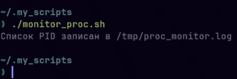

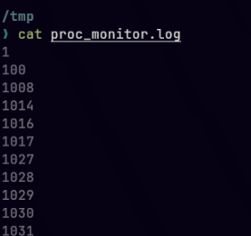

### 1.2 Дополните скрипт, чтобы он получал имя процесса по номеру директории через прочтения /proc/N/exe (PID = номер папки)

```
#!/bin/bash

LOG_FILE="/tmp/proc_monitor.log"
> "$LOG_FILE"

for item in /proc/*; do
    basename_item=$(basename "$item")
    
    if [[ "$basename_item" =~ ^[0-9]+$ ]]; then
        PID="$basename_item"
        
        EXE_PATH=$(readlink "/proc/$PID/exe" 2>/dev/null)
        COMM=$(cat "/proc/$PID/comm" 2>/dev/null)

        if [ -n "$EXE_PATH" ]; then
            echo "PID: $PID | Name: $COMM | Executable: $EXE_PATH" >> "$LOG_FILE"
        else
            echo "PID: $PID | Name: $COMM | Executable: [недоступно]" >> "$LOG_FILE"
        fi
    fi
done

echo "Информация о процессах записана в $LOG_FILE"
```
#### 1. Чтение символической ссылки /proc/PID/exe
```
EXE_PATH=$(readlink "/proc/$PID/exe" 2>/dev/null)
```
- readlink — команда, которая разыменовывает символические ссылки

- /proc/$PID/exe — это символическая ссылка на исполняемый файл процесса

- 2>/dev/null — подавляет ошибки (если ссылка недоступна)

#### 2. Чтение имени процесса из /proc/PID/comm
```
COMM=$(cat "/proc/$PID/comm" 2>/dev/null)
```
Читает файл /proc/PID/comm, в котором хранится короткое имя процесса

Позволяет получить имя процесса, даже если exe недоступен
#### 3. Проверка и запись в лог
```
if [ -n "$EXE_PATH" ]; then
    echo "PID: $PID | Name: $COMM | Executable: $EXE_PATH" >> "$LOG_FILE"
else
    echo "PID: $PID | Name: $COMM | Executable: [недоступно]" >> "$LOG_FILE"
fi
```
Проверяет, удалось ли получить путь к исполняемому файлу (-n — непустая строка)
Если да — записывает полную информацию
Если нет — всё равно записывает имя процесса и помечает exe как недоступный

даже если нет exe, мы всё равно видим, какой это процесс

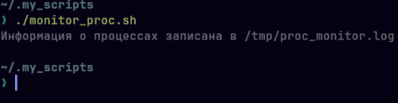

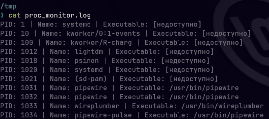

### 1.3 Дополните скрипт, чтобы по каждому процессу можно было выбрать группу параметров, не менее 4 (/proc/N/cmdline, /proc/N/environ, /proc/N/limits, /proc/N/mounts, /proc/N/status, /proc/N/cwd, /proc/N/fd, /proc/N/fdinfo, /proc/N/root) 

```
#!/bin/bash

# Проверка, передан ли аргумент
if [ -z "$1" ]; then
    echo "Использование: $0 <группа>"
    echo "Доступные группы: main, resources, files, system"
    exit 1
fi

GROUP="$1"
LOG_FILE="/tmp/proc_monitor_${GROUP}.log"
> "$LOG_FILE"

echo "Запуск мониторинга с группой параметров: $GROUP" >> "$LOG_FILE"

for item in /proc/*; do
    basename_item=$(basename "$item")
    
    if [[ "$basename_item" =~ ^[0-9]+$ ]]; then
        PID="$basename_item"
        COMM=$(cat "/proc/$PID/comm" 2>/dev/null)
        
        {
            echo "=== PID: $PID ($COMM) ==="
            
            case "$GROUP" in
                main)
                    # Основная информация
                    CMDLINE=$(cat "/proc/$PID/cmdline" 2>/dev/null | tr '\0' ' ')
                    STATUS=$(grep -E '^(Name|State|Uid|VmRSS)' "/proc/$PID/status" 2>/dev/null | tr '\n' ';')
                    CWD=$(readlink "/proc/$PID/cwd" 2>/dev/null)
                    ENVIRON=$(cat "/proc/$PID/environ" 2>/dev/null | tr '\0' ' ' | cut -c1-200)
                    
                    echo "Command line: $CMDLINE"
                    echo "Status: $STATUS"
                    echo "Current working directory: $CWD"
                    echo "Environment (first 200 chars): $ENVIRON"
                    ;;
                resources)
                    # Ресурсы и ограничения
                    STATUS=$(grep -E '^(Name|Threads|VmSize|VmRSS)' "/proc/$PID/status" 2>/dev/null | tr '\n' ';')
                    LIMITS=$(grep 'Max open files\|Max processes' "/proc/$PID/limits" 2>/dev/null | tr '\n' ';')
                    MOUNTS=$(head -n 2 "/proc/$PID/mounts" 2>/dev/null | tr '\n' ';')
                    FD_COUNT=$(ls "/proc/$PID/fd" 2>/dev/null | wc -l 2>/dev/null || echo "N/A")
                    
                    echo "Status: $STATUS"
                    echo "Limits: $LIMITS"
                    echo "Mounts (first 2): $MOUNTS"
                    echo "File descriptors count: $FD_COUNT"
                    ;;
                files)
                    # Файловая система и дескрипторы
                    CMDLINE=$(cat "/proc/$PID/cmdline" 2>/dev/null | tr '\0' ' ')
                    ENVIRON=$(cat "/proc/$PID/environ" 2>/dev/null | tr '\0' ' ' | cut -c1-100)
                    ROOT=$(readlink "/proc/$PID/root" 2>/dev/null)
                    FDINFO=$(head -n 2 "/proc/$PID/fdinfo"/* 2>/dev/null 2>/dev/null | tr '\n' ';' 2>/dev/null || echo "N/A")
                    
                    echo "Command line: $CMDLINE"
                    echo "Environment (first 100 chars): $ENVIRON"
                    echo "Root directory: $ROOT"
                    echo "FD info (first 2): $FDINFO"
                    ;;
                system)
                    # Системные параметры
                    NAME=$(grep 'Name' "/proc/$PID/status" 2>/dev/null)
                    CWD=$(readlink "/proc/$PID/cwd" 2>/dev/null)
                    ROOT=$(readlink "/proc/$PID/root" 2>/dev/null)
                    FD_LIST=$(ls "/proc/$PID/fd" 2>/dev/null | head -n 5 | tr '\n' ' ' 2>/dev/null || echo "N/A")
                    
                    echo "Process name: $NAME"
                    echo "Working directory: $CWD"
                    echo "Root directory: $ROOT"
                    echo "Open FDs (first 5): $FD_LIST"
                    ;;
                *)
                    echo "Ошибка: неизвестная группа '$GROUP'"
                    echo "Доступные группы: main, resources, files, system"
                    ;;
            esac
            
            echo "----------------------------------------"
        } >> "$LOG_FILE"
    fi
done

echo "Данные записаны в $LOG_FILE"
```
#### 1. Добавление обработки аргументов командной строки
```
if [ -z "$1" ]; then
    echo "Использование: $0 <группа>"
    echo "Доступные группы: main, resources, files, system"
    exit 1
fi

GROUP="$1"
```
Добавили проверку входного аргумента, чтобы пользователь мог выбирать, какую группу параметров собирать

#### 2. Создание именованных групп параметров
```
LOG_FILE="/tmp/proc_monitor_${GROUP}.log"
```
Создали разные лог-файлы для разных групп, чтобы данные каждой группы хранились отдельно

#### 3. Определение 4 логических групп параметров

| Группа    | Назначение                     |            Параметр            |
|-----------|--------------------------------|:------------------------------:|
| main      | Основная информация о процессе |  cmdline,status, cwd, environ  |
| resources | Ресурсы и ограничения          | status, limits, mounts, fd     |
| files     | Файловая система               | cmdline, environ, root, fdinfo |
| system    | Системные параметры            |      status, cwd, root, fd     |

Разбили все параметры на логические блоки, для гибкости выбора нужной информации

#### 4. Реализация выбора параметров через case
```
case "$GROUP" in
    main)
        # параметры группы main
        ;;
    resources)
        # параметры группы resources
        ;;
    # ... остальные группы
esac
```
Добавили условную логику выбора параметров, чтобы в зависимости от аргумента собирать разные данные

#### 5. Сбор конкретных параметров для каждой группы

Для группы main:
```
/proc/PID/cmdline — командная строка
/proc/PID/status — статус процесса
/proc/PID/cwd — текущая директория
/proc/PID/environ — переменные окружения
```
Для группы resources:
```
/proc/PID/status — статус
/proc/PID/limits — лимиты ресурсов
/proc/PID/mounts — точки монтирования
/proc/PID/fd — количество файловых дескрипторов
```
Для группы files:
```
/proc/PID/cmdline — командная строка
/proc/PID/environ — окружение
/proc/PID/root — корневая директория процесса
/proc/PID/fdinfo — информация о дескрипторах
``` 

Для группы system:
```
/proc/PID/status — статус
/proc/PID/cwd — рабочая директория
/proc/PID/root — корневая директория
/proc/PID/fd — список дескрипторов
```

Для каждой группы определили конкретные файлы /proc, чтобы собирать целенаправленную информацию

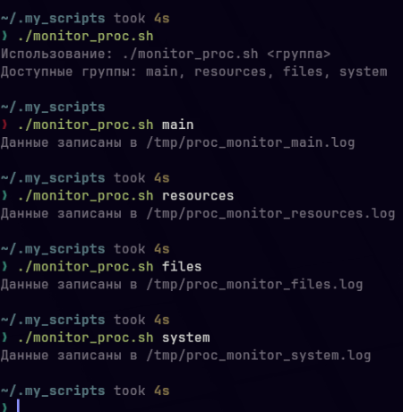

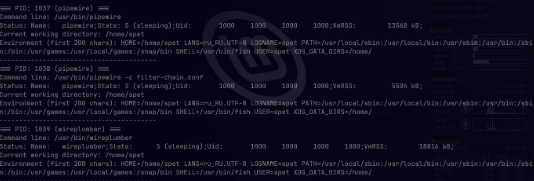
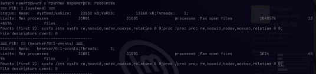
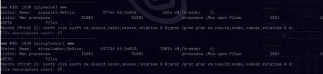
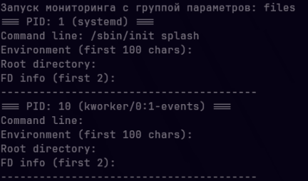
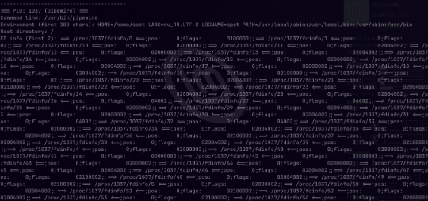
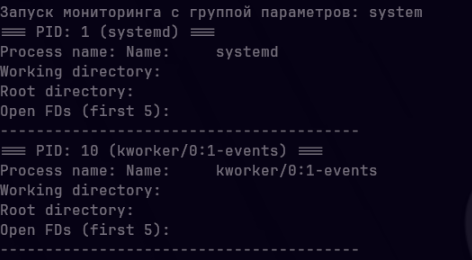


### 1.4 Дополните скрипт циклом, который оформит полученную информацию в виде таблицы с наименованием столбцов PID, Name, и 4 параметров, которые вы выбрали в предыдущем пункте задания (пункт 1.3)
```
#!/bin/bash

# Проверка аргумента
if [ -z "$1" ]; then
    echo "Использование: $0 <группа>"
    echo "Доступные группы: main, resources, files, system"
    exit 1
fi

GROUP="$1"
LOG_FILE="/tmp/proc_monitor_${GROUP}.log"
> "$LOG_FILE"

# Записываем заголовок таблицы в зависимости от группы
{
    case "$GROUP" in
        main)
            printf "%-8s %-15s %-30s %-25s %-30s %-50s\n" "PID" "Name" "Command Line" "Status" "CWD" "Environment"
            ;;
        resources)
            printf "%-8s %-15s %-30s %-30s %-30s %-20s\n" "PID" "Name" "Status" "Limits" "Mounts" "FD Count"
            ;;
        files)
            printf "%-8s %-15s %-30s %-30s %-30s %-30s\n" "PID" "Name" "Command Line" "Environment" "Root" "FD Info"
            ;;
        system)
            printf "%-8s %-15s %-25s %-30s %-30s %-30s\n" "PID" "Name" "Process Name" "Working Dir" "Root Dir" "Open FDs"
            ;;
        *)
            echo "Ошибка: неизвестная группа '$GROUP'"
            exit 1
            ;;
    esac
} >> "$LOG_FILE"

# Обработка каждого процесса
for item in /proc/*; do
    basename_item=$(basename "$item")
    
    if [[ "$basename_item" =~ ^[0-9]+$ ]]; then
        PID="$basename_item"
        COMM=$(cat "/proc/$PID/comm" 2>/dev/null || echo "N/A")
        
        # Подготавливаем данные в зависимости от группы
        case "$GROUP" in
            main)
                CMDLINE=$(cat "/proc/$PID/cmdline" 2>/dev/null | tr '\0' ' ' | cut -c1-30 || echo "N/A")
                STATUS=$(grep -E '^(State|Uid|VmRSS)' "/proc/$PID/status" 2>/dev/null | tr '\n' ';' | cut -c1-25 || echo "N/A")
                CWD=$(readlink "/proc/$PID/cwd" 2>/dev/null | cut -c1-30 || echo "N/A")
                ENVIRON=$(cat "/proc/$PID/environ" 2>/dev/null | tr '\0' ' ' | cut -c1-50 || echo "N/A")
                
                printf "%-8s %-15s %-30s %-25s %-30s %-50s\n" "$PID" "$COMM" "$CMDLINE" "$STATUS" "$CWD" "$ENVIRON" >> "$LOG_FILE"
                ;;
            resources)
                STATUS=$(grep -E '^(Threads|VmSize|VmRSS)' "/proc/$PID/status" 2>/dev/null | tr '\n' ';' | cut -c1-30 || echo "N/A")
                LIMITS=$(grep 'Max open files\|Max processes' "/proc/$PID/limits" 2>/dev/null | tr '\n' ';' | cut -c1-30 || echo "N/A")
                MOUNTS=$(head -n 1 "/proc/$PID/mounts" 2>/dev/null | cut -c1-30 || echo "N/A")
                FD_COUNT=$(ls "/proc/$PID/fd" 2>/dev/null | wc -l 2>/dev/null || echo "N/A")
                
                printf "%-8s %-15s %-30s %-30s %-30s %-20s\n" "$PID" "$COMM" "$STATUS" "$LIMITS" "$MOUNTS" "$FD_COUNT" >> "$LOG_FILE"
                ;;
            files)
                CMDLINE=$(cat "/proc/$PID/cmdline" 2>/dev/null | tr '\0' ' ' | cut -c1-30 || echo "N/A")
                ENVIRON=$(cat "/proc/$PID/environ" 2>/dev/null | tr '\0' ' ' | cut -c1-30 || echo "N/A")
                ROOT=$(readlink "/proc/$PID/root" 2>/dev/null | cut -c1-30 || echo "N/A")
                FDINFO=$(head -n 1 "/proc/$PID/fdinfo"/* 2>/dev/null 2>/dev/null | cut -c1-30 || echo "N/A")
                
                printf "%-8s %-15s %-30s %-30s %-30s %-30s\n" "$PID" "$COMM" "$CMDLINE" "$ENVIRON" "$ROOT" "$FDINFO" >> "$LOG_FILE"
                ;;
            system)
                NAME=$(grep 'Name' "/proc/$PID/status" 2>/dev/null | cut -d: -f2 | xargs || echo "N/A")
                CWD=$(readlink "/proc/$PID/cwd" 2>/dev/null | cut -c1-30 || echo "N/A")
                ROOT=$(readlink "/proc/$PID/root" 2>/dev/null | cut -c1-30 || echo "N/A")
                FD_LIST=$(ls "/proc/$PID/fd" 2>/dev/null | head -n 3 | tr '\n' ' ' | cut -c1-30 || echo "N/A")
                
                printf "%-8s %-15s %-25s %-30s %-30s %-30s\n" "$PID" "$COMM" "$NAME" "$CWD" "$ROOT" "$FD_LIST" >> "$LOG_FILE"
                ;;
        esac
    fi
done

echo "Табличные данные записаны в $LOG_FILE"
```
#### 1. Добавление форматированного вывода таблицы
```
printf "%-8s %-15s %-30s %-25s %-30s %-50s\n" "PID" "Name" "Command Line" "Status" "CWD" "Environment"
```
Заменили обычный echo на printf с форматированием, чтобы создать табличную структуру с выравниванием колонок

#### 2. Создание заголовков для каждой группы
```
case "$GROUP" in
    main)
        printf "%-8s %-15s %-30s %-25s %-30s %-50s\n" "PID" "Name" ...
    resources)
        printf "%-8s %-15s %-30s %-30s %-30s %-20s\n" "PID" "Name" ...
    # ... остальные группы
esac
```
Для каждой группы создали свой набор заголовков, потому что разные группы имеют разные параметры

#### 3. Организация цикла по процессам с табличным выводом
```
for item in /proc/*; do
    # ... проверка PID
    case "$GROUP" in
        main)
            printf "%-8s %-15s %-30s %-25s %-30s %-50s\n" "$PID" "$COMM" "$CMDLINE" "$STATUS" "$CWD" "$ENVIRON" >> "$LOG_FILE"
```
Заменили многострочный вывод на одну строку таблицы для каждого процесса, чтобы данные были в табличном формате, а не в виде блоков

#### 4. Подготовка данных для каждой колонки
```
CMDLINE=$(cat "/proc/$PID/cmdline" 2>/dev/null | tr '\0' ' ' | cut -c1-30 || echo "N/A")
STATUS=$(grep -E '^(State|Uid|VmRSS)' "/proc/$PID/status" 2>/dev/null | tr '\n' ';' | cut -c1-25 || echo "N/A")
```
Для каждого параметра создали обработку и форматирование, чтобы данные помещались в колонки и не ломали таблицу

#### 5. Ограничение длины строк для читаемости
```
cut -c1-30  # Ограничиваем длину до 30 символов
```
Обрезаем длинные строки, чтобы таблица не разъезжалась из-за очень длинных путей/команд

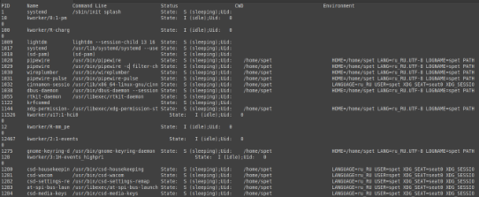

### 1.5 Дополните скрипт, чтобы создавался лог файл с записью времени выполнения скрипта и занесения новых процессов. Старые процессы не заносятся
```
#!/bin/bash

# Проверка аргумента
if [ -z "$1" ]; then
    echo "Использование: $0 <группа>"
    echo "Доступные группы: main, resources, files, system"
    exit 1
fi

GROUP="$1"
LOG_FILE="/tmp/proc_monitor_${GROUP}.log"
PREVIOUS_PIDS_FILE="/tmp/proc_previous_pids_${GROUP}.txt"
CURRENT_PIDS_FILE="/tmp/proc_current_pids_${GROUP}.txt"
TEMP_LOG="/tmp/proc_monitor_${GROUP}_temp.log"

# Получаем текущее время
TIMESTAMP=$(date '+%Y-%m-%d %H:%M:%S')

# Очищаем текущий список PID
> "$CURRENT_PIDS_FILE"

# Собираем текущие PID
for item in /proc/*; do
    basename_item=$(basename "$item")
    if [[ "$basename_item" =~ ^[0-9]+$ ]]; then
        echo "$basename_item" >> "$CURRENT_PIDS_FILE"
    fi
done

# Определяем новые PID
if [ -f "$PREVIOUS_PIDS_FILE" ]; then
    # Находим новые PID (есть в текущем, но нет в предыдущем)
    NEW_PIDS=$(comm -13 <(sort "$PREVIOUS_PIDS_FILE") <(sort "$CURRENT_PIDS_FILE"))
else
    # Если предыдущего файла нет - все процессы новые
    NEW_PIDS=$(cat "$CURRENT_PIDS_FILE")
fi

# Сохраняем текущие PID как предыдущие для следующего запуска
cp "$CURRENT_PIDS_FILE" "$PREVIOUS_PIDS_FILE"

# Создаем новый блок во временном файле
{
    echo "=== ЗАПУСК ==="
    echo "Время выполнения: $TIMESTAMP"
    echo "Новые процессы: $(echo "$NEW_PIDS" | wc -l)"
    echo ""

    # Выводим заголовок таблицы
    case "$GROUP" in
        main)
            printf "%-8s %-15s %-30s %-25s %-30s %-50s\n" "PID" "Name" "Command Line" "Status" "CWD" "Environment"
            ;;
        resources)
            printf "%-8s %-15s %-30s %-30s %-30s %-20s\n" "PID" "Name" "Status" "Limits" "Mounts" "FD Count"
            ;;
        files)
            printf "%-8s %-15s %-30s %-30s %-30s %-30s\n" "PID" "Name" "Command Line" "Environment" "Root" "FD Info"
            ;;
        system)
            printf "%-8s %-15s %-25s %-30s %-30s %-30s\n" "PID" "Name" "Process Name" "Working Dir" "Root Dir" "Open FDs"
            ;;
        *)
            echo "Ошибка: неизвестная группа '$GROUP'"
            exit 1
            ;;
    esac

    # Выводим только новые процессы
    if [ -n "$NEW_PIDS" ]; then
        for PID in $NEW_PIDS; do
            if [ -d "/proc/$PID" ]; then
                # Функция для обработки одного процесса
                COMM=$(cat "/proc/$PID/comm" 2>/dev/null || echo "N/A")
                case "$GROUP" in
                    main)
                        CMDLINE=$(cat "/proc/$PID/cmdline" 2>/dev/null | tr '\0' ' ' | cut -c1-30 || echo "N/A")
                        STATUS=$(grep -E '^(State|Uid|VmRSS)' "/proc/$PID/status" 2>/dev/null | tr '\n' ';' | cut -c1-25 || echo "N/A")
                        CWD=$(readlink "/proc/$PID/cwd" 2>/dev/null | cut -c1-30 || echo "N/A")
                        ENVIRON=$(cat "/proc/$PID/environ" 2>/dev/null | tr '\0' ' ' | cut -c1-50 || echo "N/A")
                        printf "%-8s %-15s %-30s %-25s %-30s %-50s\n" "$PID" "$COMM" "$CMDLINE" "$STATUS" "$CWD" "$ENVIRON"
                        ;;
                    resources)
                        STATUS=$(grep -E '^(Threads|VmSize|VmRSS)' "/proc/$PID/status" 2>/dev/null | tr '\n' ';' | cut -c1-30 || echo "N/A")
                        LIMITS=$(grep 'Max open files\|Max processes' "/proc/$PID/limits" 2>/dev/null | tr '\n' ';' | cut -c1-30 || echo "N/A")
                        MOUNTS=$(head -n 1 "/proc/$PID/mounts" 2>/dev/null | cut -c1-30 || echo "N/A")
                        FD_COUNT=$(ls "/proc/$PID/fd" 2>/dev/null | wc -l 2>/dev/null || echo "N/A")
                        printf "%-8s %-15s %-30s %-30s %-30s %-20s\n" "$PID" "$COMM" "$STATUS" "$LIMITS" "$MOUNTS" "$FD_COUNT"
                        ;;
                    files)
                        CMDLINE=$(cat "/proc/$PID/cmdline" 2>/dev/null | tr '\0' ' ' | cut -c1-30 || echo "N/A")
                        ENVIRON=$(cat "/proc/$PID/environ" 2>/dev/null | tr '\0' ' ' | cut -c1-30 || echo "N/A")
                        ROOT=$(readlink "/proc/$PID/root" 2>/dev/null | cut -c1-30 || echo "N/A")
                        FDINFO=$(head -n 1 "/proc/$PID/fdinfo"/* 2>/dev/null 2>/dev/null | cut -c1-30 || echo "N/A")
                        printf "%-8s %-15s %-30s %-30s %-30s %-30s\n" "$PID" "$COMM" "$CMDLINE" "$ENVIRON" "$ROOT" "$FDINFO"
                        ;;
                    system)
                        NAME=$(grep 'Name' "/proc/$PID/status" 2>/dev/null | cut -d: -f2 | xargs || echo "N/A")
                        CWD=$(readlink "/proc/$PID/cwd" 2>/dev/null | cut -c1-30 || echo "N/A")
                        ROOT=$(readlink "/proc/$PID/root" 2>/dev/null | cut -c1-30 || echo "N/A")
                        FD_LIST=$(ls "/proc/$PID/fd" 2>/dev/null | head -n 3 | tr '\n' ' ' | cut -c1-30 || echo "N/A")
                        printf "%-8s %-15s %-25s %-30s %-30s %-30s\n" "$PID" "$COMM" "$NAME" "$CWD" "$ROOT" "$FD_LIST"
                        ;;
                esac
            fi
        done
    else
        echo "Нет новых процессов"
    fi

    echo ""

    # Добавляем старое содержимое лога (если есть)
    if [ -f "$LOG_FILE" ]; then
        cat "$LOG_FILE"
    fi
} > "$TEMP_LOG"

# Перемещаем временный файл на место оригинала
mv "$TEMP_LOG" "$LOG_FILE"

echo "Новые процессы добавлены в начало $LOG_FILE"
```
#### 1. Добавлено отслеживание времени последнего запуска
```
PREVIOUS_PIDS_FILE="/tmp/proc_previous_pids_${GROUP}.txt"
CURRENT_PIDS_FILE="/tmp/proc_current_pids_${GROUP}.txt"
```
Добавили файлы для хранения списков PID, чтобы сравнивать текущие процессы с предыдущими и находить новые

#### 2. Реализована логика определения новых процессов
```
# Сбор текущих PID в файл
for item in /proc/*; do
    if [[ "$basename_item" =~ ^[0-9]+$ ]]; then
        echo "$basename_item" >> "$CURRENT_PIDS_FILE"
    fi
done

# Сравнение с предыдущими PID
NEW_PIDS=$(comm -13 <(sort "$PREVIOUS_PIDS_FILE") <(sort "$CURRENT_PIDS_FILE"))
```
Сравниваем два списка PID с помощью comm, чтобы найти процессы, которые появились с последнего запуска

#### 3. Добавлено сохранение текущих PID для следующего запуска
```
cp "$CURRENT_PIDS_FILE" "$PREVIOUS_PIDS_FILE"
```
Копируем текущий список в "предыдущий", чтобы при следующем запуске сравнить с ним
#### 4. Добавлено время выполнения в каждый блок
```
TIMESTAMP=$(date '+%Y-%m-%d %H:%M:%S')
echo "Время выполнения: $TIMESTAMP"
```
Добавили вывод времени в каждый блок

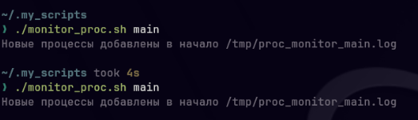

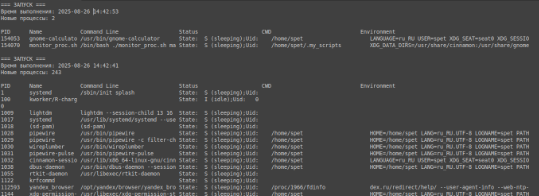

### 1.6 Создайте сценарий для «планировщика заданий» (например cron, acron) для опроса каждые 5 минут директории на предмет новых процессов


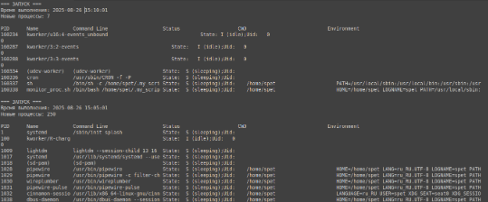

## 2. Задание по созданию Bash-скрипта, который будет информировать о подключенных устройствах к системе при его запуске  и сигнализировать о новых подключениях устройств при работе в фоновом режиме

### 2.1 Напишите Bash-скрипт, который выполняет просмотр /proc/bus/input/

```
#!/bin/bash

echo "=== Подключённые устройства ввода ==="
cat /proc/bus/input/devices
```
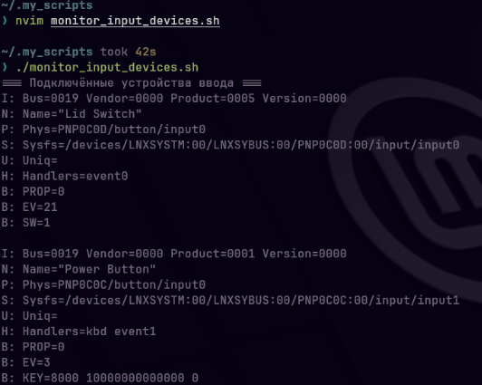
### 2.2 Дополните скрипт, который разберет полученные данные по наименованию столбцов, для работы скрипта использовать циклы
```
#!/bin/bash

# Временный файл для хранения текущего списка устройств
TEMP_FILE="/tmp/current_devices.txt"

# Функция для извлечения устройств
extract_devices() {
    local output_file=$1
    > "$output_file" # очищаем файл

    # Читаем блоки устройств
    while IFS= read -r line; do
        if [[ $line == N:* ]]; then
            # Извлекаем имя устройства
            name=$(echo "$line" | sed -n 's/N: Name="\([^"]*\)"/\1/p')
        elif [[ $line == H:* ]]; then
            # Извлекаем handlers
            handlers=$(echo "$line" | sed -n 's/H: Handlers=\(.*\)/\1/p')
            # Записываем в файл
            echo "$name|$handlers" >> "$output_file"
        fi
    done < /proc/bus/input/devices
}

# Извлекаем текущие устройства
extract_devices "$TEMP_FILE"

# Выводим заголовок
echo "=== Подключённые устройства ввода ==="
printf "%-40s %s\n" "Имя устройства" "Обработчики"
echo "---------------------------------------- -------------------"

# Читаем из временного файла и выводим с форматированием
while IFS='|' read -r name handlers; do
    printf "%-40s %s\n" "$name" "$handlers"
done < "$TEMP_FILE"
```
#### 1. Объявление переменных
```
TEMP_FILE="/tmp/current_devices.txt"
```
#### 2. Создание функции extract_devices
```
extract_devices() {
    local output_file=$1
    > "$output_file"
```
Объявляет функцию с параметром (путь к файлу вывода)
Очищает файл перед записью, чтобы извлекать и сохранять список устройств

#### 3. Чтение файла /proc/bus/input/devices
```
while IFS= read -r line; do
```
Читает файл построчно, потому что информация о каждом устройстве распределена по нескольким строкам
#### 4. Поиск строк с именем устройства
```
if [[ $line == N:* ]]; then
    name=$(echo "$line" | sed -n 's/N: Name="\([^"]*\)"/\1/p')
```
Проверяет, начинается ли строка с N: (Name)
Извлекает имя устройства из кавычек
Пример: Из строки N: Name="AT Translated Set 2 keyboard" получаем AT Translated Set 2 keyboard

#### 5. Поиск строк с обработчиками
```
elif [[ $line == H:* ]]; then
    handlers=$(echo "$line" | sed -n 's/H: Handlers=\(.*\)/\1/p')
```
Проверяет, начинается ли строка с H: (Handlers)
Извлекает список обработчиков
Пример: Из строки H: Handlers=sysrq kbd event0 leds получаем sysrq kbd event0 leds

#### 6. Сохранение информации об устройстве
```
echo "$name|$handlers" >> "$output_file"
```
Записывает имя и обработчики в файл, разделённые |, для удобного последующего чтения и анализа

#### 7. Вызов функции для текущих устройств
```
extract_devices "$TEMP_FILE"
```
Вызывает функцию и передаёт путь к временному файлу, файл заполняется текущим списком устройств

#### 8. Вывод заголовка таблицы
```
echo "=== Подключённые устройства ввода ==="
printf "%-40s %s\n" "Имя устройства" "Обработчики"
echo "---------------------------------------- -------------------"
```
Создаёт красиво отформатированный заголовок таблицы, для читаемого вывода результатов

#### 9. Чтение и вывод устройств
```
while IFS='|' read -r name handlers; do
    printf "%-40s %s\n" "$name" "$handlers"
done < "$TEMP_FILE"
```
Читает файл построчно, разделяя поля по символу |
Выводит каждое устройство в виде строки таблицы, чтобы показать пользователю список устройств в читаемом виде

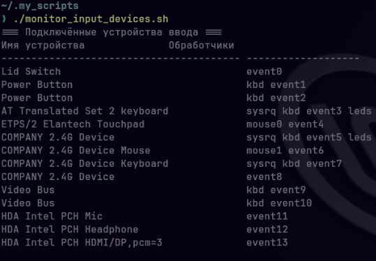

### 2.3 Дополните скрипт, чтобы создавался лог файл с записью времени выполнения скрипта и занесения новых устройств. Старые устройства не заносятся.

```
#!/bin/bash

# Файлы для хранения данных
TEMP_FILE="/tmp/current_devices.txt"
PREV_FILE="/tmp/previous_devices.txt"
LOG_FILE="/tmp/input_devices_monitor.log"
TEMP_LOG="/tmp/input_devices_monitor_temp.log"

# Получаем текущее время
TIMESTAMP=$(date '+%Y-%m-%d %H:%M:%S')

# Функция для извлечения устройств
extract_devices() {
    local output_file=$1
    > "$output_file" # очищаем файл

    # Читаем блоки устройств
    while IFS= read -r line; do
        if [[ $line == N:* ]]; then
            # Извлекаем имя устройства
            name=$(echo "$line" | sed -n 's/N: Name="\([^"]*\)"/\1/p')
        elif [[ $line == H:* ]]; then
            # Извлекаем handlers
            handlers=$(echo "$line" | sed -n 's/H: Handlers=\(.*\)/\1/p')
            # Записываем в файл (имя|handlers)
            echo "$name|$handlers" >> "$output_file"
        fi
    done < /proc/bus/input/devices
}

# Извлекаем текущие устройства
extract_devices "$TEMP_FILE"

# Находим новые устройства
NEW_DEVICES=""
if [ -f "$PREV_FILE" ]; then
    # Сравниваем текущие и предыдущие устройства
    NEW_DEVICES=$(comm -13 <(sort "$PREV_FILE") <(sort "$TEMP_FILE") | sed '/^$/d')
else
    # Если предыдущего файла нет - все устройства новые
    NEW_DEVICES=$(cat "$TEMP_FILE")
fi

# Убираем лишние пробелы и пустые строки
NEW_DEVICES=$(echo "$NEW_DEVICES" | sed 's/^[[:space:]]*//;s/[[:space:]]*$//' | grep -v '^$')

# Сохраняем текущие устройства как предыдущие для следующего запуска
cp "$TEMP_FILE" "$PREV_FILE"

# Создаем временный файл с новым блоком
{
    echo "=== Мониторинг устройств ввода ==="
    echo "Время выполнения: $TIMESTAMP"

    if [ -n "$NEW_DEVICES" ]; then
        echo "Новые устройства: $(echo "$NEW_DEVICES" | wc -l)"

        printf "%-40s %s\n" "Имя устройства" "Обработчики"
        echo "---------------------------------------- -------------------"
        echo "$NEW_DEVICES" | while IFS='|' read -r name handlers; do
            printf "%-40s %s\n" "$name" "$handlers"
        done
    else
        echo "Новые устройства: 0"
        echo "Нет новых устройств"
    fi

    echo ""
} > "$TEMP_LOG"

# Добавляем старый лог в конец временного файла
if [ -f "$LOG_FILE" ]; then
    cat "$LOG_FILE" >> "$TEMP_LOG"
fi

# Перемещаем временный файл на место оригинала
mv "$TEMP_LOG" "$LOG_FILE"

echo "Мониторинг завершен. Новые устройства записаны в $LOG_FILE"
```
#### 1. Добавлены новые файлы для хранения данных
```
TEMP_FILE="/tmp/current_devices.txt"      # Текущие устройства
PREV_FILE="/tmp/previous_devices.txt"     # Предыдущие устройства  
LOG_FILE="/tmp/input_devices_monitor.log" # Основной лог
TEMP_LOG="/tmp/input_devices_monitor_temp.log" # Временный файл
```
Для отслеживания изменений между запусками, сравниваем TEMP_FILE и PREV_FILE

#### 2. Реализована логика определения новых устройств
```
if [ -f "$PREV_FILE" ]; then
    NEW_DEVICES=$(comm -13 <(sort "$PREV_FILE") <(sort "$TEMP_FILE") | sed '/^$/d')
else
    NEW_DEVICES=$(cat "$TEMP_FILE")
fi
```
Если есть предыдущий файл → сравниваем с текущим

Если нет → все устройства новые

comm -13:
- -1 — не показывать строки только в первом файле
- -3 — не показывать строки в обоих файлах
Результат: только строки, которые есть в текущем, но нет в предыдущем

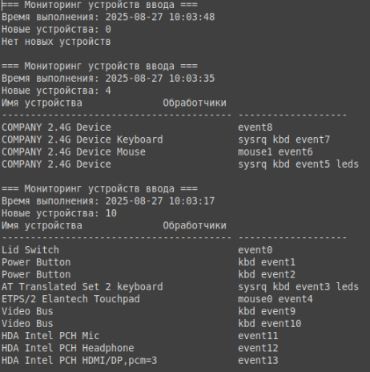

### 2.4 Создайте сценарий для «планировщика заданий» (например cron,acron) для опроса  каждые 1 минуту директории на предмет новых процессов

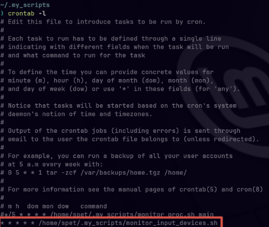
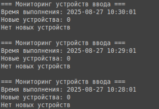


