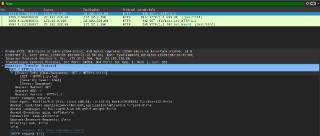
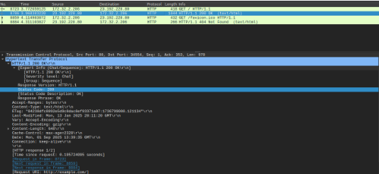
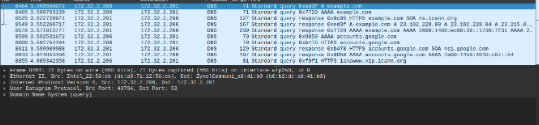
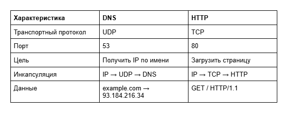

# Домашнее задание к занятию  «Теоретические основы сети. Модель OSI и TCP/IP» - Спетницкий Д.И.

## Задание 1
 Анализ захвата трафика

Описание задания Вам поставили задачу проанализировать результаты захвата трафика сетевого интерфейса. Это базовый навык при работе с сетью. В будущем он пригодится вам для того, чтобы выявлять источники проблем в сети и проверять проблемы безопасности (траблшутинг).

Требования к результату
Вы должны отправить скриншоты захваченного пакета. Пример вы найдёте по ссылке.
К скриншотам необходимо приложить комментарии с информацией, какие протоколы и уровни модели OSI вы обнаружили.
Процесс выполнения
Откройте Wireshark.
Запустите захват трафика с сетевого интерфейса.
Запустите браузер и зайдите на любой сайт.
Выберите какой-нибудь пакет из захваченного трафика.
Посмотрите разные уровни и разверните параметры при необходимости.
Напишите, какие протоколы и уровни модели OSI вы видите.

---

## Решение 1

На скриншоте показан процесс захвата HTTP-трафика при переходе на сайт http://example.com.

Обнаруженные протоколы и уровни модели OSI:

- Физический уровень (L1): Frame — фрейм переданный по интерфейсу wlp2s0

- Канальный уровень (L2): Ethernet II — MAC-адреса:
Источник: Intel_22:56:eb (клиент),
Назначение: ZyxelCommuni_a8:41:b0 (роутер).

- Сетевой уровень (L3): IPv4 — IP-адреса:
Источник: 172.32.2.206 (клиент),
Назначение: 23.192.228.80 (сервер example.com).

- Транспортный уровень (L4): TCP — порты:
Исходный: 34554 (случайный),
Целевой: 80 (HTTP).
Установлено соединение через трехэтапное рукопожатие.

- Прикладной уровень (L7): HTTP —
Метод: GET,

URI: /,

Версия: HTTP/1.1,

Заголовки:

Host: example.com,

User-Agent: Mozilla/5.0 (X11; Linux x86_64; rv:142.0) Gecko/20100101 Firefox/142.0,

Accept: text/html,

Connection: keep-alive.

Вывод: трафик захвачен корректно, все уровни OSI прослеживаются, нет ошибок. Ответ сервера 200 OK подтверждает успешную загрузку страницы. 

На скриншоте показан ответ сервера на HTTP-запрос к сайту http://example.com.

Обнаруженные протоколы и уровни модели OSI:

- Физический уровень (L1): Frame — фрейм данных размером 1044 байта.

- Канальный уровень (L2): Ethernet II — MAC-адреса:
Источник: ZyxelCommuni_a8:41:b0 (роутер),
Назначение: Intel_22:56:eb (клиент).

- Сетевой уровень (L3): IPv4 — IP-адреса:
Источник: 23.192.228.80 (сервер example.com),
Назначение: 172.32.2.206 (клиент).

- Транспортный уровень (L4): TCP — порты:
Исходный: 80 (HTTP),
Целевой: 34554 (клиент).
Соединение активно (keep-alive).

- Прикладной уровень (L7): HTTP —
Статус: HTTP/1.1 200 OK,
Тип контента: text/html,
Размер: Content-Length: 649 байт,
Кэширование: Cache-Control: max-age=2328,
Дата: Mon, 01 Sep 2025 13:39:35 GMT.

Вывод: сервер успешно отвечает на запрос, передавая HTML-страницу. Все уровни OSI прослеживаются, нет ошибок. Это подтверждает корректную работу HTTP-соединения. 

---

## Задание 2
Инкапсуляция данных

Описание задания Вам поставили задачу найти различия в инкапсуляции данных разных протоколов и технологий. Это также базовый навык при работе с сетью. Вы сможете понимать, как одни приложения и технологии зависят от других протоколов и приложений. Это позволит эффективнее решать сетевые проблемы.

Требования к результату
- Вы должны отправить скриншоты захваченных пакетов.
- В комментариях к скриншоту необходимо указать, чем они различаются по уровням модели OSI.
Процесс выполнения
- Откройте Wireshark.
- Запустите захват трафика с сетевого интерфейса.
- Запустите браузер и зайдите на любой сайт.
- Сначала установите фильтр захваченного трафика по технологии DNS, затем выберите любой HTTP-поток.
- Сравните пакеты между собой. В чём отличия с точки зрения модели OSI?

---

## Решение 2

На скриншоте показан DNS-запрос к домену example.com.

Обнаруженные протоколы и уровни модели OSI:

Физический уровень (L1): Frame — фрейм данных размером 71 байт.

Канальный уровень (L2): Ethernet II — MAC-адреса отправителя (Intel_22:56:eb) и получателя (ZyxelCommuni_a8:41:b0).

Сетевой уровень (L3): IPv4 — IP-адреса клиента (172.32.2.206) и DNS-сервера (172.32.2.201).

Транспортный уровень (L4): UDP — порт 53 (стандартный для DNS). Это позволяет быстро отправить короткий запрос без установки соединения.

Прикладной уровень (L7): DNS — запрос типа AAAA (IPv6) для домена example.com.

Вывод: DNS использует UDP, так как он не требует надёжной доставки — достаточно одного ответа. Это отличается от HTTP, который использует TCP для передачи больших объёмов данных. 

---