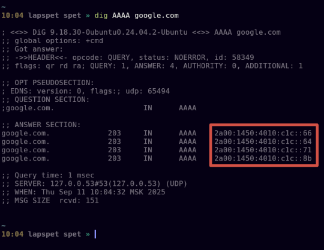

# Домашнее задание к занятию  «Сеть и сетевые протоколы: IPv6» - Спетницкий Д.И.

## Задание 1
Какая нотация используется для записи IPv6-адресов:

какие и сколько символов?
какие разделители?
Приведите ответ в свободной форме.
---
## Решение 1

IPv6-адреса пишутся в шестнадцатеричной системе, то есть используются цифры от 0 до 9 и буквы от A до F (всего 16 символов). Буквы можно писать и в нижнем, и в верхнем регистре без разницы.

Адрес состоит из 8 групп по 4 символа и между группами ставится двоеточие  :.
Например: 2001:0db8:85a3:0000:0000:8a2e:0370:7334

Ещё есть упрощённая запись если в адресе идут подряд нули (например 0000:0000), их можно заменить на два двоеточия подряд ::, но только один раз в адресе, чтобы не было путаницы.

---
## Задание 2
Какой адрес используется в IPv6 как loopback?

Приведите ответ в свободной форме.

---
## Решение 2

В IPv6 адрес для loopback это просто ::1. Это как 127.0.0.1 но только для IPv6. Если написать ping ::1 и получаем ответ, значит IPv6 на машине работает.
::1 используется, потому что полный адрес нули и в конце единица, можно сократить нули до ::

---
## Задание 3
Что такое Unicast, Multicast, Anycast адреса?

Приведите ответ в свободной форме.

---
## Решение 3

Unicast — это когда пакет идёт строго одному получателю. 

Multicast — это рассылка сразу группе. Не всем подряд, а только тем кто входит в нужную группу. Экономит трафик, потому что пакет один, а получают его много.

Anycast — это особый тип адреса, который используется для маршрутизации пакетов к ближайшему устройству из группы устройств с одинаковым адресом anycast. 

Unicast — один получатель  
Multicast — группа получателей  
Anycast — любой из нескольких, но ближайший

---

## Задание 4
Используя любую консольную утилиту в Linux, получите IPv6-адрес для какого либо ресурса.

В качестве ответа приложите скриншот выполнения команды.

---

## Решение 4

---
## Задание 5
Как выглядят IPv6-адреса, которые маршрутизируются в интернете?
Как выглядят локальные IPv6 адреса?
Приведите ответ в свободной форме.

---

## Решение 5

IPv6-адреса бывают "для интернета" и "для дома" как публичные и частные в IPv4.

Адреса, которые ходят в интернете это Global Unicast. 
Они начинаются обычно с 2 или 3  например: 2a00:1450:4010:c1c::66
Такие адреса уникальны во всём мире, их можно пинговать из любой точки, и они реально маршрутизируются через интернет.

Локальные адреса это типа "домашние", их снаружи не видно.  

Они бывают двух видов:

1. Link-local начинаются с fe80::  
Такие адреса работают только в пределах одной сети например, между ноутом и роутером. Их не пускают дальше, маршрутизаторы их не пересылают.  
Пример: fe80::1 или fe80::a1b2:c3d4:e5f6:7890.

2. Unique Local Address (ULA) начинаются с fd (реже fc). Это как приватные адреса в IPv4. Их можно использовать внутри компании или дома, и они не должны вылезать в интернет.  
Пример: fd00:1234:5678::1

---

