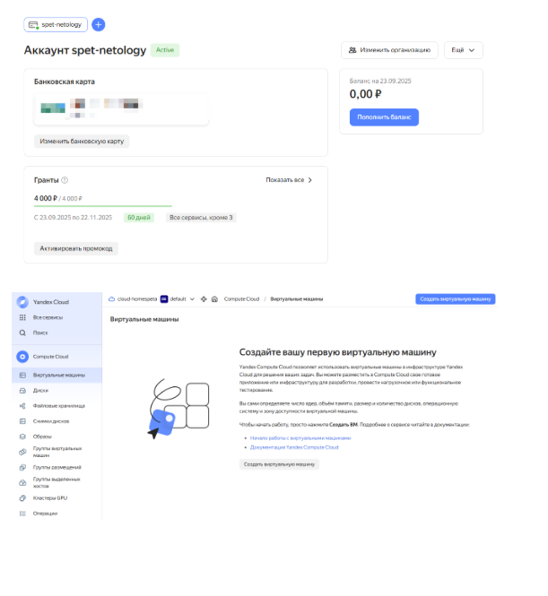
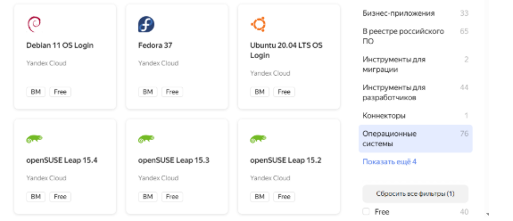
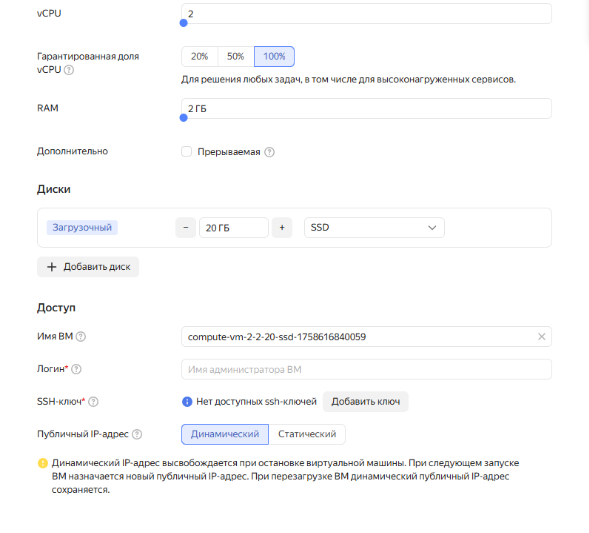
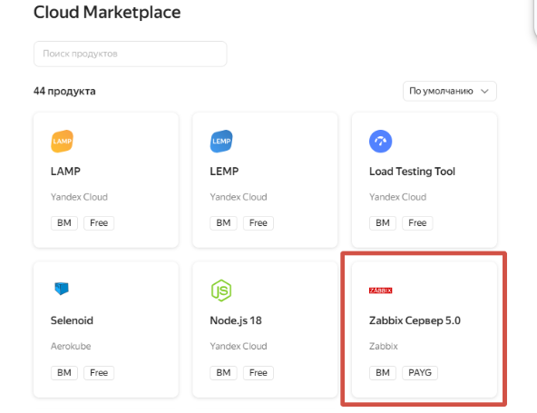
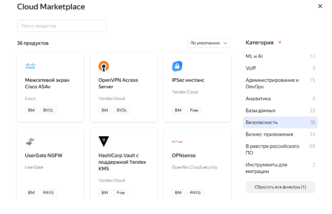
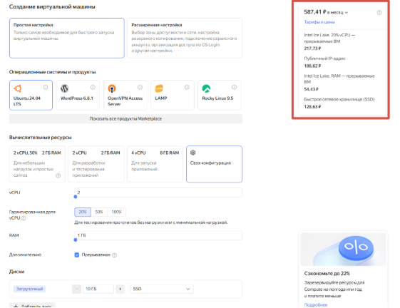
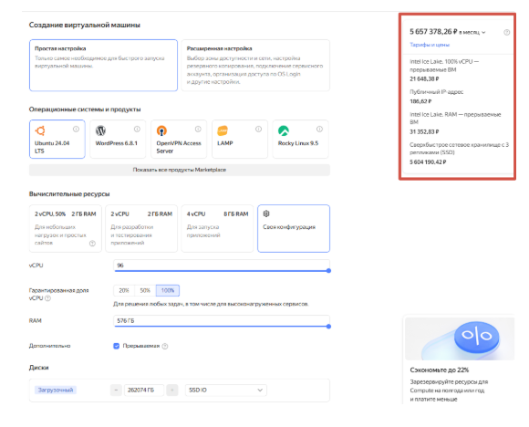
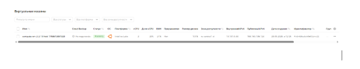
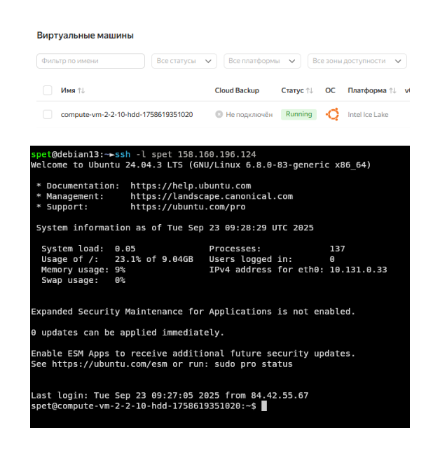

# Домашнее задание к занятию  «Виртуализация и облачные решения. AWS, GCP, Openstack» - Спетницкий Д.И.

## Задание 1

Ответьте на вопрос в свободной форме.

Чем частное облако отличается от общедоступного, публичного и гибридного?

---

## Решение 1
Основное различие между типами облаков заключается в уровнях доступа и круге пользователей. Частное облако предназначено исключительно для определённой группы аутентифицированных пользователей, доступ для всех остальных закрыт. Публичное облако, напротив, открыто для любого пользователя, доступ предоставляется всем желающим. Общественное (или общедоступное) облако используется несколькими организациями, объединёнными общими целями или интересами, например, научными, военными или отраслевыми. Гибридное облако сочетает в себе элементы двух или более моделей,позволяя гибко распределять нагрузку и данные в зависимости от требований безопасности, производительности и стоимости.

---

## Задание 2
Что обозначают: IaaS, PaaS, SaaS, CaaS, DRaaS, BaaS, DBaaS, MaaS, DaaS, NaaS, STaaS? Напишите примеры их использования.

---

## Решение 2
IaaS — Infrastructure as a Service (Инфраструктура как услуга)
Предоставление базовых вычислительных ресурсов: виртуальные серверы, хранилища, сети, ОС.
Пример: Аренда виртуальных машин в AWS EC2 или Microsoft Azure для развёртывания собственных приложений.

PaaS — Platform as a Service (Платформа как услуга)
Готовая среда для разработки, тестирования и запуска приложений  без необходимости управления инфраструктурой.
Пример: Использование Google App Engine или Heroku для развёртывания веб-приложений; платформы для машинного обучения, как Azure ML.

SaaS — Software as a Service (Программное обеспечение как услуга)
Готовые приложения, доступные через интернет, полностью обслуживаемые провайдером.
Пример: Gmail, Яндекс.Почта, облачная 1С, Salesforce, Microsoft 365.

CaaS — Communications as a Service (Коммуникации как услуга)
Облачные решения для корпоративных коммуникаций: VoIP, видеоконференции, мессенджеры, совместная работа.
Пример: Zoom, Microsoft Teams, Cisco Webex  как сервисы, предоставляемые по подписке.

DRaaS — Disaster Recovery as a Service (Восстановление после сбоев как услуга)
Резервное копирование и быстрое восстановление ИТ-инфраструктуры в случае аварии или катастрофы.
Пример: Репликация серверов в облако VMware Cloud DR или Azure Site Recovery для минимизации простоев.

BaaS — Backend as a Service / Backup as a Service / Banking as a Service
Многозначная аббревиатура:

Backend as a Service — облачный бэкенд для мобильных и веб-приложений (авторизация, базы данных, push-уведомления).
Пример: Firebase, Back4App  для ускорения разработки мобильных приложений.

Backup as a Service — резервное копирование данных в облаке.
Пример: Acronis Cyber Backup, Veeam Cloud Connect  для автоматического бэкапа корпоративных данных.

Banking as a Service — аренда банковской инфраструктуры для интеграции финансовых сервисов в сторонние приложения.
Пример: Stripe, Тинькофф API  для встраивания платежей в ERP-системы или мобильные приложения.

DBaaS — Database as a Service (База данных как услуга)
Управляемые облачные СУБД, доступные по подписке.
Пример: Amazon RDS, Google Cloud SQL, Yandex Managed PostgreSQL  для хранения и обработки данных без администрирования серверов.

MaaS — Monitoring as a Service (Мониторинг как услуга)
Облачные системы для постоянного наблюдения за ИТ-инфраструктурой, приложениями и производительностью.
Пример: Datadog, Zabbix Cloud, Prometheus + Grafana в облаке  для отслеживания состояния серверов и сервисов.

DaaS — Desktop as a Service (Рабочий стол как услуга)
Виртуальные рабочие столы, доступные из любого устройства через интернет.
Пример: Windows 365, Amazon WorkSpaces  для удалённой работы сотрудников с полным доступом к ПО и данным.

NaaS — Network as a Service (Сеть как услуга)
Облачные сетевые сервисы: виртуальные WAN, безопасные подключения, управление пропускной способностью.
Пример: Cisco+ Meraki, VMware SD-WAN, AWS Direct Connect  для построения гибкой и безопасной корпоративной сети без физической инфраструктуры.

STaaS — Storage as a Service (Хранение как услуга)
Облачные хранилища для файлов, архивов, резервных копий  масштабируемые и доступные из любого места.
Пример: Google Drive, Dropbox Business, AWS S3  как внешний диск для пользователей или корпоративное хранилище для больших данных.

---

## Задание 3

Ответьте на вопрос в свободной форме.

Напишите, какой вид сервиса предоставляется пользователю в ситуациях:

1. Всеми процессами управляет провайдер.
2. Вы управляете приложением и данными, остальным управляет провайдер.
3. Вы управляете операционной системой, средой исполнения, данными, приложениями, остальными управляет провайдер.
4. Вы управляете сетью, хранилищами, серверами, виртуализацией, операционной системой, средой исполнения, данными, приложениями.

---

## Решение 3

1. SaaS
2. PaaS
3. IAAS	
4. On-prem / Colocation

---

## Задание 4

зайти в консоль;
выбрать меню биллинг;
зарегистрировать аккаунт.
После регистрации выбрать меню в консоли Computer cloud.
Приступить к созданию виртуальной машины.
Ответьте на вопросы в свободной форме:

1. Какие ОС можно выбрать?
2. Какие параметры сервера можно выбрать?
3. Какие компоненты мониторинга можно создать?
4. Какие системы безопасности предусмотрены?
5. Как меняется цена от выбранных характеристик? Приведите пример самой дорогой и самой дешёвой конфигурации.

---

## Решение 4

1. Можно выбрать любую из 76 представленных операционных систем 

2. Можно выбрать vCPU, RAM, диски, сетевые настройки

3. Можно создать Zabbix Сервер 

4. В разделе безопасность можно выбрать до 36 необходимых компонентов. Например такие как межсетевой экран и антивирус

5. (1)  Дешевый 

5. (2) Дорогой

## Задание 5*

Выполните действия и приложите скриншот:

- Создайте виртуальную машину на Yandex Cloud.
- Создайте сервисный аккаунт.
- Отсканируйте SSH-ключ.
- Придумайте логин.
- Подключитесь к облаку через SSH.

---

## Решение 5*

---

