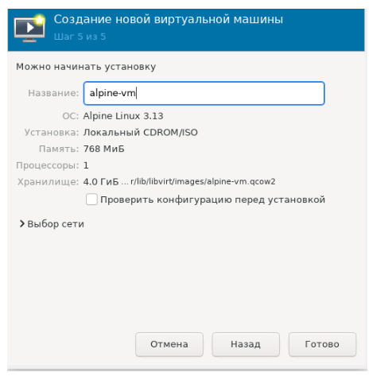
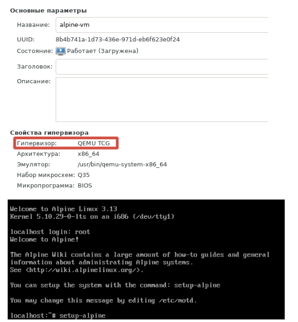
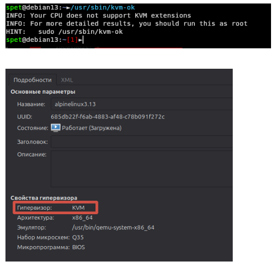

# Домашнее задание к занятию  «Типы виртуализаций KVM, QEMU» - Спетницкий Д.И.

## Задание 1
Выполните действия и приложите скриншоты по каждому этапу:

- Установите QEMU в зависимости от системы.
- Создайте виртуальную машину.
- Установите виртуальную машину. Можете использовать пример по ссылке. Пример взят с сайта.
- Если KVM уже установлен, создайте ВМ без использования аппаратной виртуализации.
- В случае использования virt-install используйте параметр --virt-type=qemu.

---

## Решение 1

---

## Задание 2

Выполните действия и приложите скриншоты по каждому этапу:

- Установите KVM и библиотеку libvirt.
- Создайте виртуальную машину.
- Установите виртуальную машину. Можете использовать пример по ссылке. Пример взят с сайта.
- В случае использования virt-install используйте параметр --virt-type=kvm.

---

## Решение 2

---

## Задание 3
Напишите, как изменилось время установки и старта системы при аппаратной виртуализации (KVM) по сравнению с программной эмуляцией (QEMU).

---

## Решение 3
С KVM быстрее в разы получается 

Без KVM (--virt-type=qemu) QEMU эмулирует каждый инструкт процессора

С KVM (--virt-type=kvm):
Процессор сам "делает" виртуализацию QEMU только управляет виртуальной машиной

---