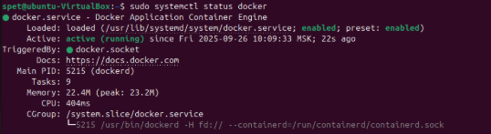
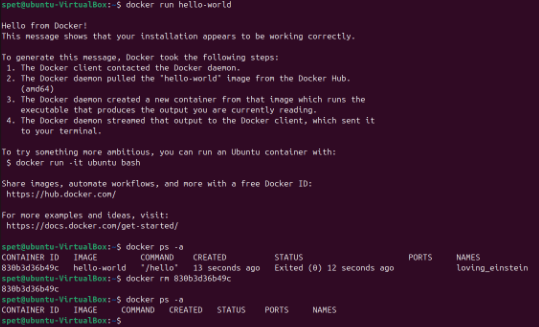
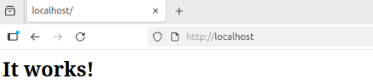
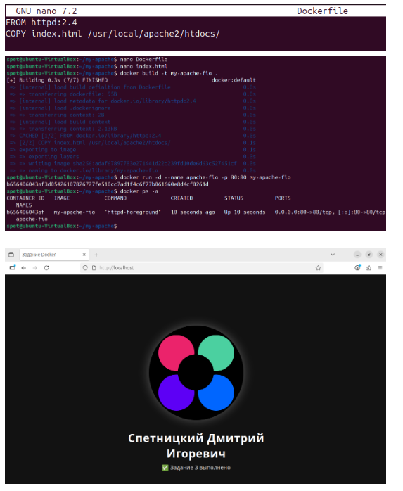

# Домашнее задание к занятию  «Типы виртуализаций KVM, QEMU» - Спетницкий Д.И.


## Задание 1
- Установите Docker.
- Выполните: инструкцию linux post install
- Запустите образ hello-world без использования sudo(см п2).
- Удалите ваш контейнер с hello-world.


---

## Решение 1
```
# Add Docker's official GPG key:
sudo apt-get update
sudo apt-get install ca-certificates curl
sudo install -m 0755 -d /etc/apt/keyrings
sudo curl -fsSL https://download.docker.com/linux/ubuntu/gpg -o /etc/apt/keyrings/docker.asc
sudo chmod a+r /etc/apt/keyrings/docker.asc

# Add the repository to Apt sources:
echo \
  "deb [arch=$(dpkg --print-architecture) signed-by=/etc/apt/keyrings/docker.asc] https://download.docker.com/linux/ubuntu \
  $(. /etc/os-release && echo "${UBUNTU_CODENAME:-$VERSION_CODENAME}") stable" | \
  sudo tee /etc/apt/sources.list.d/docker.list > /dev/null
sudo apt-get update

sudo apt-get install docker-ce docker-ce-cli containerd.io docker-buildx-plugin docker-compose-plugin
```






---

## Задание 2
Найдите в Docker Hub образ Apache(httpd) и запустите его на 80 порту вашей ВМ.
Откройте страницу http://localhost и убедитесь, что видите приветственную страницу Apache.


---

## Решение 2
```
nano Dockerfile
```
FROM httpd:2.4
_________________________________________________________________________
```
docker build -t my-apache .
docker run -d --name my-web -p 80:80 my-apache
```


---

## Задание 3

Создайте свой Docker образ с Apache и подмените стандартную страницу index.html на страницу, содержащую ваши ФИО.
Запустите ваш образ, откройте страницу http://localhost и убедитесь, что страница изменилась.


---

## Решение 3



---