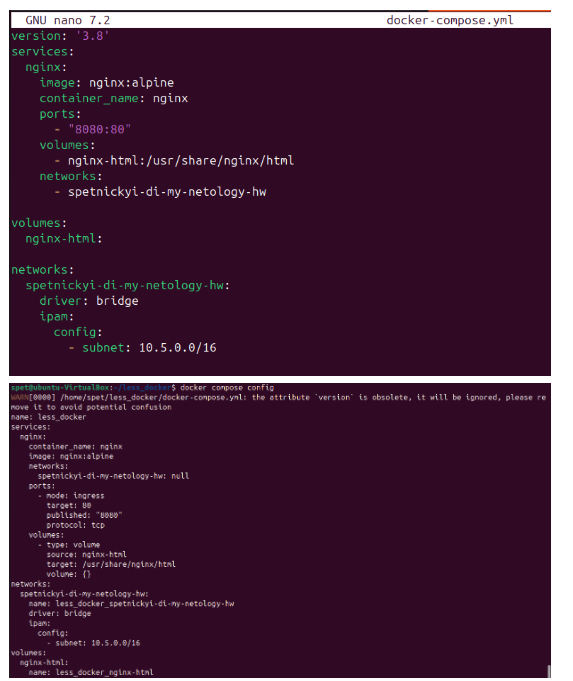
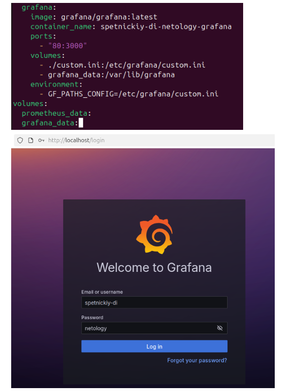
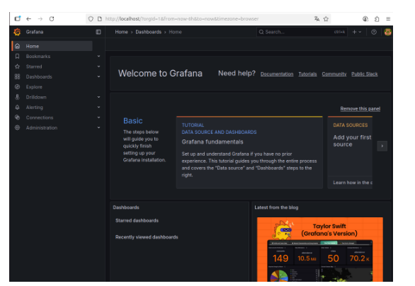
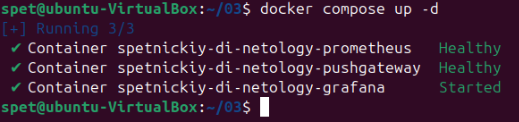
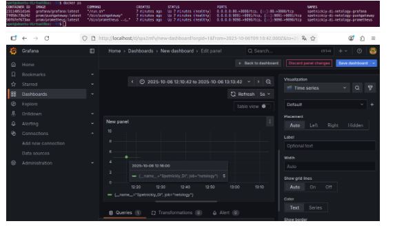
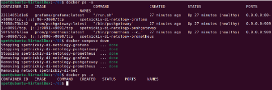

# Домашнее задание к занятию  «Docker. Часть 2» - Спетницкий Д.И.


## Задание 1
Напишите ответ в свободной форме, не больше одного абзаца текста.

Установите Docker Compose и опишите, для чего он нужен и как может улучшить лично вашу жизнь.


---

## Решение 1


Docker Compose — это инструмент для определения и запуска многоконтейнерных приложений Docker с помощью одного YAML-файла, в котором описываются сервисы, сети и тома. Он упрощает управление сложными приложениями, позволяя одним командой docker-compose up запускать всю инфраструктуру — например, веб-сервер, базу данных и кэш.
На данном жизненном этапе Docker Compose лично мою жизнь не улучшает, так как я пока не занимаюсь разработкой или развёртыванием многокомпонентных приложений, где требовалась бы автоматизация запуска нескольких связанных контейнеров. Однако я понимаю его ценность для будущих задач и проектов, где он сможет значительно упростить настройку и управление окружением.


---

## Задание 2
Выполните действия и приложите текст конфига на этом этапе.

Создайте файл docker-compose.yml и внесите туда первичные настройки:

- version;
- services;
- volumes;
- networks.
При выполнении задания используйте подсеть 10.5.0.0/16. Ваша подсеть должна называться: <ваши фамилия и инициалы>-my-netology-hw. Все приложения из последующих заданий должны находиться в этой конфигурации.


---

## Решение 2




---

## Задание 3

Выполните действия:

- Создайте конфигурацию docker-compose для Prometheus с именем контейнера <ваши фамилия и инициалы>-netology-prometheus.
- Добавьте необходимые тома с данными и конфигурацией (конфигурация лежит в репозитории в директории 6-04/prometheus ).
- Обеспечьте внешний доступ к порту 9090 c докер-сервера.


---

## Решение 3


---

## Задание 4
Выполните действия:

- Создайте конфигурацию docker-compose для Pushgateway с именем контейнера <ваши фамилия и инициалы>-netology-pushgateway.
- Обеспечьте внешний доступ к порту 9091 c докер-сервера.


---

## Решение 4


---

## Задание 5

Выполните действия:

- Создайте конфигурацию docker-compose для Grafana с именем контейнера <ваши фамилия и инициалы>-netology-grafana.
- Добавьте необходимые тома с данными и конфигурацией (конфигурация лежит в репозитории в директории 6-04/grafana.
- Добавьте переменную окружения с путем до файла с кастомными настройками (должен быть в томе), в самом файле пропишите логин=<ваши фамилия и инициалы> пароль=netology.
- Обеспечьте внешний доступ к порту 3000 c порта 80 докер-сервера.


---

## Решение 5





---

## Задание 6

Выполните действия.

- Настройте поочередность запуска контейнеров.
- Настройте режимы перезапуска для контейнеров.
- Настройте использование контейнерами одной сети.
- Запустите сценарий в detached режиме.


---

## Решение 6

```
services:
  prometheus:
    image: prom/prometheus:latest
    container_name: spetnickiy-di-netology-prometheus
    ports:
      - "9090:9090"
    volumes:
      - ./prometheus.yml:/etc/prometheus/prometheus.yml
      - prometheus_data:/prometheus
    restart: unless-stopped
    healthcheck:
      test: ["CMD-SHELL", "wget --no-verbose --tries=1 --spider http://localhost:9090/-/healthy || exit 1"]
      interval: 10s
      timeout: 5s
      retries: 3
      start_period: 10s

  pushgateway:
    image: prom/pushgateway:latest
    container_name: spetnickiy-di-netology-pushgateway
    ports:
      - "9091:9091"
    restart: unless-stopped
    depends_on:
      prometheus:
        condition: service_healthy
    healthcheck:
      test: ["CMD-SHELL", "wget --no-verbose --tries=1 --spider http://localhost:9091/-/healthy || exit 1"]
      interval: 10s
      timeout: 5s
      retries: 3
      start_period: 10s

  grafana:
    image: grafana/grafana:latest
    container_name: spetnickiy-di-netology-grafana
    ports:
      - "80:3000"
    volumes:
      - ./custom.ini:/etc/grafana/custom.ini
      - grafana_data:/var/lib/grafana
    environment:
      - GF_PATHS_CONFIG=/etc/grafana/custom.ini
    restart: unless-stopped
    depends_on:
      prometheus:
        condition: service_healthy
      pushgateway:
        condition: service_healthy
    healthcheck:
      test: ["CMD-SHELL", "wget --no-verbose --tries=1 --spider http://localhost:3000/api/health || exit 1"]
      interval: 15s
      timeout: 10s
      retries: 5
      start_period: 30s

networks:
  default:
    name: spetnickiy-di-net

volumes:
  prometheus_data:
  grafana_data:
```


---

## Задание 7

Выполните действия.

- Выполните запрос в Pushgateway для помещения метрики <ваши фамилия и инициалы> со значением 5 в Prometheus: echo "<ваши фамилия и инициалы> 5" | curl --data-binary @- http://localhost:9091/metrics/job/netology.
- Залогиньтесь в Grafana с помощью логина и пароля из предыдущего задания.
- Cоздайте Data Source Prometheus (Home -> Connections -> Data sources -> Add data source -> Prometheus -> указать "Prometheus server URL = http://prometheus:9090" -> Save & Test).
- Создайте график на основе добавленной в пункте 5 метрики (Build a dashboard -> Add visualization -> Prometheus -> Select metric -> Metric explorer -> <ваши фамилия и инициалы -> Apply.
В качестве решения приложите:

- docker-compose.yml целиком;
- скриншот команды docker ps после запуске docker-compose.yml;
- скриншот графика, постоенного на основе вашей метрики.


---

## Решение 7
```
services:
  prometheus:
    image: prom/prometheus:latest
    container_name: spetnickiy-di-netology-prometheus
    ports:
      - "9090:9090"
    volumes:
      - ./prometheus.yml:/etc/prometheus/prometheus.yml
      - prometheus_data:/prometheus
    restart: unless-stopped
    healthcheck:
      test: ["CMD-SHELL", "wget --no-verbose --tries=1 --spider http://localhost:9090/-/healthy || exit 1"]
      interval: 10s
      timeout: 5s
      retries: 3
      start_period: 10s

  pushgateway:
    image: prom/pushgateway:latest
    container_name: spetnickiy-di-netology-pushgateway
    ports:
      - "9091:9091"
    restart: unless-stopped
    depends_on:
      prometheus:
        condition: service_healthy
    healthcheck:
      test: ["CMD-SHELL", "wget --no-verbose --tries=1 --spider http://localhost:9091/-/healthy || exit 1"]
      interval: 10s
      timeout: 5s
      retries: 3
      start_period: 10s

  grafana:
    image: grafana/grafana:latest
    container_name: spetnickiy-di-netology-grafana
    ports:
      - "80:3000"
    volumes:
      - ./custom.ini:/etc/grafana/custom.ini
      - grafana_data:/var/lib/grafana
    environment:
      - GF_PATHS_CONFIG=/etc/grafana/custom.ini
    restart: unless-stopped
    depends_on:
      prometheus:
        condition: service_healthy
      pushgateway:
        condition: service_healthy
    healthcheck:
      test: ["CMD-SHELL", "wget --no-verbose --tries=1 --spider http://localhost:3000/api/health || exit 1"]
      interval: 15s
      timeout: 10s
      retries: 5
      start_period: 30s

networks:
  default:
    name: spetnickiy-di-net
```


---

## Задание 8
Выполните действия:

- Остановите и удалите все контейнеры одной командой.
- В качестве решения приложите скриншот консоли с проделанными действиями.


---

## Решение 8



---
