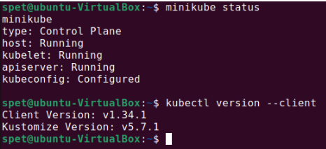
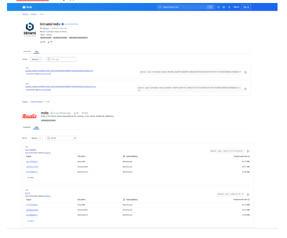
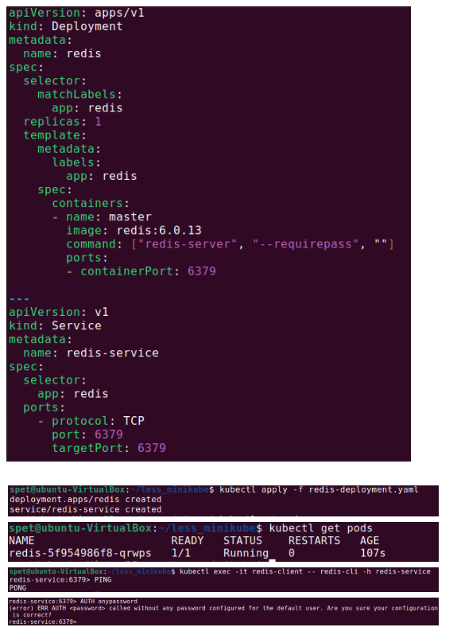
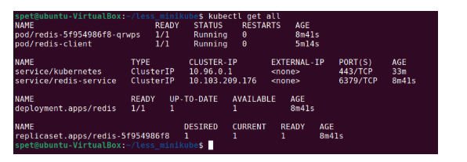
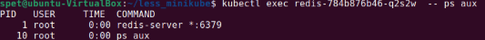
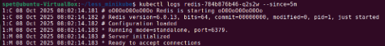
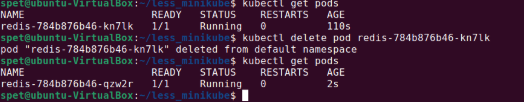
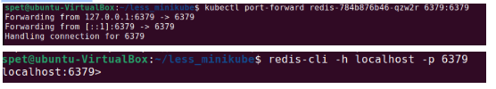
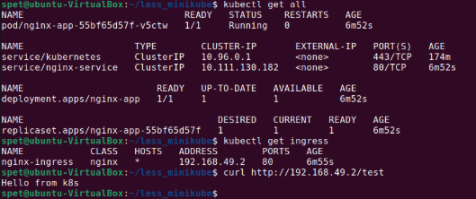

# Домашнее задание к занятию  «Kubernetes» - Спетницкий Д.И.


## Задание 1
Выполните действия:

- Запустите Kubernetes локально, используя k3s или minikube на свой выбор.
- Добейтесь стабильной работы всех системных контейнеров.


---

## Решение 1



---

## Задание 2

Есть файл с деплоем:
```
apiVersion: apps/v1
kind: Deployment
metadata:
  name: redis
spec:
  selector:
    matchLabels:
      app: redis
  replicas: 1
  template:
    metadata:
      labels:
        app: redis
    spec:
      containers:
      - name: master
        image: bitnami/redis
        env:
         - name: REDIS_PASSWORD
           value: password123
        ports:
        - containerPort: 6379

```

Выполните действия:

- Измените файл с учётом условий:
- redis должен запускаться без пароля;
- создайте Service, который будет направлять трафик на этот Deployment;
- версия образа redis должна быть зафиксирована на 6.0.13.
- Запустите Deployment в своём кластере и добейтесь его стабильной работы.


---

## Решение 2
На DockerHub нет редиса с тегом 6.0.13

Поэтому использовался образ от самого редис 





---

## Задание 3

Выполните действия:

- Напишите команды kubectl для контейнера из предыдущего задания:
- выполнения команды ps aux внутри контейнера;
- просмотра логов контейнера за последние 5 минут;
- удаления контейнера;
- проброса порта локальной машины в контейнер для отладки.


---

## Решение 3
Переставил все на redis:6.0.13-alpine, потому что в стандартном 6.0.13 не было команды ps.



#### Логи:



#### Удаляем контейнер Deployment сразу создает новый:



#### Проброс порта:



---

## Задание 4

Есть конфигурация nginx:
```
location / {
    add_header Content-Type text/plain;
    return 200 'Hello from k8s';
}
```
Выполните действия:

- Напишите yaml-файлы для развёртки nginx, в которых будут присутствовать:

- - ConfigMap с конфигом nginx;
- - Deployment, который бы подключал этот configmap;
- - Ingress, который будет направлять запросы по префиксу /test на наш сервис.


---

## Решение 4
```
apiVersion: v1
kind: ConfigMap
metadata:
  name: nginx-config
data:
  default.conf: |
    server {
        listen 80;
        location / {
            add_header Content-Type text/plain;
            return 200 'Hello from k8s\n';
        }
    }

---
apiVersion: apps/v1
kind: Deployment
metadata:
  name: nginx-app
spec:
  replicas: 1
  selector:
    matchLabels:
      app: nginx
  template:
    metadata:
      labels:
        app: nginx
    spec:
      containers:
      - name: nginx
        image: nginx:1.25
        ports:
        - containerPort: 80
        volumeMounts:
        - name: nginx-config-volume
          mountPath: /etc/nginx/conf.d
      volumes:
      - name: nginx-config-volume
        configMap:
          name: nginx-config

---
apiVersion: v1
kind: Service
metadata:
  name: nginx-service
spec:
  selector:
    app: nginx
  ports:
    - protocol: TCP
      port: 80
      targetPort: 80
  type: ClusterIP

---
apiVersion: networking.k8s.io/v1
kind: Ingress
metadata:
  name: nginx-ingress
spec:
  rules:
  - http:
      paths:
      - path: /test
        pathType: Prefix
        backend:
          service:
            name: nginx-service
            port:
              number: 80

```




---
