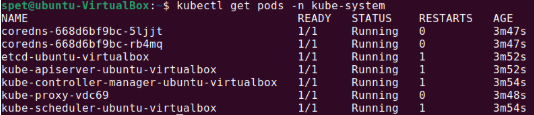
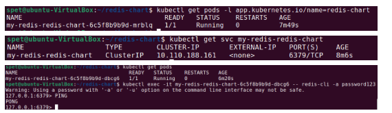

# Домашнее задание к занятию  «Kubernetes. Часть 2» - Спетницкий Д.И.


## Задание 1
Выполните действия:

- Создайте свой кластер с помощью kubeadm.
- Установите любой понравившийся CNI плагин.
- Добейтесь стабильной работы кластера.


---

## Решение 1



---

## Задание 2

Есть файл с деплоем:
```
---
apiVersion: apps/v1
kind: Deployment
metadata:
  name: redis
spec:
  selector:
    matchLabels:
      app: redis
  replicas: 1
  template:
    metadata:
      labels:
        app: redis
    spec:
      containers:
      - name: master
        image: bitnami/redis
        env:
         - name: REDIS_PASSWORD
           value: password123
        ports:
        - containerPort: 6379
```
Выполните действия:

- Создайте Helm Charts.
- Добавьте в него сервис.
- Вынесите все нужные, на ваш взгляд, параметры в values.yaml.
- Запустите чарт в своём кластере и добейтесь его стабильной работы.


---

## Решение 2



---
