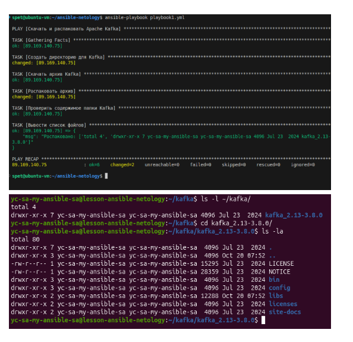
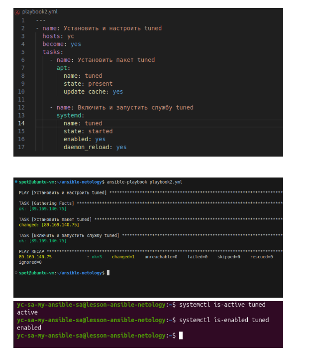
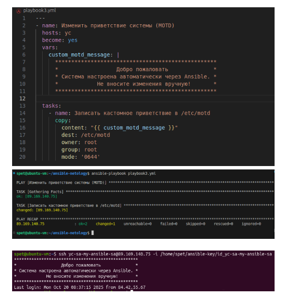
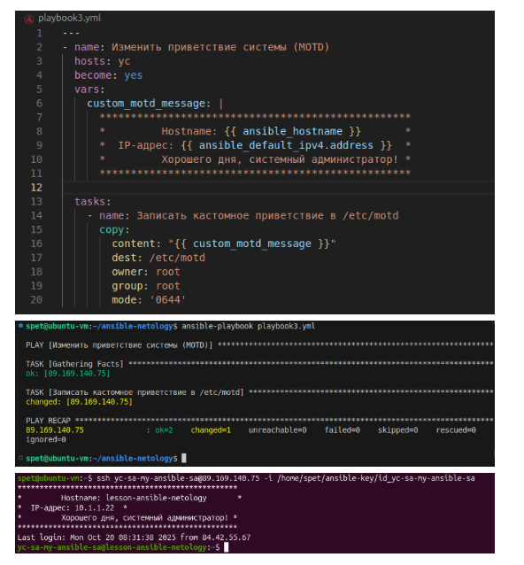
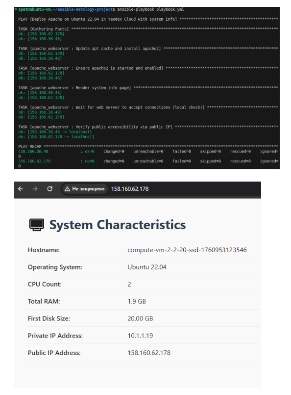
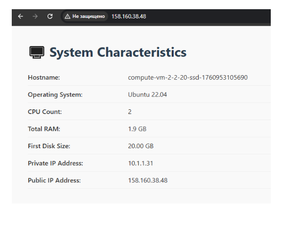

# Домашнее задание к занятию  «Ansible.Часть 2» - Спетницкий Д.И.

## Задание 1
Выполните действия, приложите файлы с плейбуками и вывод выполнения.

Напишите три плейбука. При написании рекомендуем использовать текстовый редактор с подсветкой синтаксиса YAML.

Плейбуки должны:

Скачать какой-либо архив, создать папку для распаковки и распаковать скаченный архив. Например, можете использовать официальный сайт и зеркало Apache Kafka. При этом можно скачать как исходный код, так и бинарные файлы, запакованные в архив — в нашем задании не принципиально.

Установить пакет tuned из стандартного репозитория вашей ОС. Запустить его, как демон — конфигурационный файл systemd появится автоматически при установке. Добавить tuned в автозагрузку.

Изменить приветствие системы (motd) при входе на любое другое. Пожалуйста, в этом задании используйте переменную для задания приветствия. Переменную можно задавать любым удобным способом.

---

## Решение 1
- [ansible.cfg](ansible.cfg)

- [inventory.ini](inventory.ini)

- [playbook1.yml](playbook1.yml)

---

## Задание 2
Выполните действия, приложите файлы с модифицированным плейбуком и вывод выполнения.

Модифицируйте плейбук из пункта 3, задания 1. В качестве приветствия он должен установить IP-адрес и hostname управляемого хоста, пожелание хорошего дня системному администратору.

---

## Решение 2

---

## Задание 3

Выполните действия, приложите архив с ролью и вывод выполнения.

Ознакомьтесь со статьёй «Ansible - это вам не bash», сделайте соответствующие выводы и не используйте модули shell или command при выполнении задания.

Создайте плейбук, который будет включать в себя одну, созданную вами роль. Роль должна:

Установить веб-сервер Apache на управляемые хосты.
Сконфигурировать файл index.html c выводом характеристик каждого компьютера как веб-страницу по умолчанию для Apache. Необходимо включить CPU, RAM, величину первого HDD, IP-адрес. Используйте Ansible facts и jinja2-template. Необходимо реализовать handler: перезапуск Apache только в случае изменения файла конфигурации Apache.
Открыть порт 80, если необходимо, запустить сервер и добавить его в автозагрузку.
Сделать проверку доступности веб-сайта (ответ 200, модуль uri).
В качестве решения:

- предоставьте плейбук, использующий роль;
- разместите архив созданной роли у себя на Google диске и приложите ссылку на роль в своём решении;
- предоставьте скриншоты выполнения плейбука;
- предоставьте скриншот браузера, отображающего сконфигурированный index.html в качестве сайта.

---

## Решение 3

- [playbook2.yml](playbook2.yml)

---

