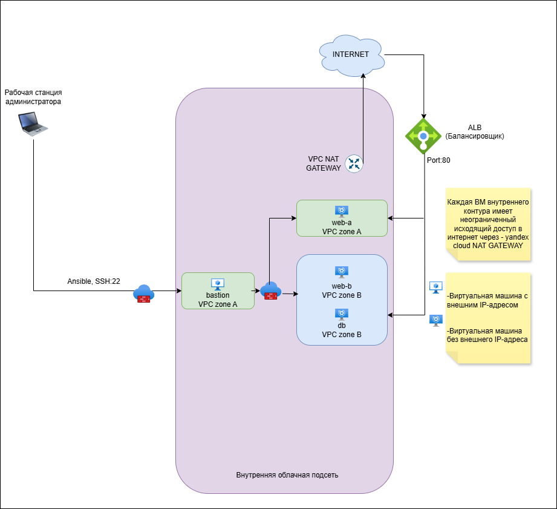
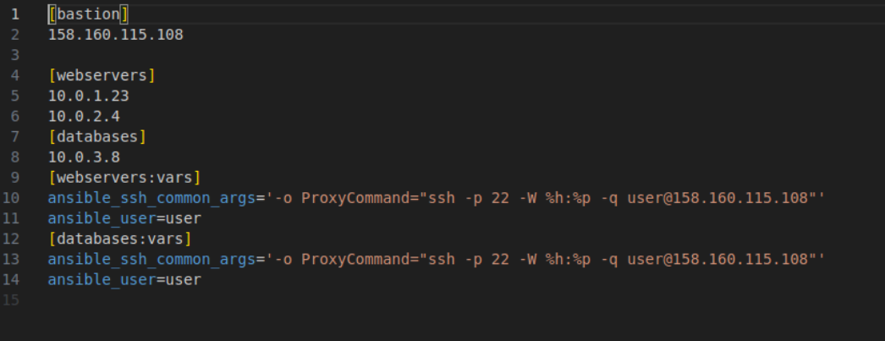
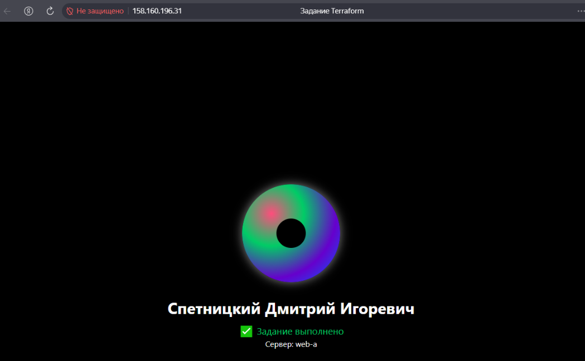
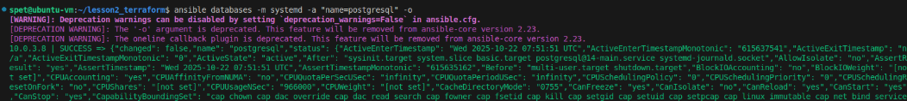

# Домашнее задание к занятию  «Подъем инфраструктуры в облаке» - Спетницкий Д.И.


## Задание 1
Повторить демонстрацию лекции(развернуть vpc, 2 веб сервера, бастион сервер)


## Задание 2

С помощью ansible подключиться к web-a и web-b , установить на них nginx.(написать нужный ansible playbook)


---

## Задание 3*

Выполните действия, приложите скриншот скриптов, скриншот выполненного проекта.

Добавить еще одну виртуальную машину.
Установить на нее любую базу данных.
Выполнить проверку состояния запущенных служб через Ansible.

---

## Решение 

- #### Итак, была проделана следующая работа

- #### Повторена демонстрация из вебинара, была создана еще одна ВМ с БД, был создан балансировщик ALB, для проверки работы nginx на машинах настроенных через Ansible.

---


# 🌐 Инфраструктура в Yandex Cloud с Terraform и Ansible
Данный проект демонстрирует развертывание отказоустойчивой веб-инфраструктуры в облаке Yandex Cloud с использованием Terraform и Ansible.

# 📌 Описание
На основе материалов вебинара была воссоздана базовая архитектура, а затем расширена для демонстрации более сложного сценария:

## Базовая часть (из вебинара):
- Создание облачной сети (VPC) с двумя подсетями в разных зонах доступности (ru-central1-a, ru-central1-b)
- Развертывание bastion-хоста для безопасного администрирования
- Запуск двух веб-серверов (web-a, web-b) в приватных подсетях
## Расширение:
- Добавлена отдельная подсеть и виртуальная машина для базы данных (PostgreSQL)
- Настроен Application Load Balancer (ALB) для распределения трафика между веб-серверами
- Реализованы два Ansible-плейбука:
  - playbook-web.yml — устанавливает nginx и разворачивает кастомную HTML-страницу с именем автора и указанием текущего сервера (web-a / web-b)
  - playbook-db.yml — устанавливает PostgreSQL и проверяет статус службы
# 🛠️ Используемые технологии
- Yandex Cloud — облачная платформа
- Terraform — управление инфраструктурой как кодом (IaC)
- Ansible — автоматизация конфигурации и развёртывания
- Ubuntu 22.04 LTS — операционная система на всех ВМ
- nginx — веб-сервер
- PostgreSQL — СУБД
# 🗂️ Структура проекта

```
├── alb.tf                 # Настройка Application Load Balancer
├── main.tf                # Описание ВМ (bastion, web-a, web-b, db)
├── network.tf             # VPC, подсети, NAT, Security Groups
├── outputs.tf             # Вывод публичных IP (ALB, bastion)
├── variables.tf           # Переменные Terraform
├── providers.tf           # Конфигурация провайдера Yandex Cloud
├── cloud-init.yml         # Базовая настройка ВМ при старте
├── ansible.cfg            # Конфигурация Ansible
├── playbook-web.yml       # Плейбук для веб-серверов
├── playbook-db.yml        # Плейбук для базы данных
└── files/
    └── index.html.j2      # Шаблон кастомной главной страницы
```
## 🖼️ Скриншоты

### Архитектурная диаграмма


### Ansible Inventory (hosts.ini)


### Application Load Balancer — сервер web-a


### Application Load Balancer — сервер web-b


### Проверка PostgreSQL
