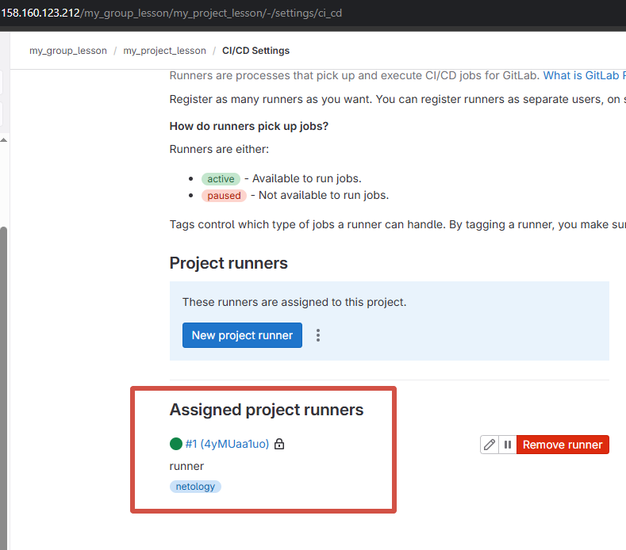
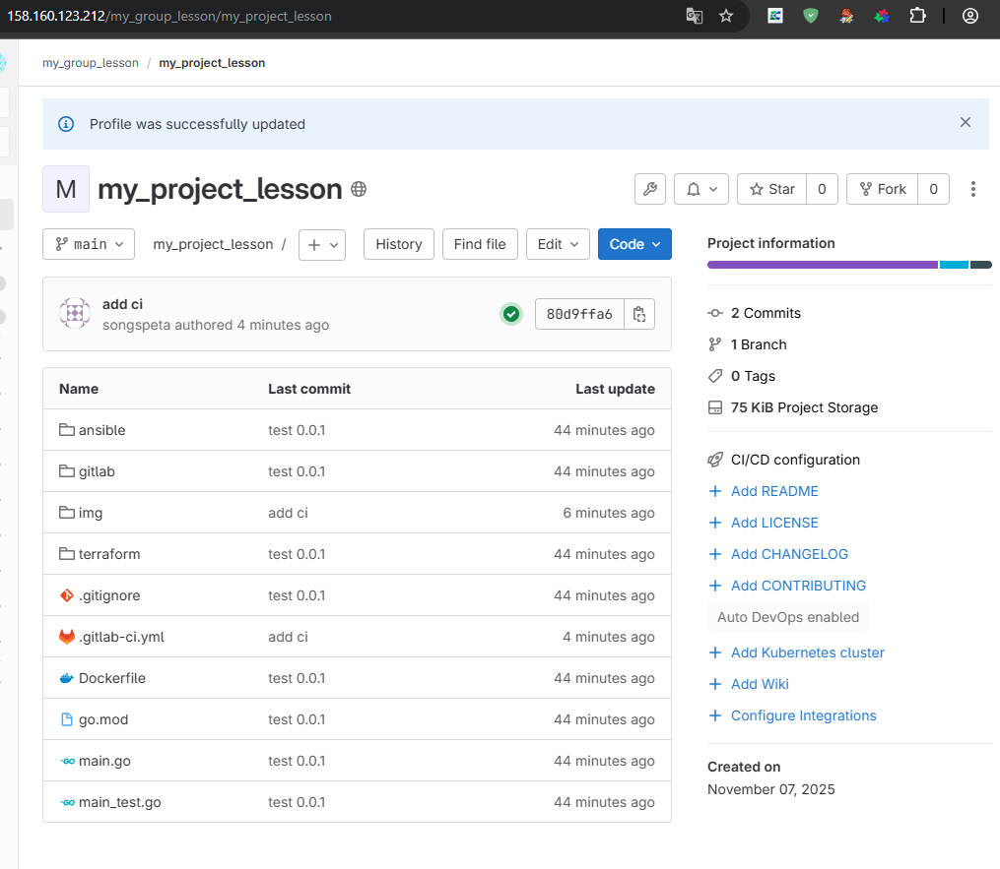
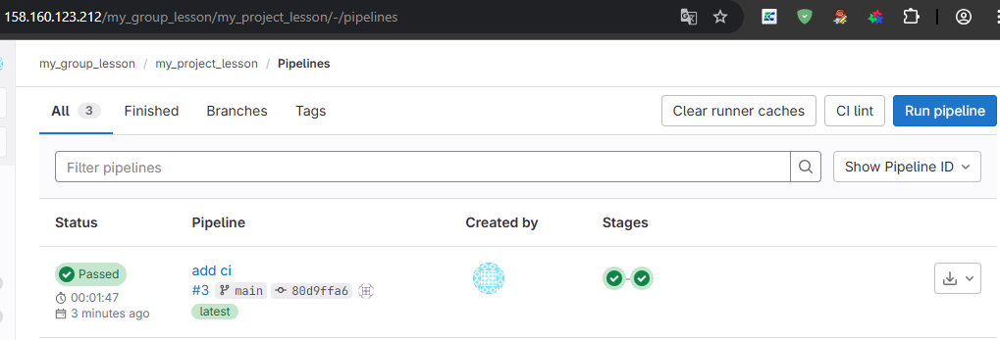
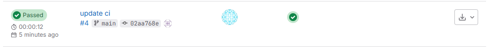
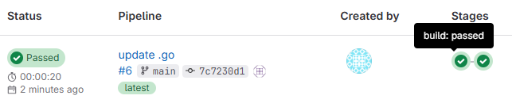

# Домашнее задание к занятию "GitLab" - Спетницкий Д.И.


---

### Задание 1

**Что нужно сделать:**

1. Разверните GitLab локально, используя Vagrantfile и инструкцию, описанные в [этом репозитории](https://github.com/netology-code/sdvps-materials/tree/main/gitlab).
2. Создайте новый проект и пустой репозиторий в нём.
3. Зарегистрируйте gitlab-runner для этого проекта и запустите его в режиме Docker. Раннер можно регистрировать и запускать на той же виртуальной машине, на которой запущен GitLab.

В качестве ответа в репозиторий шаблона с решением добавьте скриншоты с настройками раннера в проекте.

---

1. Мы создали 2 машины с помощью [terraform](terraform/) и настроили  с помощью [ansible](ansible/) docker на ВМ c runner.
2. Создали новый проект на своем Gitlab сервере
3. Зарегистрировали gitlab-runner для этого проекта и запустили его в режиме Docker


### Скриншоты
#### 1. Runner



---

### Задание 2

**Что нужно сделать:**

1. Запушьте [репозиторий](https://github.com/netology-code/sdvps-materials/tree/main/gitlab) на GitLab, изменив origin. Это изучалось на занятии по Git.
2. Создайте .gitlab-ci.yml, описав в нём все необходимые, на ваш взгляд, этапы.

В качестве ответа в шаблон с решением добавьте:

 * файл gitlab-ci.yml для своего проекта или вставьте код в соответствующее поле в шаблоне;
 * скриншоты с успешно собранными сборками.


---
1. Запушили репозиторий на GitLab, remote `my_gitlab_lesson`
2. Создали .gitlab-ci.yml


### Скриншоты
#### 1. Project

#### 2. Успешная сборка



---

### Задание 3*

Измените CI так, чтобы:

 - этап сборки запускался сразу, не дожидаясь результатов тестов;
 - тесты запускались только при изменении файлов с расширением *.go.

В качестве ответа добавьте в шаблон с решением файл gitlab-ci.yml своего проекта или вставьте код в соответсвующее поле в шаблоне.


---
1. Изменили .gitlab-ci.yml
```bash
stages:
  - build
  - test

test:
  stage: test
  image: golang:1.17
  script:
    - go test .
  tags:
    - netology
  only:
    changes:
      - "*.go"

build:
  stage: build
  image: docker:latest
  script:
    - docker build .
  tags:
    - netology
```
2. #### Change CI


3. #### Change go

