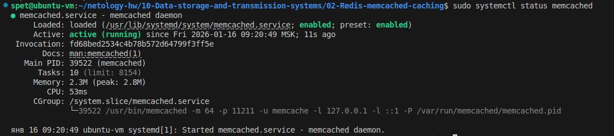
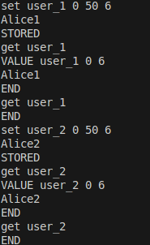
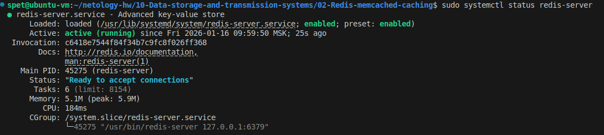
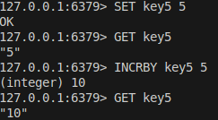

# Домашнее задание к занятию  «Кеширование Redis/memcached» - Спетницкий Д.И.

## Задание 1 Кеширование
Приведите примеры проблем, которые может решить кеширование.

Приведите ответ в свободной форме.

---

## Решение 1

Кеширование решает несколько ключевых проблем, с которыми сталкиваются системы при высоких нагрузках или частых обращениях к данным.

1. Высокая задержка при обращении к данным. Например, если веб-приложение постоянно запрашивает одни и те же данные из медленной базы данных, кеширование результатов (например, через Redis или Memcached) позволяет мгновенно отдавать их пользователю, минуя повторные запросы к БД. Это критично для сервисов вроде новостных сайтов, где контент редко меняется.
2. Перегрузка серверов. При резком всплеске трафика (например, во время распродажи) кеш на уровне CDN или прокси-сервера принимает основной удар, отдавая статический контент без обращения к бэкенду. Это предотвращает падение сервера под нагрузкой.
3. Избыточное потребление сетевых ресурсов. Мобильные приложения часто кешируют данные API на устройстве (например, список товаров в интернет-магазине). Это снижает трафик, ускоряет работу при плохом интернете и экономит заряд батареи за счет меньшего числа сетевых запросов.
4. Дублирование вычислений. В системах машинного обучения или аналитики результаты дорогостоящих вычислений (например, прогноз погоды на сутки) можно закешировать. Повторные запросы за теми же данными будут получать ответ из кеша, а не перезапускать модель.
5. Проблемы с масштабируемостью. В распределенных системах кеширование помогает сохранять сессии пользователей на конкретных нодах, избегая постоянной синхронизации состояния между серверами.


---

## Задание 2 Memcached

Установите и запустите memcached.

Приведите скриншот systemctl status memcached, где будет видно, что memcached запущен.

---

## Решение 2
Установка
```
sudo apt install memcached -y
```



---

## Задание 3 Удаление по TTL в Memcached

Запишите в memcached несколько ключей с любыми именами и значениями, для которых выставлен TTL 5.

Приведите скриншот, на котором видно, что спустя 5 секунд ключи удалились из базы.

---

## Решение 3
Поставил TTL 50, за 5 секунд тупо не успевал набрать команду, чтобы проверить запись, она уже удалялась




---

## Задание 4 Запись данных в Redis

Запишите в Redis несколько ключей с любыми именами и значениями.

Через redis-cli достаньте все записанные ключи и значения из базы, приведите скриншот этой операции.

---

## Решение 4

Установка
```
sudo apt install redis-server redis-tools -y
```



Подключаемся к Redis и добавляем 3 ключа:
```
redis-cli

SET user:name "Ivan Petrov"
SET user:age 28
SET app:theme "dark"
```
#### Получение всех ключей и значений


---

## Задание 5* Работа с числами

Запишите в Redis ключ key5 со значением типа "int" равным числу 5. Увеличьте его на 5, чтобы в итоге в значении лежало число 10.

Приведите скриншот, где будут проделаны все операции и будет видно, что значение key5 стало равно 10.

---

## Решение 5*




---


