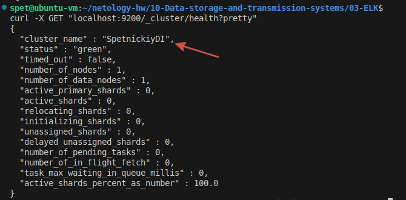
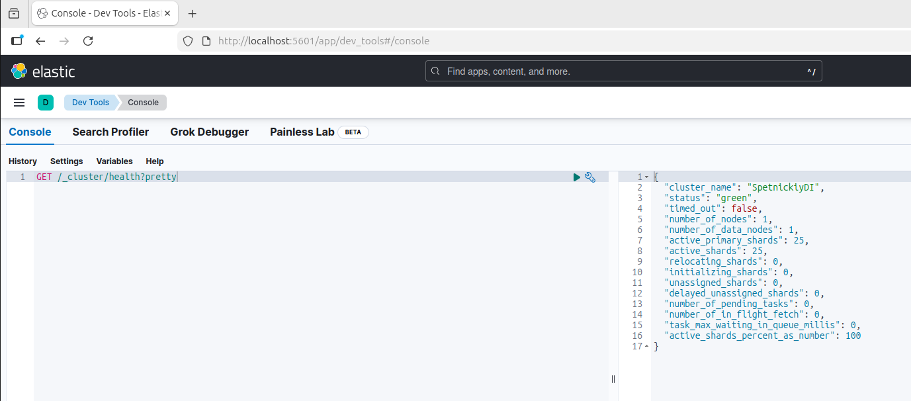
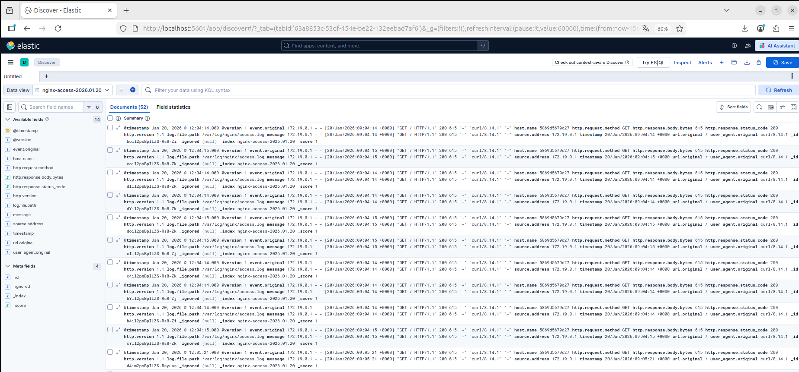
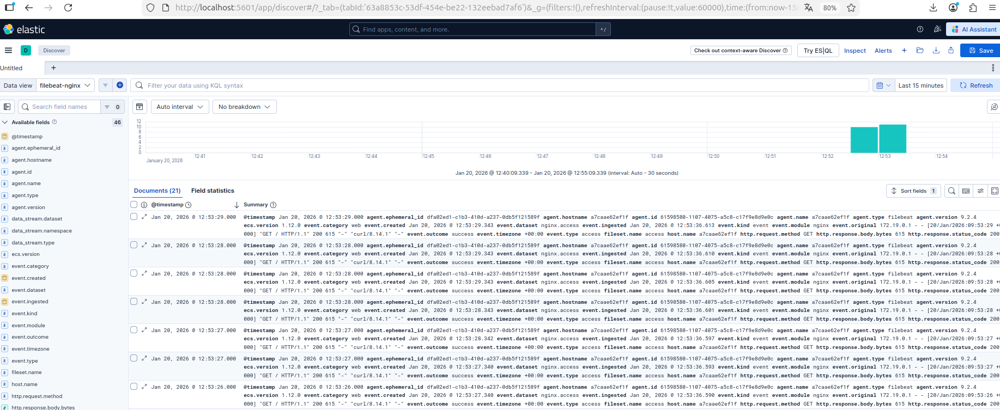
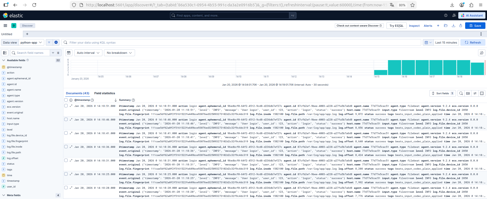

# Домашнее задание к занятию  «ELK» - Спетницкий Д.И.

## Задание 1 Elasticsearch
Установите и запустите Elasticsearch, после чего поменяйте параметр cluster_name на случайный.

Приведите скриншот команды 'curl -X GET 'localhost:9200/_cluster/health?pretty', сделанной на сервере с установленным Elasticsearch. Где будет виден нестандартный cluster_name.

---

## Решение 1

[docker-compose.yml](docker-compose.yml)




---

## Задание 2 Kibana

Установите и запустите Kibana.

Приведите скриншот интерфейса Kibana на странице http://<ip вашего сервера>:5601/app/dev_tools#/console, где будет выполнен запрос GET /_cluster/health?pretty.

---

## Решение 2

[docker-compose.yml](docker-compose.yml)




---

## Задание 3 Logstash

Установите и запустите Logstash и Nginx. С помощью Logstash отправьте access-лог Nginx в Elasticsearch.

Приведите скриншот интерфейса Kibana, на котором видны логи Nginx.

---

## Решение 3

[docker-compose.yml](docker-compose.yml)




---

## Задание 4 Filebeat

Установите и запустите Filebeat. Переключите поставку логов Nginx с Logstash на Filebeat.

Приведите скриншот интерфейса Kibana, на котором видны логи Nginx, которые были отправлены через Filebeat.

---

## Решение 4

[docker-compose-filebeat.yml](docker-compose-filebeat.yml)




## Задание 5* Доставка данных

Настройте поставку лога в Elasticsearch через Logstash и Filebeat любого другого сервиса , но не Nginx. Для этого лог должен писаться на файловую систему, Logstash должен корректно его распарсить и разложить на поля.

Приведите скриншот интерфейса Kibana, на котором будет виден этот лог и напишите лог какого приложения отправляется.

---

## Решение 5*

[docker-compose.yml](Task_5/docker-compose.yml)

[app.py](Task_5/app/app.py)

[filebeat](Task_5/filebeat/config/filebeat.yml)

[app.conf](Task_5/logstash/config/app.conf)


#### Лог Python-приложения для отслеживания событий входа пользователей

Python-приложение генерирует структурированные JSON-логи с информацией о входе пользователей в систему. Каждая запись содержит следующие поля:
```
{
  "timestamp": "2026-01-20 14:18:51",
  "level": "INFO",
  "message": "User login",
  "user_id": 123,
  "action": "login",
  "status": "success",
  "ip_address": "192.168.1.100",
  "session_id": "sess_1737381531"
}
```
#### Процесс доставки логов:
1. Python-приложение пишет логи в файл ./logs/app/app.log
2. Filebeat мониторит этот файл и отправляет данные в Logstash на порт 5044
3. Logstash обрабатывает JSON-логи, преобразует поле timestamp в @timestamp и отправляет в Elasticsearch
4. В Kibana создается Data View python-app-logs, где видны все структурированные поля




---


