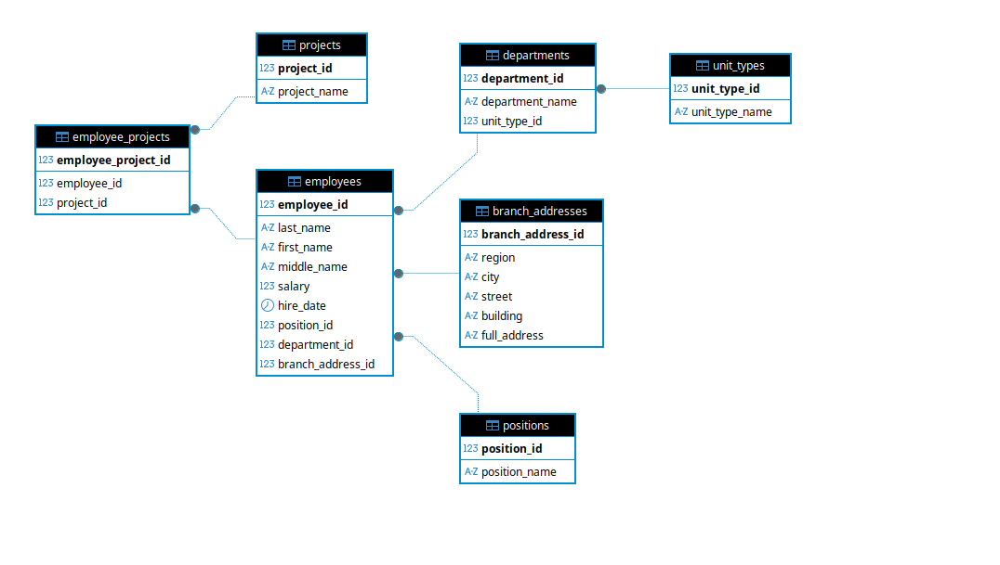

# Домашнее задание к занятию  «Базы данных» - Спетницкий Д.И.

Легенда
Заказчик передал вам [файл в формате Excel](hw-11-1.xlsx), в котором сформирован отчёт.

На основе этого отчёта нужно выполнить следующие задания.

## Задание 1
Опишите не менее семи таблиц, из которых состоит база данных. Определите:

- какие данные хранятся в этих таблицах,
- какой тип данных у столбцов в этих таблицах, если данные хранятся в PostgreSQL.

Начертите схему полученной модели данных. Можете использовать онлайн-редактор: https://app.diagrams.net/

Этапы реализации:
1.	Внимательно изучите предоставленный вам файл с данными и подумайте, как можно сгруппировать данные по смыслу.
2.	Разбейте исходный файл на несколько таблиц и определите список столбцов в каждой из них.
3.	Для каждого столбца подберите подходящий тип данных из PostgreSQL.
4.	Для каждой таблицы определите первичный ключ (PRIMARY KEY).
5.	Определите типы связей между таблицами.
6.	Начертите схему модели данных.
На схеме должны быть чётко отображены:
   - все таблицы с их названиями,
   - все столбцы  с указанием типов данных,
   - первичные ключи (они должны быть явно выделены),
   - линии, показывающие связи между таблицами.

**Результатом выполнения задания** должен стать скриншот получившейся схемы базы данных.
.

---

## Решение 1

Описание таблиц и типов данных (PostgreSQL)

1. employees — Сотрудники
Хранит персональные данные сотрудников и основные атрибуты:

- employee_id — SERIAL PRIMARY KEY
- last_name — VARCHAR(100) NOT NULL (фамилия)
- first_name — VARCHAR(100) NOT NULL (имя)
- middle_name — VARCHAR(100) (отчество)
- salary — NUMERIC(10,2) NOT NULL (оклад)
- hire_date — DATE NOT NULL (дата найма)
- position_id — INTEGER NOT NULL REFERENCES positions(position_id)
- department_id — INTEGER NOT NULL REFERENCES departments(department_id)
- branch_address_id — INTEGER NOT NULL REFERENCES branch_addresses(branch_address_id)

2. positions — Должности (справочник)
Хранит уникальные названия должностей:

- position_id — SERIAL PRIMARY KEY
- position_name — VARCHAR(200) NOT NULL UNIQUE

3. departments — Структурные подразделения
Хранит информацию о подразделениях и их типе:

- department_id — SERIAL PRIMARY KEY
- department_name — VARCHAR(200) NOT NULL UNIQUE
- unit_type_id — INTEGER NOT NULL REFERENCES unit_types(unit_type_id)

4. unit_types — Типы подразделений (справочник)
Хранит классификацию подразделений:

- unit_type_id — SERIAL PRIMARY KEY
- unit_type_name — VARCHAR(50) NOT NULL UNIQUE («Отдел», «Группа», «Департамент»)

5. branch_addresses — Адреса филиалов
Хранит географическую привязку филиалов (нормализовано для аналитики по регионам/городам):

- branch_address_id — SERIAL PRIMARY KEY
- region — VARCHAR(100) (регион/область)
- city — VARCHAR(100) NOT NULL (город)
- street — VARCHAR(200) (улица)
- building — VARCHAR(20) (номер дома)
- full_address — TEXT NOT NULL UNIQUE (полный адрес для отображения)
6. projects — Проекты (справочник)
Хранит названия проектов (извлечены из фигурных скобок, разделены при наличии нескольких):

- project_id — SERIAL PRIMARY KEY
- project_name — VARCHAR(200) NOT NULL UNIQUE
7. employee_projects — Связь сотрудников с проектами (связь многие-ко-многим)
Реализует отношение «сотрудник может работать на нескольких проектах»:

- employee_project_id — SERIAL PRIMARY KEY
- employee_id — INTEGER NOT NULL REFERENCES employees(employee_id) ON DELETE CASCADE
- project_id — INTEGER NOT NULL REFERENCES projects(project_id) ON DELETE CASCADE
- UNIQUE(employee_id, project_id)

Связи:

• employees ──(position_id)──► positions (многие к одному)

• employees ──(department_id)──► departments (многие к одному)

• employees ──(branch_address_id)──► branch_addresses (многие к одному)

• departments ──(unit_type_id)──► unit_types (многие к одному)

• employee_projects ──(employee_id)──► employees (многие ко многим)

• employee_projects ──(project_id)──► projects (многие ко многим)

---

## Задание 2*

1. Разверните СУБД Postgres на своей хостовой машине, на виртуальной машине или в контейнере docker.
2. Опишите схему, полученную в предыдущем задании, с помощью скрипта SQL.
3. Создайте в вашей полученной СУБД новую базу данных и выполните полученный ранее скрипт для создания вашей модели данных.

В качестве решения приложите SQL скрипт и скриншот диаграммы.

Для написания и редактирования sql удобно использовать  специальный инструмент dbeaver.

---

## Решение 2

[script](Script-11-01.sql)

---