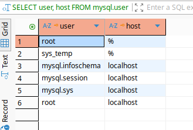
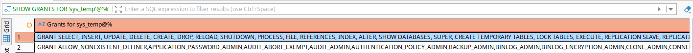
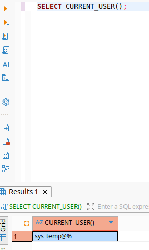
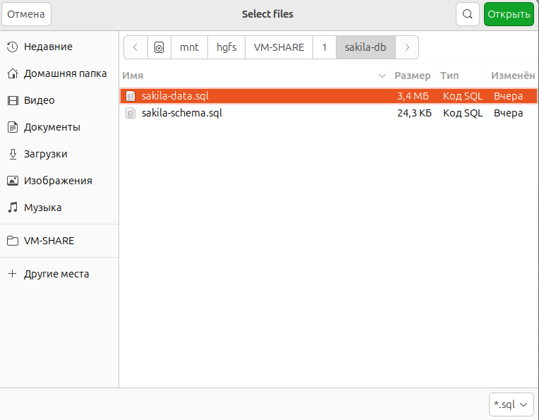
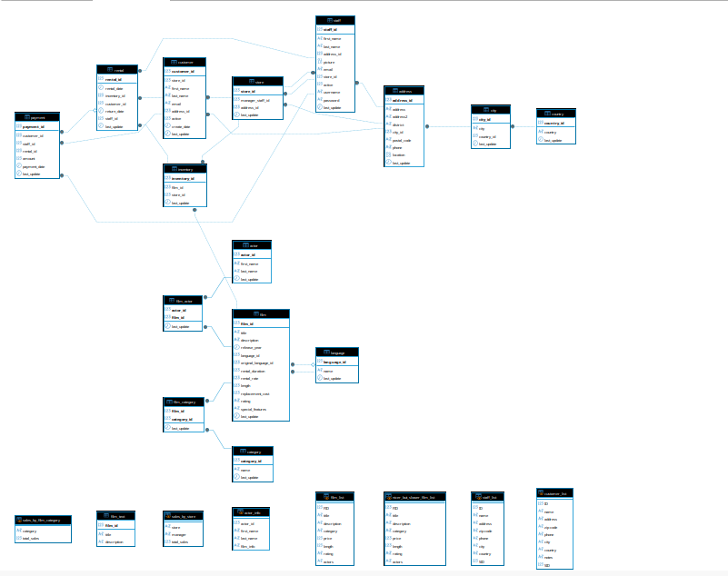
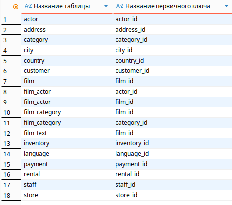
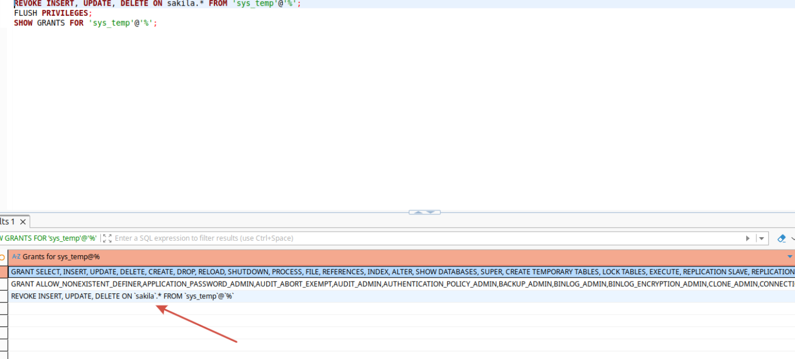
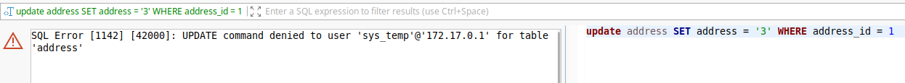

# Домашнее задание к занятию  «Работа с данными (DDL/DML)» - Спетницкий Д.И.


## Задание 1
1.1. Поднимите чистый инстанс MySQL версии 8.0+. Можно использовать локальный сервер или контейнер Docker.

1.2. Создайте учётную запись sys_temp. 

1.3. Выполните запрос на получение списка пользователей в базе данных. (скриншот)

1.4. Дайте все права для пользователя sys_temp. 

1.5. Выполните запрос на получение списка прав для пользователя sys_temp. (скриншот)

1.6. Переподключитесь к базе данных от имени sys_temp.

Для смены типа аутентификации с sha2 используйте запрос: 
```sql
ALTER USER 'sys_test'@'localhost' IDENTIFIED WITH mysql_native_password BY 'password';
```
1.6. По ссылке https://downloads.mysql.com/docs/sakila-db.zip скачайте дамп базы данных.

1.7. Восстановите дамп в базу данных.

1.8. При работе в IDE сформируйте ER-диаграмму получившейся базы данных. При работе в командной строке используйте команду для получения всех таблиц базы данных. (скриншот)

*Результатом работы должны быть скриншоты обозначенных заданий, а также простыня со всеми запросами.*


---

## Решение 1

1.1. Поднимите чистый инстанс MySQL версии 8.0+. Можно использовать локальный сервер или контейнер Docker.

```
docker run -d \
  --name mysql-sakila \
  -p 3306:3306 \
  -e MYSQL_ROOT_PASSWORD=123 \
  -e MYSQL_DATABASE=sakila \
  mysql:8.4.8 \
  --default-authentication-plugin=mysql_native_password
 ```
Подключение к MySQL
```
 docker exec -it mysql-sakila mysql -uroot -p123
```
1.2. Создайте учётную запись sys_temp. 
```
CREATE USER 'sys_temp'@'%' IDENTIFIED BY '456';
```
1.3. Выполните запрос на получение списка пользователей в базе данных. (скриншот)

```
SELECT user, host FROM mysql.user;
```



1.4. Дайте все права для пользователя sys_temp. 

```
GRANT ALL PRIVILEGES ON *.* TO 'sys_temp'@'%';
FLUSH PRIVILEGES;
```
1.5. Выполните запрос на получение списка прав для пользователя sys_temp. (скриншот)
```
SHOW GRANTS FOR 'sys_temp'@'%';
```


1.6. Переподключитесь к базе данных от имени sys_temp.



1.7. Восстановите дамп в базу данных.



1.8. При работе в IDE сформируйте ER-диаграмму получившейся базы данных. При работе в командной строке используйте команду для получения всех таблиц базы данных. (скриншот)




---

## Задание 2

Составьте таблицу, используя любой текстовый редактор или Excel, в которой должно быть два столбца: в первом должны быть названия таблиц восстановленной базы, во втором названия первичных ключей этих таблиц. Пример: (скриншот/текст)
```
Название таблицы | Название первичного ключа
customer         | customer_id
```

---

## Решение 2

```
SELECT 
  TABLE_NAME AS 'Название таблицы',
  COLUMN_NAME AS 'Название первичного ключа'
FROM INFORMATION_SCHEMA.KEY_COLUMN_USAGE
WHERE 
  TABLE_SCHEMA = 'sakila' 
  AND CONSTRAINT_NAME = 'PRIMARY'
ORDER BY TABLE_NAME;
```



---


## Задание 3*
3.1. Уберите у пользователя sys_temp права на внесение, изменение и удаление данных из базы sakila.

3.2. Выполните запрос на получение списка прав для пользователя sys_temp. (скриншот)


---

## Решение 3*
```
REVOKE INSERT, UPDATE, DELETE ON sakila.* FROM 'sys_temp'@'%';
FLUSH PRIVILEGES;
SHOW GRANTS FOR 'sys_temp'@'%';
```




---