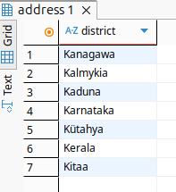
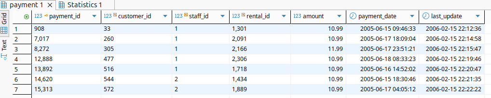
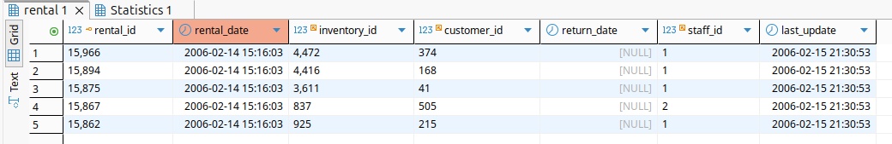
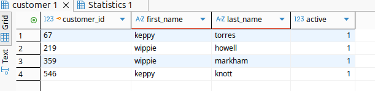
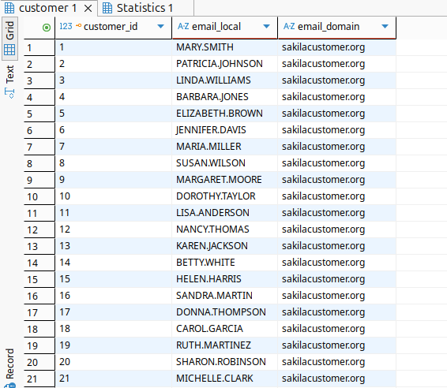
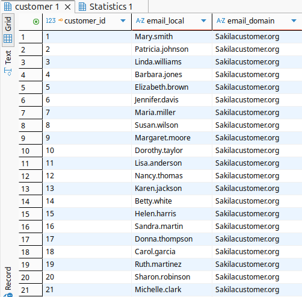

# Домашнее задание к занятию  «Работа с данными (DDL/DML)» - Спетницкий Д.И.


## Задание 1
Получите уникальные названия районов из таблицы с адресами, которые начинаются на “K” и заканчиваются на “a” и не содержат пробелов.

---

## Решение 1
```
USE sakila;
SELECT DISTINCT district
FROM address
WHERE 
    district LIKE 'K%a'          
    AND district NOT LIKE '% %';
```





---


## Задание 2
Получите из таблицы платежей за прокат фильмов информацию по платежам, которые выполнялись в промежуток с 15 июня 2005 года по 18 июня 2005 года включительно и стоимость которых превышает 10.00.

---

## Решение 2

```
SELECT *
FROM payment
WHERE 
    payment_date >= '2005-06-15'
    AND payment_date < '2005-06-19'
    AND amount > 10.00;;
```


---

## Задание 3
Получите последние пять аренд фильмов.

---

## Решение 3

SELECT *
FROM rental
ORDER BY rental_date DESC, rental_id DESC
LIMIT 5;



---

## Задание 4

Одним запросом получите активных покупателей, имена которых Kelly или Willie.

Сформируйте вывод в результат таким образом:

все буквы в фамилии и имени из верхнего регистра переведите в нижний регистр,
замените буквы 'll' в именах на 'pp'.

---

## Решение 4
```
SELECT 
    customer_id,
    LOWER(
        REPLACE(
            LOWER(first_name), 
            'll', 
            'pp'
        )
    ) AS first_name,
    LOWER(last_name) AS last_name,
    active
FROM customer
WHERE 
    active = 1
    AND first_name IN ('Kelly', 'Willie');
```



---

## Задание 5*

Выведите Email каждого покупателя, разделив значение Email на две отдельных колонки: в первой колонке должно быть значение, указанное до @, во второй — значение, указанное после @.

---

## Решение 5*

```
SELECT 
    customer_id,
    SUBSTRING_INDEX(email, '@', 1) AS email_local,
    SUBSTRING_INDEX(email, '@', -1) AS email_domain
FROM customer;
```



---

## Задание 6*

Доработайте запрос из предыдущего задания, скорректируйте значения в новых колонках: первая буква должна быть заглавной, остальные — строчными.

---

## Решение 6*

```
SELECT 
    customer_id,
    CONCAT(
        UPPER(LEFT(SUBSTRING_INDEX(email, '@', 1), 1)),
        LOWER(SUBSTRING(SUBSTRING_INDEX(email, '@', 1), 2))
    ) AS email_local,
    CONCAT(
        UPPER(LEFT(SUBSTRING_INDEX(email, '@', -1), 1)),
        LOWER(SUBSTRING(SUBSTRING_INDEX(email, '@', -1), 2))
    ) AS email_domain
FROM customer;
```



---