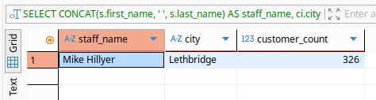
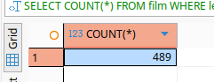
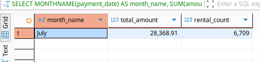
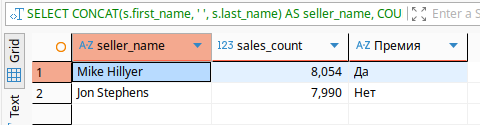
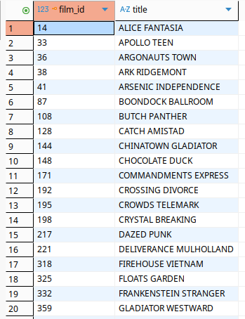

# Домашнее задание к занятию  «Расширенные возможности SQL» - Спетницкий Д.И.


## Задание 1

Одним запросом получите информацию о магазине, в котором обслуживается более 300 покупателей, и выведите в результат следующую информацию: 
- фамилия и имя сотрудника из этого магазина;
- город нахождения магазина;
- количество пользователей, закреплённых в этом магазине.

---

## Решение 1
```
SELECT 
    CONCAT(s.first_name, ' ', s.last_name) AS staff_name,
    ci.city AS city,
    COUNT(c.customer_id) AS customer_count
FROM store st
JOIN staff s ON st.manager_staff_id = s.staff_id
JOIN address a ON st.address_id = a.address_id
JOIN city ci ON a.city_id = ci.city_id
JOIN customer c ON st.store_id = c.store_id
GROUP BY st.store_id, s.first_name, s.last_name, ci.city
HAVING COUNT(c.customer_id) > 300;
```





---

## Задание 2

Получите количество фильмов, продолжительность которых больше средней продолжительности всех фильмов.

---

## Решение 2

```
SELECT COUNT(*)
FROM film
WHERE length > (SELECT AVG(length) FROM film);
```


---

## Задание 3

Получите информацию, за какой месяц была получена наибольшая сумма платежей, и добавьте информацию по количеству аренд за этот месяц.

---

## Решение 3

```
SELECT 
    MONTHNAME(payment_date) AS month_name,
    SUM(amount) AS total_amount,
    COUNT(*) AS rental_count
FROM payment
GROUP BY MONTHNAME(payment_date)
ORDER BY total_amount DESC
LIMIT 1;
```


---

## Задание 4*
Посчитайте количество продаж, выполненных каждым продавцом. Добавьте вычисляемую колонку «Премия». Если количество продаж превышает 8000, то значение в колонке будет «Да», иначе должно быть значение «Нет».

---

## Решение 4*

```
SELECT 
    CONCAT(s.first_name, ' ', s.last_name) AS seller_name,
    COUNT(*) AS sales_count,
    CASE 
        WHEN COUNT(*) > 8000 THEN 'Да'
        ELSE 'Нет'
    END AS Премия
FROM payment p
JOIN staff s ON p.staff_id = s.staff_id
GROUP BY p.staff_id, s.first_name, s.last_name
ORDER BY sales_count DESC;
```


---

## Задание 5*

Найдите фильмы, которые ни разу не брали в аренду.

---

## Решение 5*

```
SELECT f.film_id, f.title
FROM film f
LEFT JOIN inventory i ON f.film_id = i.film_id
LEFT JOIN rental r ON i.inventory_id = r.inventory_id
GROUP BY f.film_id
HAVING COUNT(r.rental_id) = 0;
```




---