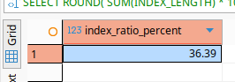

# Домашнее задание к занятию  «Индексы» - Спетницкий Д.И.


## Задание 1


Напишите запрос к учебной базе данных, который вернёт процентное отношение общего размера всех индексов к общему размеру всех таблиц.

---

## Решение 1
```
SELECT 
    ROUND(
        SUM(INDEX_LENGTH) * 100.0 / SUM(DATA_LENGTH + INDEX_LENGTH),
        2
    ) AS index_ratio_percent
FROM information_schema.TABLES
WHERE TABLE_SCHEMA = 'sakila';
```




---

## Задание 2

Выполните explain analyze следующего запроса:
```sql
select distinct concat(c.last_name, ' ', c.first_name), sum(p.amount) over (partition by c.customer_id, f.title)
from payment p, rental r, customer c, inventory i, film f
where date(p.payment_date) = '2005-07-30' and p.payment_date = r.rental_date and r.customer_id = c.customer_id and i.inventory_id = r.inventory_id
```
- перечислите узкие места;
- оптимизируйте запрос: внесите корректировки по использованию операторов, при необходимости добавьте индексы.


---

## Решение 2

- Отсутствует связь i.film_id = f.film_id (Декартово произведение: каждая запись из inventory умножается на все 1000 фильмов → 1000× замедление)
- Связь p.payment_date = r.rental_date вместо p.rental_id = r.rental_id (В Sakila связь между платежами и арендой идёт через rental_id, а не дату. Сравнение дат приведёт к ошибкам и полному сканированию таблиц)
- DATE(p.payment_date) = '2005-07-30' (Функция над колонкой блокирует использование индекса → type: ALL (полное сканирование таблицы payment))
- DISTINCT + оконная функция SUM() OVER (...) (Бессмысленная комбинация: оконная функция не уменьшает количество строк, а DISTINCT пытается удалить дубликаты → лишняя сортировка)

### Оптимизированный запрос
```
SELECT 
    CONCAT(c.last_name, ' ', c.first_name) AS customer_name,
    f.title,
    SUM(p.amount) AS total_amount
FROM payment p
JOIN rental r ON p.rental_id = r.rental_id  -- Правильная связь!
JOIN customer c ON r.customer_id = c.customer_id
JOIN inventory i ON r.inventory_id = i.inventory_id
JOIN film f ON i.film_id = f.film_id  -- Добавлена критическая связь!
WHERE 
    p.payment_date >= '2005-07-30' 
    AND p.payment_date < '2005-07-31'  -- Замена DATE() на диапазон
GROUP BY 
    c.customer_id, 
    c.last_name, 
    c.first_name, 
    f.title
ORDER BY customer_name, f.title;
```

- p.rental_id = r.rental_id (Использует первичный ключ → мгновенная связь без сканирования)
- i.film_id = f.film_id (Убирает декартово произведение → вместо 1000× строк — корректное соединение)
- Диапазон вместо DATE() (Позволяет использовать индекс на payment_date → type: range вместо type: ALL)
- GROUP BY вместо DISTINCT + OVER() (Убирает лишнюю сортировку и оконную функцию → прямая агрегация)
- Явные JOIN (Читаемость + защита от ошибок в связях)

### Добавим покрывающий индекс для фильтрации по дате:
```
CREATE INDEX idx_payment_date ON payment(payment_date, rental_id, amount);
```
-   Быстро фильтровать по дате (`payment_date`)
-   Получать `rental_id` и `amount` без обращения к таблице («покрывающий индекс»)
---

## Задание 3*

Самостоятельно изучите, какие типы индексов используются в PostgreSQL. Перечислите те индексы, которые используются в PostgreSQL, а в MySQL — нет.

*Приведите ответ в свободной форме.*

---

## Решение 3*


Типы индексов, которые есть в PostgreSQL, но отсутствуют в MySQL

PostgreSQL предлагает более богатый набор типов индексов благодаря своей архитектуре расширяемых индексов.


#### 1. **GiST (Generalized Search Tree)**

-   **Что делает:** Универсальное дерево для сложных типов данных и операторов (не только `=` и `<`).
-   **Где применяется:**
    -   Пространственные данные (геометрия через расширение PostGIS)
    -   Полнотекстовый поиск (`tsvector`)
    -   Массивы, диапазоны (`range`), пользовательские типы
-   **Почему нет в MySQL:** Пространственные индексы в MySQL реализованы через R-Tree (только для MyISAM/InnoDB с ограничениями), а полнотекстовый поиск — через отдельный механизм `FULLTEXT`. Единого гибкого фреймворка как GiST нет.

#### 2. **SP-GiST (Space-Partitioned GiST)**

-   **Что делает:** Оптимизирован для несбалансированных структур данных (например, префиксные деревья, квадродеревья).
-   **Где применяется:**
    -   Поиск по префиксам (например, IP-адресов)
    -   Неравномерно распределённые данные
    -   Иерархические структуры
-   **Почему нет в MySQL:** Полностью уникальный тип, аналогов в MySQL нет.

----------

#### 3. **GIN (Generalized Inverted Index)**

-   **Что делает:** Инвертированный индекс для составных значений — когда одно поле содержит множество элементов.
-   **Где применяется:**
    -   Массивы (`ARRAY`) — поиск по элементу массива: `WHERE tags @> ARRAY['sql']`
    -   JSONB — поиск по вложенным полям: `WHERE data @> '{"category": "film"}'`
    -   Полнотекстовый поиск (`tsvector`)
    -   Диапазоны (`range`)
-   **Почему нет в MySQL:**
    -   Для JSON в MySQL есть функциональные индексы и генерируемые столбцы, но нет прямого аналога GIN для эффективного поиска по элементам массива или вложенным полям.
    -   Полнотекстовые индексы `FULLTEXT` работают только с текстом, не с составными структурами.

----------

#### 4. **BRIN (Block Range Index)**

-   **Что делает:** Сжатый индекс, хранящий агрегированные данные о блоках страниц (мин/макс значения). Идеален для очень больших таблиц с естественной сортировкой.
-   **Где применяется:**
    -   Временные ряды (логи, метрики) — когда данные вставляются хронологически
    -   Таблицы на сотни ГБ/ТБ, где обычные индексы слишком велики
-   **Пример:**  `CREATE INDEX ON logs USING BRIN(timestamp);`
-   **Почему нет в MySQL:** Нет прямого аналога. В MySQL для подобных сценариев используют партиционирование или внешние решения (например, TimescaleDB поверх PostgreSQL).
---


