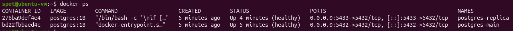
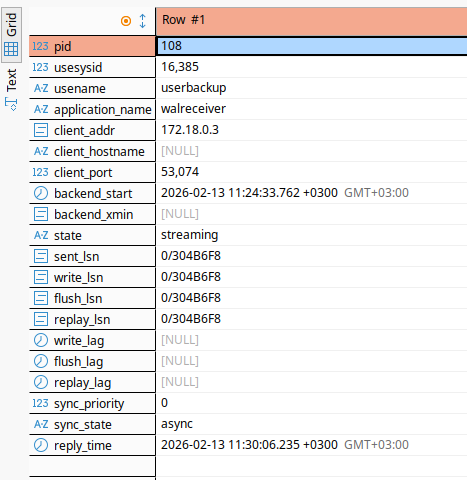
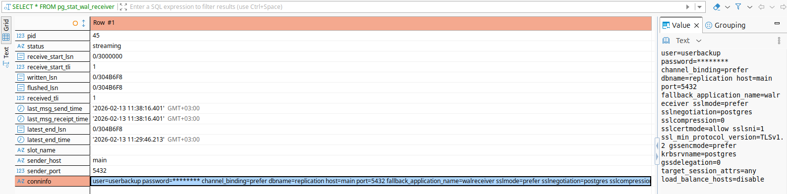

# Домашнее задание к занятию  «Репликация и масштабирование. Часть 1» - Спетницкий Д.И.


## Задание 1


На лекции рассматривались режимы репликации master-slave, master-master, опишите их различия.

_Ответить в свободной форме._

---

## Решение 1

На лекции мы разбирали два основных режима репликации в СУБД — master-slave  и master-master.

В режиме master-slave только один сервер (master) принимает запись данных. Все изменения с него автоматически копируются на один или несколько резервных серверов (slaves). Slaves обычно используются только для чтения — например, чтобы распределить нагрузку или иметь резервную копию при отказе master’а.

В режиме master-master оба (или несколько) серверов могут одновременно принимать и запись, и чтение. Изменения на одном master’е реплицируются на другой и наоборот. Это даёт гибкость и отказоустойчивость — если один узел упал, второй продолжает работать в полную силу. Но есть серьёзный минус, возможны конфликты данных, например, если на обоих серверах одновременно изменяют одну и ту же строку. Чтобы этого избежать, часто приходится использовать дополнительные механизмы — например, разделение по ключам, очереди или специальные алгоритмы разрешения конфликтов.

Короче, master-slave — про надёжность и простоту, master-master — про гибкость и высокую доступность, но с риском конфликтов.


---

## Задание 2

Выполните конфигурацию master-slave репликации, примером можно пользоваться из лекции.

_Приложите скриншоты конфигурации, выполнения работы: состояния и режимы работы серверов._

---

## Решение 2

├── [docker-compose.yml](postgres-master-slave/docker-compose.yml)
├── main/
│ ├── conf/
│ │ ├── [postgresql.conf](postgres-master-slave/postgresql.conf) # Конфигурация мастера
│ │ └── [pg_hba.conf](postgres-master-slave/pg_hba.conf) # Правила доступа
│ ├── data/ # Данные мастера (пустая при старте)
│ └── init/
│ └── [01.init.sql](postgres-master-slave/01.init.sql) # Создание пользователя для репликации
└── replica/
└── data/ # Данные реплики (пустая при старте)

### Запуск
```
docker compose up -d
```
### Статус контейнеров


### Проверка на master
```
SELECT * FROM pg_stat_replication;
```


Строка state = streaming подтверждает активную репликацию

### Проверка на slave
```
SELECT * FROM pg_stat_wal_receiver;
```


---
