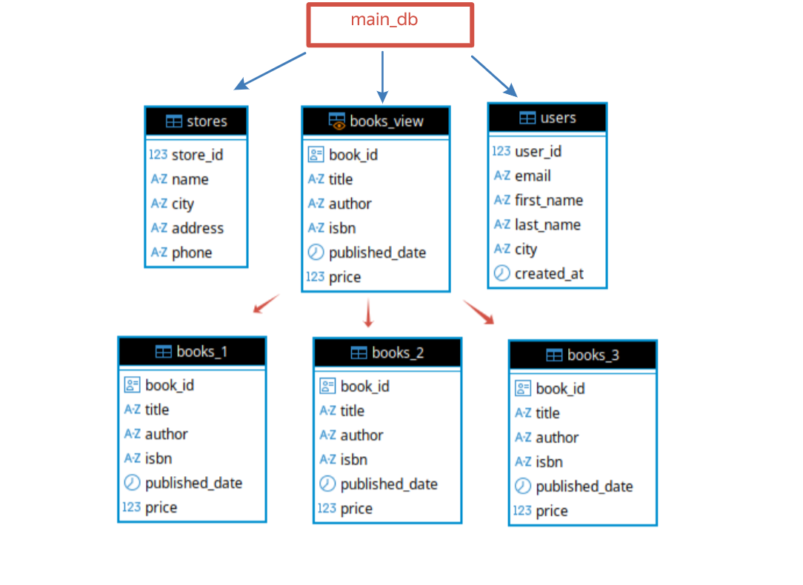

# Домашнее задание к занятию  «Репликация и масштабирование. Часть 2» - Спетницкий Д.И.

## Задание 1

Опишите основные преимущества использования масштабирования методами:

-   активный master-сервер и пассивный репликационный slave-сервер;
-   master-сервер и несколько slave-серверов;

_Дайте ответ в свободной форме._

---

## Решение 1

### Преимущества схем масштабирования

#### 1. Активный мастер + пассивный слейв (1:1)

-   **Отказоустойчивость «на случай ЧП»** — если мастер упадёт (поломка сервера, сеть пропала), слейв можно быстро «раскачать» в нового мастера. Приложение продолжит работать без полного даунтайма.
-   **Простота настройки** — всего два сервера, меньше точек отказа, проще отлаживать проблемы с репликацией.
-   **Резервная копия «живая»** — данные на слейве почти в реальном времени копируются с мастера. Это не полноценный бэкап (если на мастере удалили данные — удалятся и на слейве), но для быстрого восстановления после аппаратного сбоя очень удобно.
-   **Разгрузка для тяжёлых отчётов** — можно запускать аналитические запросы на слейве, чтобы не тормозить основной сервис на мастере.

Минус: один слейв — это «одна точка отказа» для самого слейва. Если он упадёт — резерва не останется.

#### 2. Мастер + несколько слейвов (1:N)

-   **Горизонтальное масштабирование чтения** — основная нагрузка в большинстве приложений — это `SELECT`. Слейвы берут на себя чтение, мастер остаётся свободен для записи. Чем больше слейвов — тем больше запросов на чтение можно обрабатывать параллельно.
-   **Географическое распределение** — можно разместить слейвы в разных дата-центрах или даже странах. Пользователи из Европы читают с европейского слейва, из Азии — с азиатского. Снижается задержка.
-   **Высокая отказоустойчивость** — если один слейв упадёт, остальные продолжат работать. Даже если мастер выйдет из строя, любой из слейвов можно назначить новым мастером.
-   **Гибкость под задачи** — можно выделить отдельный слейв под отчёты, другой — под тестирование, третий — для бэкапа. Один слейв не справится с такой нагрузкой.

Минус: сложнее администрировать (нужно следить за синхронизацией на всех слейвах), выше стоимость инфраструктуры.

---

## Задание 2

Разработайте план для выполнения горизонтального и вертикального шаринга базы данных. База данных состоит из трёх таблиц:

- пользователи,
- книги,
- магазины (столбцы произвольно).

Опишите принципы построения системы и их разграничение или разбивку между базами данных.

*Пришлите блоксхему, где и что будет располагаться. Опишите, в каких режимах будут работать сервера.*

---

## Решение 2

### 📝 Описание принципов построения системы:

#### 1. **Вертикальный шардинг**

-   Таблицы `users` и `stores` вынесены на отдельные серверы (`users_shard`, `stores_shard`)
-   Каждая таблица полностью изолирована и обслуживается своим сервером
-   Применяется для разделения доменов (пользователи, магазины)

#### 2. **Горизонтальный шардинг**

-   Таблица `books` разделена на 3 физических шарда по диапазонам даты публикации
-   Ключ шардинга: `published_date`
-   Каждый шард содержит только свои данные
-   Уникальность обеспечивается через `UUID` для `book_id`

#### 3. **Прокси-уровень (`main_db`)**

-   Использует `postgres_fdw` для создания внешних таблиц
-   Объединяет данные через `VIEW books_view = UNION ALL`
-   Маршрутизирует операции через `RULES` (INSERT/UPDATE/DELETE)
-   Работаем только с `main_db`

#### 4. **Режимы работы серверов**

| Сервер  | Режим | Функция |
|-------|-----|------------|
| main_db | Proxy  | Маршрутизация запросов, объединение данных   |
| users_shard   | Master (R/W)  | Хранит и обрабатывает таблицу `users`   |
| stores_shard  | Master (R/W)  | Хранит и обрабатывает таблицу `stores` |
| books_shard_1/2/3  | Master (R/W)  | Хранят части таблицы `books` по диапазонам дат |

#### 5 Блок-схема

---

## Задание 3*

Выполните настройку выбранных методов шардинга из задания 2.

*Пришлите конфиг Docker и SQL скрипт с командами для базы данных*.

---

## Решение 3

[sharding](sharding)

---