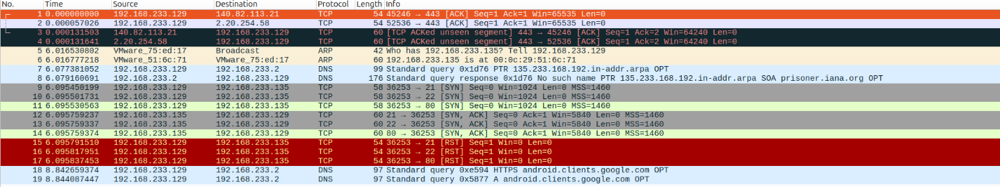
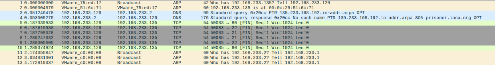
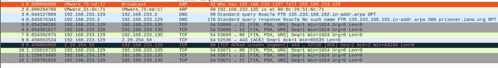
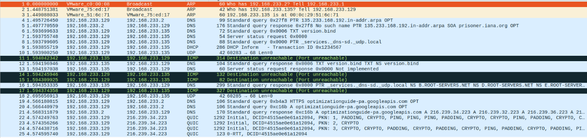

# Домашнее задание к занятию  «Уязвимости и атаки на информационные системы» - Спетницкий Д.И.


## Задание 1
Скачайте и установите виртуальную машину Metasploitable: https://sourceforge.net/projects/metasploitable/.

Это типовая ОС для экспериментов в области информационной безопасности, с которой следует начать при анализе уязвимостей.

Просканируйте эту виртуальную машину, используя **nmap**.

Попробуйте найти уязвимости, которым подвержена эта виртуальная машина.

Сами уязвимости можно поискать на сайте https://www.exploit-db.com/.

Для этого нужно в поиске ввести название сетевой службы, обнаруженной на атакуемой машине, и выбрать подходящие по версии уязвимости.

Ответьте на следующие вопросы:

- Какие сетевые службы в ней разрешены?
- Какие уязвимости были вами обнаружены? (список со ссылками: достаточно трёх уязвимостей)

*Приведите ответ в свободной форме.*


---


## Решение

#### сканируем
```
nmap -A 192.168.233.135
```
#### отчет
```
map scan report for 192.168.233.135
Host is up (0.00047s latency).
Not shown: 977 closed tcp ports (conn-refused)
PORT     STATE SERVICE     VERSION
21/tcp   open  ftp         vsftpd 2.3.4
| ftp-syst:
|   STAT:
| FTP server status:
|      Connected to 192.168.233.129
|      Logged in as ftp
|      TYPE: ASCII
|      No session bandwidth limit
|      Session timeout in seconds is 300
|      Control connection is plain text
|      Data connections will be plain text
|      vsFTPd 2.3.4 - secure, fast, stable
|_End of status
|_ftp-anon: Anonymous FTP login allowed (FTP code 230)
22/tcp   open  ssh         OpenSSH 4.7p1 Debian 8ubuntu1 (protocol 2.0)
| ssh-hostkey:
|   1024 60:0f:cf:e1:c0:5f:6a:74:d6:90:24:fa:c4:d5:6c:cd (DSA)
|_  2048 56:56:24:0f:21:1d:de:a7:2b:ae:61:b1:24:3d:e8:f3 (RSA)
23/tcp   open  telnet      Linux telnetd
25/tcp   open  smtp        Postfix smtpd
| sslv2:
|   SSLv2 supported
|   ciphers:
|     SSL2_RC2_128_CBC_WITH_MD5
|     SSL2_DES_64_CBC_WITH_MD5
|     SSL2_RC4_128_WITH_MD5
|     SSL2_RC2_128_CBC_EXPORT40_WITH_MD5
|     SSL2_DES_192_EDE3_CBC_WITH_MD5
|_    SSL2_RC4_128_EXPORT40_WITH_MD5
|_smtp-commands: metasploitable.localdomain, PIPELINING, SIZE 10240000, VRFY, ETRN, STARTTLS, ENHANCEDSTATUSCODES, 8BITMIME, DSN
|_ssl-date: 2026-03-02T07:26:25+00:00; +7s from scanner time.
53/tcp   open  domain      ISC BIND 9.4.2
| dns-nsid:
|_  bind.version: 9.4.2
80/tcp   open  http        Apache httpd 2.2.8 ((Ubuntu) DAV/2)
|_http-server-header: Apache/2.2.8 (Ubuntu) DAV/2
|_http-title: Metasploitable2 - Linux
111/tcp  open  rpcbind     2 (RPC #100000)
| rpcinfo:
|   program version    port/proto  service
|   100000  2            111/tcp   rpcbind
|   100000  2            111/udp   rpcbind
|   100003  2,3,4       2049/tcp   nfs
|   100003  2,3,4       2049/udp   nfs
|   100005  1,2,3      37829/udp   mountd
|   100005  1,2,3      39573/tcp   mountd
|   100021  1,3,4      47173/tcp   nlockmgr
|   100021  1,3,4      60778/udp   nlockmgr
|   100024  1          33366/tcp   status
|_  100024  1          46271/udp   status
139/tcp  open  netbios-ssn Samba smbd 3.X - 4.X (workgroup: WORKGROUP)
445/tcp  open  netbios-ssn Samba smbd 3.0.20-Debian (workgroup: WORKGROUP)
512/tcp  open  exec        netkit-rsh rexecd
513/tcp  open  login       OpenBSD or Solaris rlogind
514/tcp  open  tcpwrapped
1099/tcp open  java-rmi    GNU Classpath grmiregistry
1524/tcp open  bindshell   Metasploitable root shell
2049/tcp open  nfs         2-4 (RPC #100003)
2121/tcp open  ftp         ProFTPD 1.3.1
3306/tcp open  mysql       MySQL 5.0.51a-3ubuntu5
| mysql-info:
|   Protocol: 10
|   Version: 5.0.51a-3ubuntu5
|   Thread ID: 9
|   Capabilities flags: 43564
|   Some Capabilities: Speaks41ProtocolNew, Support41Auth, SupportsCompression, SupportsTransactions, SwitchToSSLAfterHandshake, LongColumnFlag, ConnectWithDatabase
|   Status: Autocommit
|_  Salt: @Ti1WF5uqW>q?%<>aM?4
5432/tcp open  postgresql  PostgreSQL DB 8.3.0 - 8.3.7
|_ssl-date: 2026-03-02T07:26:25+00:00; +7s from scanner time.
5900/tcp open  vnc         VNC (protocol 3.3)
| vnc-info:
|   Protocol version: 3.3
|   Security types:
|_    VNC Authentication (2)
6000/tcp open  X11         (access denied)
6667/tcp open  irc         UnrealIRCd
| irc-info:
|   users: 1
|   servers: 1
|   lusers: 1
|   lservers: 0
|   server: irc.Metasploitable.LAN
|   version: Unreal3.2.8.1. irc.Metasploitable.LAN
|   uptime: 0 days, 0:03:11
|   source ident: nmap
|   source host: 3290DCC0.F2A81775.FFFA6D49.IP
|_  error: Closing Link: iyfwyjfep[192.168.233.129] (Quit: iyfwyjfep)
8009/tcp open  ajp13       Apache Jserv (Protocol v1.3)
|_ajp-methods: Failed to get a valid response for the OPTION request
8180/tcp open  http        Apache Tomcat/Coyote JSP engine 1.1
|_http-title: Apache Tomcat/5.5
|_http-server-header: Apache-Coyote/1.1
|_http-favicon: Apache Tomcat
Service Info: Hosts:  metasploitable.localdomain, irc.Metasploitable.LAN; OSs: Unix, Linux; CPE: cpe:/o:linux:linux_kernel

Host script results:
|_clock-skew: mean: 1h15m07s, deviation: 2h30m00s, median: 6s
| smb-security-mode:
|   account_used: guest
|   authentication_level: user
|   challenge_response: supported
|_  message_signing: disabled (dangerous, but default)
| smb-os-discovery:
|   OS: Unix (Samba 3.0.20-Debian)
|   Computer name: metasploitable
|   NetBIOS computer name:
|   Domain name: localdomain
|   FQDN: metasploitable.localdomain
|_  System time: 2026-03-02T02:26:17-05:00
|_smb2-time: Protocol negotiation failed (SMB2)
|_nbstat: NetBIOS name: METASPLOITABLE, NetBIOS user: <unknown>, NetBIOS MAC: <unknown> (unknown)

Service detection performed. Please report any incorrect results at https://nmap.org/submit/ .
Nmap done: 1 IP address (1 host up) scanned in 22.04 seconds
```

**Разрешённые сетевые службы:**
- FTP (vsftpd 2.3.4) — порт 21
- SSH (OpenSSH 4.7p1) — порт 22
- Telnet — порт 23
- SMTP (Postfix) — порт 25
- DNS (BIND 9.4.2) — порт 53
- HTTP (Apache 2.2.8) — порт 80
- SMB (Samba 3.0.20) — порты 139, 445
- MySQL 5.0.51a — порт 3306
- PostgreSQL 8.3.x — порт 5432
- VNC — порт 5900
- IRC (UnrealIRCd 3.2.8.1) — порт 6667
- Apache Tomcat 5.5 — порт 8180
- Интенциональный бэкдор — порт 1524

**Обнаруженные уязвимости:**
1. vsftpd 2.3.4 Backdoor —https://www.exploit-db.com/exploits/17491
2. UnrealIRCd 3.2.8.1 Backdoor —https://www.exploit-db.com/exploits/16922
3. Samba 3.0.20 usermap_script  — https://www.exploit-db.com/exploits/16320

---

## Задание 2

Проведите сканирование Metasploitable в режимах SYN, FIN, Xmas, UDP.

Запишите сеансы сканирования в Wireshark.

Ответьте на следующие вопросы:

-   Чем отличаются эти режимы сканирования с точки зрения сетевого трафика?
-   Как отвечает сервер?

_Приведите ответ в свободной форме._

---

## Решение 2

### [Cканы](scans)

#### SYN



#### FIN




#### Xmas




#### UDP



### Отлиия режимов с точки зрения трафика
| Режим  | Пакеты | Handshake | Объём трафика |
|-------|-----|------------|------------|
| **SYN** | SYN → SYN-ACK → RST |  Частичный (1.5 handshake) | Больше всего пакетов|
| **FIN**   |FIN → RST  | Нет  |Минимум (2 пакета)   |
| **Xmas**  | FIN+PSH+URG → RST  |Нет| 2 пакета, но больше флагов |
| **UDP**  | UDP → ICMP/ответ  | Нет (UDP без состояния) | Медленно, много таймаутов |


### Как отвечает сервер (Metasploitable)

**На SYN:**

-   Открытый порт → `SYN-ACK`
-   Закрытый порт → `RST-ACK`

**На FIN/Xmas:**

-   Открытый порт → `RST` (по RFC 793 для Unix/Linux)
-   Закрытый порт → `RST` (или игнорирует)

**На UDP:**

-   Открытый порт (53/DNS) → `DNS-ответ`
-   Закрытый порт → `ICMP Type 3, Code 3 (Port Unreachable)`
-   Отфильтрованный → нет ответа (timeout)


---