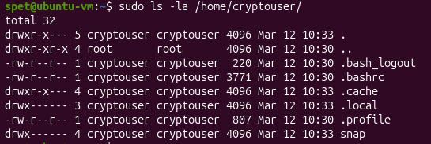
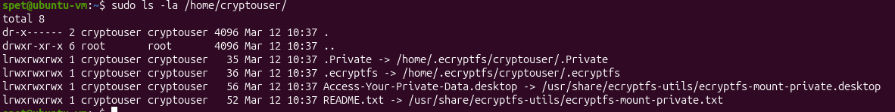
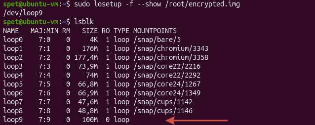
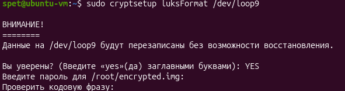
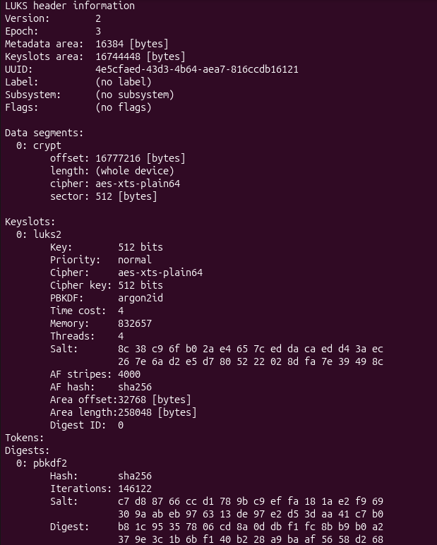
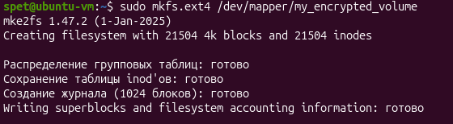
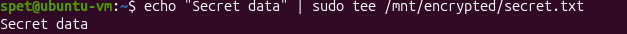

# Домашнее задание к занятию  «Защита хоста» - Спетницкий Д.И.


## Задание 1
1. Установите **eCryptfs**.
2. Добавьте пользователя cryptouser.
3. Зашифруйте домашний каталог пользователя с помощью eCryptfs.


*В качестве ответа  пришлите снимки экрана домашнего каталога пользователя с исходными и зашифрованными данными.* 

---

## Решение 1

### До



### После



---

## Задание 2

1. Установите поддержку **LUKS**.
2. Создайте небольшой раздел, например, 100 Мб.
3. Зашифруйте созданный раздел с помощью LUKS.

*В качестве ответа пришлите снимки экрана с поэтапным выполнением задания.*

---


## Решение 2


#### Создаем файл 100 Мб
```
sudo fallocate -l 100M /root/encrypted.img
```

#### Создаем loop-устройство
```
sudo losetup -f --show /root/encrypted.img
```




#### Форматируем раздел с LUKS
```
sudo cryptsetup luksFormat /dev/loop9
```




#### Показать информацию о LUKS разделе
```
sudo cryptsetup luksDump /dev/loop9
```


#### Открываем раздел 
```
sudo cryptsetup open /dev/loop9 my_encrypted_volume
```
#### Создаем файловую систему
```
sudo mkfs.ext4 /dev/mapper/my_encrypted_volume
```



##### Монтируем
```
sudo mkdir /mnt/encrypted
sudo mount /dev/mapper/my_encrypted_volume /mnt/encrypted
```

#### Создаем тестовый файл
```
echo "Secret data" | sudo tee /mnt/encrypted/secret.txt
```


#### Размонтируем
```
sudo umount /mnt/encrypted
```

#### Закрываем LUKS
```
sudo cryptsetup close my_encrypted_volume
```

---