# Курсовая работа на профессии "DevOps-инженер с нуля" - Спетницкий Д.И.


## Задание

Ключевая задача — разработать отказоустойчивую инфраструктуру для сайта, включающую мониторинг, сбор логов и резервное копирование основных данных. Инфраструктура должна размещаться в [Yandex Cloud](https://cloud.yandex.com/).

**Примечание**: в курсовой работе используется система мониторинга Prometheus. Вместо Prometheus вы можете использовать Zabbix. Задание для курсовой работы с использованием Zabbix находится по [ссылке](https://github.com/netology-code/fops-sysadm-diplom/blob/diplom-zabbix/README.md).

**Перед началом работы над дипломным заданием изучите [Инструкция по экономии облачных ресурсов](https://github.com/netology-code/devops-materials/blob/master/cloudwork.MD).**

### Инфраструктура
Для развёртки инфраструктуры используйте Terraform и Ansible.

Параметры виртуальной машины (ВМ) подбирайте по потребностям сервисов, которые будут на ней работать.

Ознакомьтесь со всеми пунктами из этой секции, не беритесь сразу выполнять задание, не дочитав до конца. Пункты взаимосвязаны и могут влиять друг на друга.

### Сайт
Создайте две ВМ в разных зонах, установите на них сервер nginx, если его там нет. ОС и содержимое ВМ должно быть идентичным, это будут наши веб-сервера.

Используйте набор статичных файлов для сайта. Можно переиспользовать сайт из домашнего задания.

Создайте [Target Group](https://cloud.yandex.com/docs/application-load-balancer/concepts/target-group), включите в неё две созданных ВМ.

Создайте [Backend Group](https://cloud.yandex.com/docs/application-load-balancer/concepts/backend-group), настройте backends на target group, ранее созданную. Настройте healthcheck на корень (/) и порт 80, протокол HTTP.

Создайте [HTTP router](https://cloud.yandex.com/docs/application-load-balancer/concepts/http-router). Путь укажите — /, backend group — созданную ранее.

Создайте [Application load balancer](https://cloud.yandex.com/en/docs/application-load-balancer/) для распределения трафика на веб-сервера, созданные ранее. Укажите HTTP router, созданный ранее, задайте listener тип auto, порт 80.

Протестируйте сайт
`curl -v <публичный IP балансера>:80`

### Мониторинг
Создайте ВМ, разверните на ней Prometheus. На каждую ВМ из веб-серверов установите Node Exporter и [Nginx Log Exporter](https://github.com/martin-helmich/prometheus-nginxlog-exporter). Настройте Prometheus на сбор метрик с этих exporter.

Создайте ВМ, установите туда Grafana. Настройте её на взаимодействие с ранее развернутым Prometheus. Настройте дешборды с отображением метрик, минимальный набор — Utilization, Saturation, Errors для CPU, RAM, диски, сеть, http_response_count_total, http_response_size_bytes. Добавьте необходимые [tresholds](https://grafana.com/docs/grafana/latest/panels/thresholds/) на соответствующие графики.

### Логи
Cоздайте ВМ, разверните на ней Elasticsearch. Установите filebeat в ВМ к веб-серверам, настройте на отправку access.log, error.log nginx в Elasticsearch.

Создайте ВМ, разверните на ней Kibana, сконфигурируйте соединение с Elasticsearch.

### Сеть
Разверните один VPC. Сервера web, Prometheus, Elasticsearch поместите в приватные подсети. Сервера Grafana, Kibana, application load balancer определите в публичную подсеть.

Настройте [Security Groups](https://cloud.yandex.com/docs/vpc/concepts/security-groups) соответствующих сервисов на входящий трафик только к нужным портам.

Настройте ВМ с публичным адресом, в которой будет открыт только один порт — ssh. Настройте все security groups на разрешение входящего ssh из этой security group. Эта вм будет реализовывать концепцию bastion host. Потом можно будет подключаться по ssh ко всем хостам через этот хост.

### Резервное копирование
Создайте snapshot дисков всех ВМ. Ограничьте время жизни snaphot в неделю. Сами snaphot настройте на ежедневное копирование.

### Дополнительно
Не входит в минимальные требования.

1. Для Prometheus можно реализовать альтернативный способ хранения данных — в базе данных PpostgreSQL. Используйте [Yandex Managed Service for PostgreSQL](https://cloud.yandex.com/en-ru/services/managed-postgresql). Разверните кластер из двух нод с автоматическим failover. Воспользуйтесь адаптером с https://github.com/CrunchyData/postgresql-prometheus-adapter для настройки отправки данных из Prometheus в новую БД.
2. Вместо конкретных ВМ, которые входят в target group, можно создать [Instance Group](https://cloud.yandex.com/en/docs/compute/concepts/instance-groups/), для которой настройте следующие правила автоматического горизонтального масштабирования: минимальное количество ВМ на зону — 1, максимальный размер группы — 3.
3. Можно добавить в Grafana оповещения с помощью Grafana alerts. Как вариант, можно также установить Alertmanager в ВМ к Prometheus, настроить оповещения через него.
4. В Elasticsearch добавьте мониторинг логов самого себя, Kibana, Prometheus, Grafana через filebeat. Можно использовать logstash тоже.
5. Воспользуйтесь Yandex Certificate Manager, выпустите сертификат для сайта, если есть доменное имя. Перенастройте работу балансера на HTTPS, при этом нацелен он будет на HTTP веб-серверов.


---


## Решение


## 1. Общая информация

### 1.1 Цель работы
Развёртывание отказоустойчивой веб-инфраструктуры с:
- ✅ Автоматическим масштабированием (2 веб-сервера в разных зонах)
- ✅ Централизованным мониторингом (Prometheus + Grafana)
- ✅ Сбором и анализом логов (ELK Stack)
- ✅ Резервным копированием (Snapshot Schedule)
- ✅ Безопасным доступом (Bastion Host + Security Groups)

### 1.2 Стек технологий

| Категория | Инструменты | Версии |
|-----------|-------------|--------|
| **Infrastructure as Code** | Terraform | >= 1.3.0 |
| **Configuration Management** | Ansible | >= 2.9 |
| **Cloud Provider** | Yandex Cloud | provider ~> 0.167.0 |
| **Monitoring** | Prometheus, Grafana, Node Exporter | 3.1.0, 12.4.2, 1.8.2 |
| **Logging** | Elasticsearch, Kibana, Filebeat | 9.3.2, 9.3.2, 9.3.2 |
| **Web Server** | Nginx + PHP-FPM | + nginx-prometheus-exporter 1.5.1 |
| **Load Balancing** | Yandex Application Load Balancer | - |
| **Security** | Fail2Ban, Security Groups | - |

### 1.3 Параметры стенда

| Компонент | Значение |
|-----------|----------|
| **Облако** | Yandex Cloud (ru-central1) |
| **Зоны доступности** | ru-central1-a, ru-central1-b |
| **VPC CIDR** | 10.0.0.0/16 |
| **Публичные подсети** | 10.0.1.0/24 (A), 10.0.2.0/24 (B) |
| **Приватные подсети** | 10.0.10.0/24 (A), 10.0.11.0/24 (B) |
| **ОС виртуальных машин** | Ubuntu 24.04 LTS |
| **Тип инстансов** | standard-v3, preemptible |

### 1.4 Виртуальные машины

| Имя | Зона | Подсеть | Публичный IP | Назначение |
|-----|------|---------|--------------|------------|
| bastion-a-1 | ru-central1-a | public_a | ✅| Точка входа SSH |
| web-a-1 | ru-central1-a | private_a | ❌| Веб-сервер (Nginx) |
| web-b-1 | ru-central1-b | private_b | ❌| Веб-сервер (Nginx) |
| prometheus-a-1 | ru-central1-a | private_a | ❌| Сбор метрик |
| grafana-a-1 | ru-central1-a | public_a | ✅ | Визуализация метрик |
| elasticsearch-b-1 | ru-central1-b | private_b| ❌ | Хранение логов |
| kibana-b-1 | ru-central1-b | public_b | ✅ | Визуализация логов |

### 1.5 Публичные эндпоинты

```bash
# После terraform apply:
GRAFANA_URL="http://<grafana_public_ip>:3000"   # login: admin / admin
KIBANA_URL="http://<kibana_private_ip>:5601"      # Kibana UI
ALB_URL="http://<alb_public_ip>"             # Веб-сайт
BASTION_IP=<bastion_public_ip>                # SSH вход
```

---

## 2. Архитектура инфраструктуры

### 2.1 Общая схема сети

**Облачная инфраструктура:** Yandex Cloud (ru-central1)

**VPC Network:** 10.0.0.0/16

#### Подсети

**Public Subnet A** (ru-central1-a): 10.0.1.0/24
- bastion-a-1
- grafana-a-1

**Public Subnet B** (ru-central1-b): 10.0.2.0/24
- kibana-b-1

**Private Subnet A** (ru-central1-a): 10.0.10.0/24
- web-a-1
- prometheus-a-1

**Private Subnet B** (ru-central1-b): 10.0.11.0/24
- web-b-1
- elasticsearch-b-1

#### Компоненты инфраструктуры

**Application Load Balancer (ALB):**
- Managed service
- Распределяет трафик на web-a-1 и web-b-1

**NAT Gateway:**
- Обеспечивает исходящий доступ в интернет для приватных подсетей
- Приватные ВМ получают обновления через NAT

**Route Tables:**
- Public subnets: прямой доступ в интернет
- Private subnets: маршрут 0.0.0.0/0 → NAT Gateway


### 2.2 Компоненты инфраструктуры

| Компонент | Тип | Количество | Назначение |
|-----------|-----|------------|------------|
| **VPC Network** | Сеть | 1 | Основная сеть 10.0.0.0/16 |
| **Subnets** | Подсети | 4 | 2 public + 2 private в разных зонах |
| **NAT Gateway** | Шлюз | 1 | Доступ в интернет для private подсетей |
| **Virtual Machines** | ВМ | 7 | Вычислительные ресурсы |
| **Security Groups** | Фаервол | 5 | Изоляция трафика |
| **Application Load Balancer** | Балансировщик | 1 | Распределение нагрузки |
| **Snapshot Schedule** | Бэкапы | 1 | Автоматические снимки дисков |

### 2.3 Виртуальные машины

| Имя | Зона | Подсеть | vCPU/RAM | Disk | Назначение |
|-----|------|---------|----------|------|------------|
| **bastion-a-1** | ru-central1-a | public_a |  2/2GB | 10GB | Точка входа SSH |
| **web-a-1** | ru-central1-a | private_a |  2/2GB | 10GB | Nginx + PHP |
| **web-b-1** | ru-central1-b | private_b |  2/2GB | 10GB | Nginx + PHP |
| **prometheus-a-1** | ru-central1-a | private_a |  2/4GB | 20GB | Сбор метрик |
| **grafana-a-1** | ru-central1-a | public_a  | 2/2GB | 10GB | Визуализация |
| **elasticsearch-b-1** | ru-central1-b | private_b | 2/4GB | 30GB | Хранение логов |
| **kibana-b-1** | ru-central1-b | public_b | 2/4GB | 10GB | Kibana UI |

**Характеристики ВМ:**
- **Платформа:** standard-v3
- **Preemptible:** true
- **OS:** Ubuntu 24.04 LTS
- **Boot disk:** network-ssd

### 2.4 Security Groups

| Группа | Правила ingress | Правила egress |
|--------|----------------|----------------|
| **bastion-sg** | SSH (22) от admin_ip, Node Exporter (9100) от monitoring-sg | ANY → все |
| **web-sg** | HTTP (80) от 0.0.0.0/0, SSH (22) от bastion-sg, Node Exporter (9100) от monitoring-sg, Nginx Exporter (9113) от monitoring-sg | ANY → все |
| **monitoring-sg** | Grafana (3000) от 0.0.0.0/0, Prometheus (9090) self, Exporters (9100-9113) self, SSH (22) от bastion-sg | ANY → все |
| **logging-sg** | Kibana (5601) от 0.0.0.0/0, Elasticsearch (9200-9300) от bastion-sg, logging-sg, web-sg, monitoring-sg, Node Exporter (9100) от monitoring-sg, SSH (22) от bastion-sg | ANY → все |
| **alb-sg** | HTTP (80) от 0.0.0.0/0, HTTPS (443) от 0.0.0.0/0 | HTTP (80) → web-sg, ANY → все |


### 2.5 Потоки трафика

#### 1. HTTP трафик (пользователи → веб-сервера)

Internet → ALB (HTTP :80) → web-a-1 / web-b-1 (внутренняя сеть VPC)

- ALB принимает запросы на порту 80
- Healthcheck проверяет доступность каждые 5 секунд
- Трафик распределяется между web-a-1 и web-b-1 (round-robin)

#### 2. SSH доступ (администратор → ВМ)

Admin PC → Internet → Bastion (SSH :22) → Private VMs (через ProxyJump)

- Прямое подключение к bastion-a-1 по публичному IP
- Подключение к приватным ВМ через `ProxyJump` (внутренняя сеть VPC)

#### 3. Мониторинг (сбор метрик)

- Prometheus  → скрапит каждые 15s:
- Node Exporter (:9100) → все ВМ
- Nginx Exporter (:9113) → web-a-1, web-b-1
- Grafana  → Prometheus (:9090) → дашборды
- Весь трафик внутри VPC (private IPs)

#### 4. Логирование (сбор логов)

- Filebeat (на всех ВМ) → Elasticsearch (:9200)
- Kibana  → Elasticsearch (:9200) → визуализация
- Filebeat отправляет логи во внутреннюю сеть VPC

#### 5. Резервное копирование (snapshot'ы)

- Snapshot Schedule (ежедневно в 03:00) → все 7 дисков → Yandex Cloud Storage
- Хранение: 7 последних снимков на каждый диск
- Автоматическое создание через Yandex Cloud API
- Хранение 7 дней, затем автоматическое удаление

#### 6. Исходящий интернет (updates)

Private VMs (web, prometheus, elasticsearch) → NAT Gateway → Internet

- apt update/upgrade
- загрузка пакетов
- внешние API запросы


### 2.6 Application Load Balancer

**Конфигурация ALB:**

| Параметр | Значение |
|----------|----------|
| **Name** | devops-coursework-alb |
| **Listener** | HTTP :80 |
| **Target Group** | web-a-1, web-b-1 |
| **Healthcheck** | HTTP GET / (interval: 5s, timeout: 2s) |
| **Backend Group** | nginx-backend (port 80, weight 100) |
| **HTTP Router** | devops-coursework-web-router |

**Принцип работы:**
1. ALB принимает HTTP запросы на порту 80
2. Healthcheck проверяет доступность веб-серверов каждые 5 секунд
3. Запросы распределяются между web-a-1 и web-b-1 (round-robin)
4. При сбое одного сервера трафик перенаправляется на здоровый

#### Пример


### 2.7 Snapshot Schedule

**Параметры резервного копирования:**

| Параметр | Значение |
|----------|----------|
| **Name** | devops-coursework-daily-backup-schedule |
| **Schedule** | `0 3 * * *` (ежедневно в 03:00 MSK) |
| **Retention** | 7 последних снимков на каждый диск |
| **Disks** | Все 7 дисков инфраструктуры |
| **Status** | ACTIVE |

**Охват backup'ов:**
- bastion-a-1 (10 GB)
- web-a-1 (10 GB)
- web-b-1 (10 GB)
- prometheus-a-1 (20 GB)
- grafana-a-1 (10 GB)
- elasticsearch-b-1 (30 GB)
- kibana-b-1 (10 GB)


---

## 3. Terraform: описание ресурсов

### 3.1 Структура проекта Terraform

```
terraform/
├── providers.tf # Провайдер Yandex Cloud
├── versions.tf # Версии Terraform и провайдеров
├── variables.tf # Входные переменные
├── data.tf # Data sources (образы, конфигурация)
├── network.tf # VPC, подсети, NAT Gateway, route tables
├── sg.tf # Security Groups (5 групп)
├── bastion.tf # Bastion host
├── web-vm.tf # Web servers
├── monitoring.tf # Prometheus + Grafana
├── logs.tf # Elasticsearch + Kibana
├── alb.tf # Application Load Balancer
├── snapshots.tf # Snapshot Schedule
├── inventory.tf # Генерация Ansible inventory
├── ssh_config.tf # Генерация SSH config
├── outputs.tf # Публичные IP и сводная информация
└── templates/
├──  inventory.tmpl # Шаблон для Ansible inventory
└──  ssh_config.tftpl # Шаблон для генерации SSH config
```

### 3.2 Ключевые подходы и паттерны

#### **1. Использование `for_each`**

Все группы ВМ объявлены через `for_each` с map-конфигурацией:

**Преимущества:**
- ✅ Масштабируемость: добавление новой ВМ — только изменение переменной
- ✅ Устойчивость к изменениям: удаление одной ВМ не пересоздаёт остальные
- ✅ Явное соответствие имени → конфигурации
- ✅ Удобная работа с `each.key` и `each.value`

#### **2. Динамический сбор disk_id для snapshot schedule**

Вместо хардкода ID дисков используется for loop + concat:

**Преимущества:**
- ✅ Автоматически подхватывает все ВМ при добавлении
- ✅ Не нужно править snapshot schedule при изменении инфраструктуры
- ✅ Работает с for_each группами ВМ

#### **3. Динамическая генерация Ansible inventory**

Используется template_file + local_file для автоматического создания hosts.ini

**Преимущества:**
- ✅ Inventory всегда актуален после terraform apply
- ✅ Автоматическая подстановка ProxyJump для приватных хостов
- ✅ Нет рассинхронизации между Terraform и Ansible


#### 4. Генерация SSH Config (ssh_config.tf)
Автоматическое создание SSH конфигурации

Для удобства подключения ко всем ВМ через Bastion автоматически генерируется SSH config файл

Сгенерированный файл содержит: конфигурацию для всех 7 ВМ, автоматический ProxyJump через bastion для приватных хостов, правильные права доступа (600)

**Использование:**

```
# Добавить include в ~/.ssh/config на файл devops-coursework.conf

# Подключение к любому хосту по имени
ssh web-a-1        # автоматически через bastion
ssh prometheus-a-1 # автоматически через bastion
ssh bastion-a-1    # прямое подключение
```

#### 5. Security Groups: обработка циклической зависимости
Проблема циклической зависимости.При создании Security Groups, которые ссылаются друг на друга через security_group_id, возникает проблема. Большинство правил создаются inline, но для bastion-sg правило Node Exporter вынесено в отдельный ресурс.


❌ Если добавить Node Exporter inline в bastion-sg → циклическая зависимость:
- bastion-sg ждёт monitoring-sg (для security_group_id)
- monitoring-sg может ждать bastion-sg (для SSH правила)

✅ Вынесение в отдельный yandex_vpc_security_group_rule → нет циклической зависимости:
- Сначала создаются все основные SG
- Потом добавляются дополнительные правила


## Скриншоты

### 1. VPC Network

#### Облачные сети
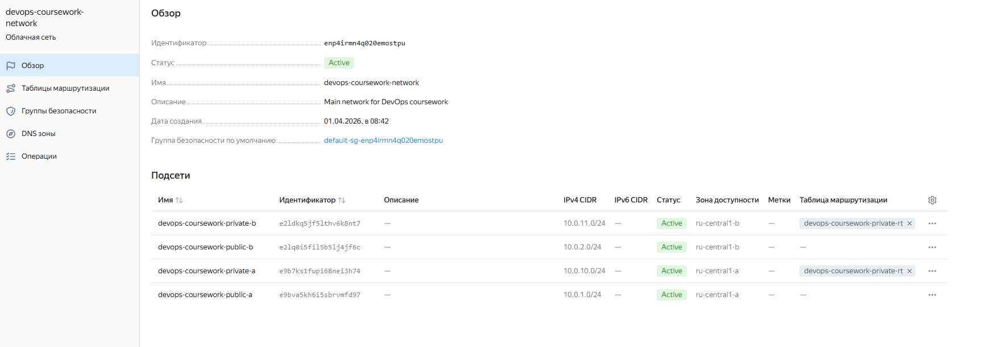
#### Таблицы маршрутизации
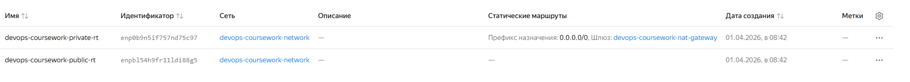
#### Группы безопасности
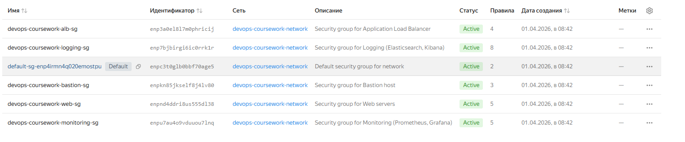
#### Шлюзы

#### Карта облачной сети
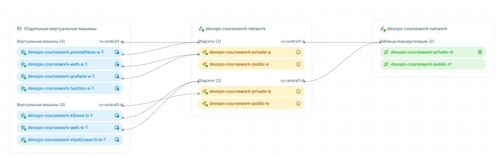

### 2. Virtual Machines
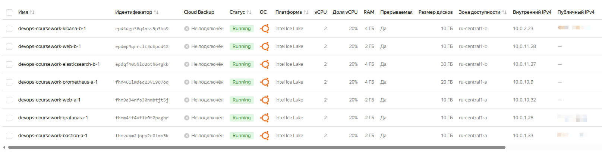

### 3. Application Load Balancer
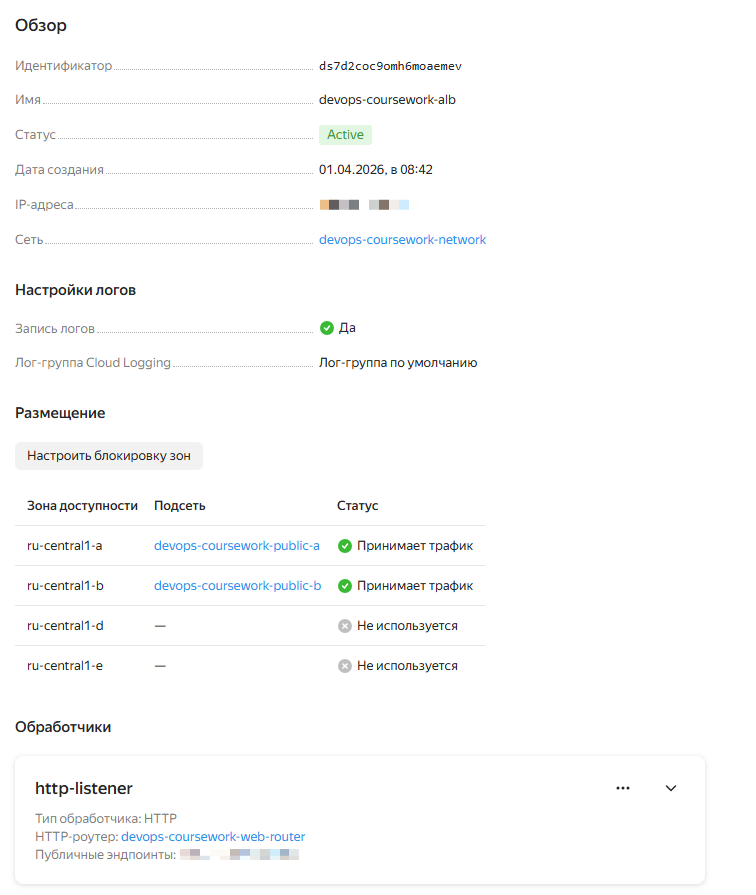

### 4. Target Group
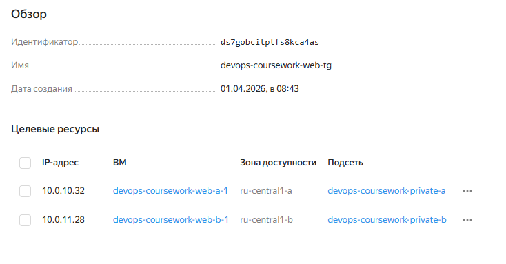

### 5. Snapshot Schedule
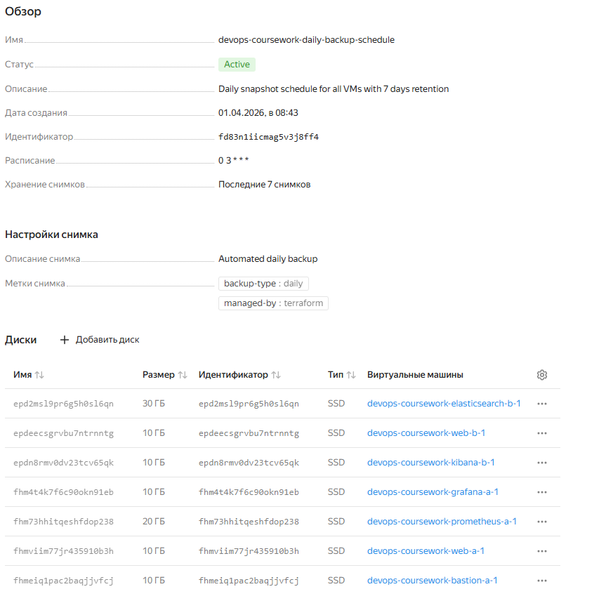


## 4. Ansible: описание ролей

### 4.1 Структура проекта Ansible

```
ansible/
├── site.yml              # Главный playbook (оркестрация)
├── hosts.ini             # Inventory (авто-генерация через Terraform)
└── roles/
    ├── base/             # Базовая настройка всех хостов
    ├── security/         # Fail2Ban, SSH hardening
    ├── node_exporter/    # Prometheus Node Exporter (все ВМ)
    ├── filebeat/         # Сбор логов (разные конфиги для групп)
    ├── nginx_exporter/   # Nginx Prometheus Exporter (webservers)
    ├── nginx/            # Nginx + PHP + API endpoints (webservers)
    ├── prometheus/       # Prometheus server
    ├── grafana/          # Grafana + dashboards provisioning
    ├── elasticsearch/    # Elasticsearch server
    ├── kibana/           # Kibana server
    └── kibana_setup/     # Data Views в Kibana (автоматизация)
```

### 4.2 Главный playbook (site.yml)
Порядок выполнения ролей:

| № | Play| Hosts| Роли| Назначение|
|----------|----------|----------|----------|----------|
|1|Base configuration|all|base, security, node_exporter, filebeat|Базовая настройка всех ВМ|
|2|Web Servers|webservers|nginx_exporter, nginx|Веб-серверы с метриками|
|3|Prometheus|prometheus|prometheus, filebeat|Сбор метрик|
|4|Grafana|grafana|grafana|Визуализация метрик|
|5|Elasticsearch|elasticsearch|elasticsearch|Хранение логов|
|6|Kibana|kibana|kibana, kibana_setup|Визуализация логов + Data Views|

Сначала настраиваются общие компоненты (base, security, exporters) на всех хостах, затем специфичные сервисы на целевых группах.

### 4.3 Описание ролей
base — Базовая настройка всех ВМ

| Задача            | Описание                                                                  |
|-------------------|---------------------------------------------------------------------------|
| Установка пакетов | curl, wget, htop, jq, net-tools, unzip, software-properties-common        |
| Timezone          | Europe/Moscow (синхронизация времени для логов и метрик)                  |
| Sysctl tuning     | Оптимизация сети (somaxconn, tcp_max_syn_backlog) и памяти (swappiness=1) |
| System limits     | nofile/nproc = 65536 (требуется для Elasticsearch)                        |

Применимо к: all hosts

---

security — Безопасность

| Компонент     | Конфигурация                                                    |
|---------------|-----------------------------------------------------------------|
| Fail2Ban      | SSH jail: maxretry=4, bantime=3600s, findtime=600s              |
| SSH Hardening | PermitRootLogin=no, PasswordAuthentication=no, X11Forwarding=no |
| SSH Keepalive | ClientAliveInterval=300, ClientAliveCountMax=2                  |

Применимо к: all hosts

---

node_exporter — Системные метрики

| Параметр          | Значение                                |
|-------------------|-----------------------------------------|
| Версия            | 1.8.2                                   |
| Порт              | 9100                                    |
| Сбор метрик       | CPU, RAM, Disk I/O, Network, filesystem |
| Prometheus scrape | каждые 15 секунд                        |

Применимо к: all hosts (для полного покрытия инфраструктуры)

---

filebeat — Сбор логов

Динамическая конфигурация для разных групп:

| Группа хостов     | Собираемые логи                                      | Индекс Elasticsearch                                                          |
|-------------------|------------------------------------------------------|-------------------------------------------------------------------------------|
| **webservers**    | nginx access.log, error.log, submissions.log, syslog | filebeat-nginx-access-*, filebeat-nginx-error-*,   filebeat-web-submissions-* |
| **bastion**       | auth.log, syslog                                     | filebeat-auth-*, filebeat-syslog-*                                            |
| **prometheus**    | prometheus.log, syslog                               | filebeat-prometheus-*, filebeat-syslog-*                                      |
| **grafana**       | grafana.log, syslog                                  | filebeat-grafana-*, filebeat-syslog-*                                         |
| **elasticsearch** | elasticsearch.log, syslog                            | filebeat-elasticsearch-*, filebeat-syslog-*                                   |
| **kibana**        | kibana.log, syslog                                   | filebeat-kibana-*, filebeat-syslog-*                                          |

Общие настройки:
- Output: Elasticsearch (http://elasticsearch-b-1:9200)
- ILM: отключён
- Processors: add_host_metadata, add_cloud_metadata
- Log level: warning

Применимо к: all hosts

---

nginx_exporter — Метрики Nginx

| Параметр | Значение                                                                        |
|----------|---------------------------------------------------------------------------------|
| Версия   | 1.5.1 (nginxinc)                                                                |
| Порт     | 9113                                                                            |
| Источник | stub_status endpoint (http://127.0.0.1:8080/stub_status)                        |
| Метрики  | nginx_connections_active, nginx_connections_accepted, nginx_connections_handled |

Примечание: Используется официальный exporter от nginxinc вместо martin-helmich/prometheus-nginxlog-exporter из-за проблем с автоматизацией парсинга access.log через Ansible (экранирование $ в systemd + HCL конфиг).

Применимо к: webservers

---

nginx — Веб-сервер

| Компонент     | Конфигурация                                                   |
|---------------|----------------------------------------------------------------|
| Nginx         | reverse proxy + статический контент                            |
| PHP-FPM       | версия 8.3                              |
| stub_status   | порт 8080 (localhost только для nginx_exporter)                |
| CORS headers  | Access-Control-Allow-Origin: * (для тестирования балансировки) |
| API endpoints | /api/submit.php (нагрузка), /api/whoami.php (балансировка)     |
| Healthcheck   | /health (для ALB)                                              |

Применимо к: webservers

---

prometheus — Сбор метрик

| Параметр        | Значение            |
|-----------------|---------------------|
| Версия          | 3.1.0               |
| Порт            | 9090                |
| Scrape interval | 15 секунд           |
| Retention       | 15 дней             |
| TSDB path       | /var/lib/prometheus |

Scrape configs:
- prometheus — localhost:9090 (self-monitoring)
- node_exporter — все хосты из inventory (порт 9100)
- nginx_exporter — webservers только (порт 9113)


Динамическая генерация targets через Jinja2:

```jinja2

- targets:
  - '{{ hostvars[host]["private_ip"] | default(host) }}:9100'

```
Применимо к: prometheus

---

grafana — Визуализация

| Параметр    | Значение                                |
|-------------|-----------------------------------------|
| Версия      | 12.4.2 (Enterprise)                     |
| Порт        | 3000                                    |
| Credentials | admin / admin                           |
| Datasource  | Prometheus (http://prometheus-a-1:9090) |

Дашборды (автоматическое provisioning):
- Node Exporter Full (ID: 1860) — системные метрики
- Nginx Dashboard (ID: 12708) — метрики подключений

Применимо к: grafana

---

elasticsearch — Хранение логов

| Параметр  | Значение                                 |
|-----------|------------------------------------------|
| Версия    | 9.3.2                                    |
| Порты     | HTTP: 9200, Transport: 9300              |
| Режим     | single-node              |
| Heap size | 512MB min/max                            |
| Security  | отключён (xpack.security.enabled: false) |

Системные требования:

- vm.max_map_count = 262144 (настраивается через sysctl)
- nofile limit = 65536 (настраивается в role: base)

Применимо к: elasticsearch

---

kibana — Визуализация логов

| Параметр      | Значение                                                 |
|---------------|----------------------------------------------------------|
| Версия        | 9.3.2                                                    |
| Порт          | 5601                                                     |
| Elasticsearch | http://elasticsearch-b-1:9200 (динамически из inventory) |
| Telemetry     | отключена                                                |

Применимо к: kibana

---

kibana_setup — Автоматизация Data Views

Kibana не создаёт Data Views автоматически при первом запуске. Поэтому создана отдельная роль, которая создаёт 10 Data Views через Kibana API:

| Data View                  | Index Pattern              |
|----------------------------|----------------------------|
| Filebeat - All             | filebeat-*                 |
| Filebeat - Auth            | filebeat-auth-*            |
| Filebeat - Nginx Access    | filebeat-nginx-access-*    |
| Filebeat - Nginx Error     | filebeat-nginx-error-*     |
| Filebeat - Syslog          | filebeat-syslog-*          |
| Filebeat - Prometheus      | filebeat-prometheus-*      |
| Filebeat - Elasticsearch   | filebeat-elasticsearch-*   |
| Filebeat - Kibana          | filebeat-kibana-*          |
| Filebeat - Grafana         | filebeat-grafana-*         |
| Filebeat - Web Submissions | filebeat-web-submissions-* |


API вызов:

```
POST /api/data_views/data_view
{
  "data_view": {
    "id": "filebeat-nginx-access",
    "name": "Filebeat - Nginx Access",
    "title": "filebeat-nginx-access-*",
    "timeFieldName": "@timestamp"
  }
}
```

Применимо к: kibana (после установки Kibana)

---

### 4.4 Ключевые подходы

#### 1. Динамический inventory из Terraform

Inventory генерируется автоматически через template_file:

| Преимущество               | Описание                      |
|----------------------------|-------------------------------|
| ✅ Актуальные IP адреса     | После каждого terraform apply |
| ✅ Автоматический ProxyJump | Для приватных хостов          |
| ✅ Группы хостов            | Для разных ролей              |

#### 2. Условная конфигурация Filebeat
Одна роль с разными шаблонами для каждой группы:

| Группа        | Шаблон                        | Логи                             |
|---------------|-------------------------------|----------------------------------|
| webservers    | filebeat-webservers.yml.j2    | nginx access, error, submissions |
| bastion       | filebeat-bastion.yml.j2       | auth.log, syslog                 |
| prometheus    | filebeat-prometheus.yml.j2    | prometheus.log, syslog           |
| grafana       | filebeat-grafana.yml.j2       | grafana.log, syslog              |
| elasticsearch | filebeat-elasticsearch.yml.j2 | elasticsearch.log, syslog        |
| kibana        | filebeat-kibana.yml.j2        | kibana.log, syslog               |

Не нужно дублировать роль для каждой группы хостов.

#### 3. Handlers для перезапуска сервисов

Все конфигурации используют notify:

| Конфигурация         | Handler               |
|----------------------|-----------------------|
| Nginx config         | Restart Nginx         |
| Prometheus config    | Restart Prometheus    |
| Filebeat config      | Restart Filebeat      |
| Grafana config       | Restart Grafana       |
| Elasticsearch config | Restart Elasticsearch |
| Kibana config        | Restart Kibana        |

Сервисы перезапускаются только при изменении конфигурации.

#### 4. Tags для селективного запуска
Каждая задача имеет теги для быстрой перенастройки:

| Команда                                                           | Назначение                      |
|-------------------------------------------------------------------|---------------------------------|
| ansible-playbook site.yml --tags nginx                            | Перенастроить только Nginx      |
| ansible-playbook site.yml --tags prometheus,grafana,node_exporter | Перенастроить только мониторинг |
| ansible-playbook site.yml --tags filebeat,elasticsearch,kibana    | Перенастроить только логи       |

---

## 5. Мониторинг (Prometheus + Grafana)
### 5.1 Архитектура системы мониторинга
```
 ┌─────────────────────────────────────────────────────────────────┐
 |                                                                 |
 │                    MONITORING STACK                             │
 ├─────────────────────────────────────────────────────────────────┤
 │                                                                 │
 │  Node Exporter (:9100)  ──┐                                     │
 │  (все 7 ВМ)               │                                     │
 │                           │                                     │
 │  Nginx Exporter (:9113)   |→ Prometheus (:9090) → Grafana       │
 │  (web-a-1, web-b-1)       │   (сбор метрик)      (дашборды)     │
 │                           │                                     │
 │  Prometheus Self-Monitor ─┘                                     │
 │                                                                 │
 └─────────────────────────────────────────────────────────────────┘
```

Принцип работы:
1. Exporters собирают метрики на каждом хосте
2. Prometheus опрашивает (scrapes) exporters каждые 15 секунд
3. Grafana визуализирует данные из Prometheus

### 5.2 Prometheus
Конфигурация

| Параметр            | Значение                               |
|---------------------|----------------------------------------|
| Версия              | 3.1.0                                  |
| Порт                | 9090                                   |
| Scrape interval     | 15 секунд                              |
| Evaluation interval | 15 секунд                              |
| Retention time      | 15 дней                                |
| TSDB path           | /var/lib/prometheus                    |
| Расположение        | prometheus-a-1                         |

Источники метрик (Scrape Configs)

| Job Name       | Targets            | Port | Назначение                                  |
|----------------|--------------------|------|---------------------------------------------|
| prometheus     | localhost:9090     | 9090 | Self-monitoring                             |
| node_exporter  | все 7 ВМ (dynamic) | 9100 | Системные метрики (CPU, RAM, Disk, Network) |
| nginx_exporter | web-a-1, web-b-1   | 9113 | Метрики подключений Nginx                   |

Динамическая генерация targets через Jinja2:
- Все хосты из inventory автоматически добавляются в node_exporter job
- При добавлении новой ВМ не требуется правка конфигурации Prometheus

### 5.3 Grafana
Конфигурация

| Параметр     | Значение                                |
|--------------|-----------------------------------------|
| Версия       | 12.4.2 (Enterprise)                     |
| Порт         | 3000                                    |
| Credentials  | admin / admin                           |
| Datasource   | Prometheus (http://prometheus-a-1:9090) |
| Расположение | grafana-a-1 (public_a) |

Дашборды

| Дашборд            | ID    | Источник     | Назначение                                                    |
|--------------------|-------|--------------|---------------------------------------------------------------|
| Node Exporter Full | 1860  | Grafana Labs | Системные метрики всех ВМ (CPU, RAM, Disk, Network)           |
| Nginx Dashboard    | 12708 | Grafana Labs | Метрики подключений Nginx (active, reading, writing, waiting) |

## Node Exporter Full
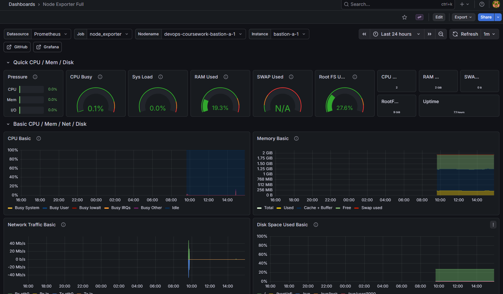

## Nginx Dashboard

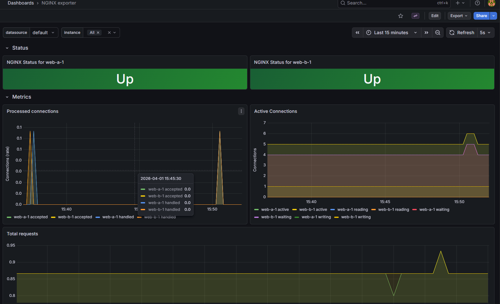

Автоматическое provisioning:
- Дашборды загружаются при первом запуске через Ansible
- DataSource Prometheus создаётся автоматически

Thresholds

| Метрика            | Warning | Critical |
|--------------------|---------|----------|
| CPU Utilization    | > 70%   | > 90%    |
| Memory Utilization | > 80%   | > 95%    |
| Disk Utilization   | > 80%   | > 95%    |
| Network Errors     | > 1%    | > 5%     |
| Nginx Connections  | > 1000  | > 5000   |

### 5.4 Node Exporter

| Параметр     | Значение                                   |
|--------------|--------------------------------------------|
| Версия       | 1.8.2                                      |
| Порт         | 9100                                       |
| Расположение | все 7 ВМ                                   |
| Сбор метрик  | CPU, Memory, Disk I/O, Network, Filesystem |

Собираемые метрики:
- node_cpu_seconds_total — время CPU по ядрам
- node_memory_MemTotal_bytes — общая память
- node_memory_MemAvailable_bytes — доступная память
- node_disk_read_bytes_total — чтение с диска
- node_disk_written_bytes_total — запись на диск
- node_network_receive_bytes_total — входящий трафик
- node_network_transmit_bytes_total — исходящий трафик
- node_filesystem_avail_bytes — свободное место на диске

### 5.5 Nginx Exporter

| Параметр     | Значение                                                 |
|--------------|----------------------------------------------------------|
| Версия       | 1.5.1 (nginxinc)                                         |
| Порт         | 9113                                                     |
| Источник     | stub_status endpoint (http://127.0.0.1:8080/stub_status) |
| Расположение | web-a-1, web-b-1                                         |

Собираемые метрики:
- nginx_connections_active — активные подключения (Utilization)
- nginx_connections_accepted — принятые подключения (Saturation)
- nginx_connections_handled — обработанные подключения (Errors если < accepted)
- nginx_connections_reading — чтение запроса
- nginx_connections_writing — запись ответа
- nginx_connections_waiting — ожидающие подключения (keep-alive)

Примечание: Используется официальный exporter от nginxinc вместо martin-helmich/prometheus-nginxlog-exporter из-за проблем с автоматизацией парсинга access.log через Ansible (экранирование $ в systemd + HCL конфиг). HTTP-метрики (статусы, RPS) доступны в Kibana через Filebeat.

## 6. Логирование (ELK Stack)

### 6.1 Архитектура системы логирования
```
  ┌─────────────────────────────────────────────────────────────────┐
  │                                                                 |
  │                    LOGGING STACK                                │
  ├─────────────────────────────────────────────────────────────────┤
  │                                                                 │
  │  Filebeat (все 7 ВМ) ─────────────────┐                         │
  │  (сбор логов)                         │                         │
  │                                       ▼                         │
  │  ┌─────────────────────────────────────────────────────────┐    │
  │  │  Elasticsearch (:9200)                                  │    │
  │  │  - Хранение логов                                       │    │
  │  │  - Индексация                                           │    │
  │  │  - Поиск                                                │    │
  │  └─────────────────────────────────────────────────────────┘    │
  │                                       │                         │
  │                                       ▼                         │
  │  ┌─────────────────────────────────────────────────────────┐    │
  │  │  Kibana (:5601)                                         │    │
  │  │  - Data Views (10 штук)                                 │    │
  │  │  - Визуализация                                         │    │
  │  └─────────────────────────────────────────────────────────┘    │
  │                                                                 │
  └─────────────────────────────────────────────────────────────────┘
```

Принцип работы:
1. Filebeat собирает логи на каждом хосте
2. Elasticsearch принимает, индексирует и хранит логи
3. Kibana визуализирует данные через Data Views
4. Автоматизация: 10 Data Views создаются через Ansible (kibana_setup role)

### 6.2 Elasticsearch
Конфигурация

| Параметр     | Значение                                  |
|--------------|-------------------------------------------|
| Версия       | 9.3.2                                     |
| Порты        | HTTP: 9200, Transport: 9300               |
| Режим        | single-node               |
| Heap size    | 512MB min/max                             |
| Security     | отключён (xpack.security.enabled: false)  |
| Расположение | elasticsearch-b-1 (private_b) |

Индексы (по типам логов)

| Индекс                     | Источник          |
|----------------------------|-------------------|
| filebeat-nginx-access-*    | web-a-1, web-b-1  |
| filebeat-nginx-error-*     | web-a-1, web-b-1  |
| filebeat-web-submissions-* | web-a-1, web-b-1  |
| filebeat-auth-*            | bastion-a-1       |
| filebeat-syslog-*          | все 7 ВМ          |
| filebeat-prometheus-*      | prometheus-a-1    |
| filebeat-grafana-*         | grafana-a-1       |
| filebeat-elasticsearch-*   | elasticsearch-b-1 |
| filebeat-kibana-*          | kibana-b-1        |

Формат индекса: `filebeat-%{[fields.service]}-%{+yyyy.MM.dd}`

### 6.3 Kibana
Конфигурация

| Параметр      | Значение                              |
|---------------|---------------------------------------|
| Версия        | 9.3.2                                 |
| Порт          | 5601                                  |
| Elasticsearch | http://elasticsearch-b-1:9200         |
| Telemetry     | отключена                             |
| Расположение  | kibana-b-1 (public_b) |

Data Views (автоматическое создание)

| №  | Data View                  | Index Pattern              |
|----|----------------------------|----------------------------|
| 1  | Filebeat - All             | filebeat-*                 |
| 2  | Filebeat - Auth            | filebeat-auth-*            |
| 3  | Filebeat - Nginx Access    | filebeat-nginx-access-*    |
| 4  | Filebeat - Nginx Error     | filebeat-nginx-error-*     |
| 5  | Filebeat - Syslog          | filebeat-syslog-*          |
| 6  | Filebeat - Prometheus      | filebeat-prometheus-*      |
| 7  | Filebeat - Elasticsearch   | filebeat-elasticsearch-*   |
| 8  | Filebeat - Kibana          | filebeat-kibana-*          |
| 9  | Filebeat - Grafana         | filebeat-grafana-*         |
| 10 | Filebeat - Web Submissions | filebeat-web-submissions-* |


Роль kibana_setup создаёт Data Views через Kibana API

### 6.4 Filebeat
Конфигурация по группам хостов

| Группа хостов | Собираемые логи                                      | Индекс                                                                                     |
|---------------|------------------------------------------------------|--------------------------------------------------------------------------------------------|
| webservers    | nginx access.log, error.log, submissions.log, syslog | filebeat-nginx-access-, filebeat-nginx-error-, filebeat-web-submissions-, filebeat-syslog- |
| bastion       | auth.log, syslog                                     | filebeat-auth-, filebeat-syslog-                                                           |
| prometheus    | prometheus.log, syslog                               | filebeat-prometheus-, filebeat-syslog-                                                     |
| grafana       | grafana.log, syslog                                  | filebeat-grafana-, filebeat-syslog-                                                        |
| elasticsearch | elasticsearch.log, syslog                            | filebeat-elasticsearch-, filebeat-syslog-                                                  |
| kibana        | kibana.log, syslog                                   | filebeat-kibana-, filebeat-syslog-                                                         |

Общие настройки Filebeat

| Параметр     | Значение                                      |
|--------------|-----------------------------------------------|
| Версия       | 9.3.2                                         |
| Output       | Elasticsearch (http://elasticsearch-b-1:9200) |
| ILM          | отключён                        |
| Template     | отключён                                      |
| Processors   | add_host_metadata, add_cloud_metadata         |
| Log level    | warning                                       |
| Log rotation | 7 файлов                                      |

### 6.5 HTTP метрики в Kibana (альтернатива nginxlog-exporter)
Поскольку используется nginxinc exporter (без метрик по статусам), HTTP-анализ доступен в Kibana:

| Метрика                 | PromQL (nginxinc)                    | Kibana Query (Filebeat)     |
|-------------------------|--------------------------------------|-----------------------------|
| RPS                     | rate(nginx_connections_accepted[1m]) | count() за 1 минуту         |
| Статусы (200, 404, 500) | ❌ Нет                                | ✅ http.response.status_code |
| Топ URL                 | ❌ Нет                                | ✅ url.original aggregation  |
| User Agents             | ❌ Нет                                | ✅ user_agent.original       |
| IP адреса клиентов      | ❌ Нет                                | ✅ source.ip                 |
| Размер ответа           | ❌ Нет                                | ✅ http.response.bytes       |

Kibana компенсирует отсутствие HTTP-метрик в Prometheus.

## Kibana

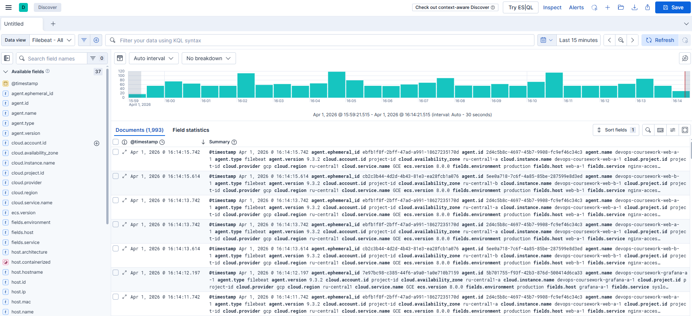

## 7. Безопасность

### 7.1 Bastion Host
Концепция единой точки входа

Admin PC → Internet → Bastion → Private VMs (через ProxyJump)

### 7.2 SSH Hardening
Конфигурация через Ansible (role: security)

| Параметр               | Значение | Обоснование                                  |
|------------------------|----------|----------------------------------------------|
| PermitRootLogin        | no       | Запрет прямого входа под root                |
| PasswordAuthentication | no       | Только SSH ключи (защита от brute-force)     |
| PermitEmptyPasswords   | no       | Запрет пустых паролей                        |
| X11Forwarding          | no       | Отключение ненужных функций                  |
| ClientAliveInterval    | 300      | Таймаут неактивных сессий (5 мин)            |
| ClientAliveCountMax    | 2        | Максимум 2 пропуска keepalive перед разрывом |

Fail2Ban конфигурация

| Параметр | Значение          |
|----------|-------------------|
| Jail     | sshd              |
| Enabled  | true              |
| Port     | ssh (22)          |
| Filter   | sshd              |
| Logpath  | /var/log/auth.log |
| Maxretry | 4                 |
| Bantime  | 3600 (1 час)      |
| Findtime | 600 (10 минут)    |

Принцип работы:
- Fail2Ban мониторит /var/log/auth.log
- При 4 неудачных попытках входа за 10 минут — блокирует IP на 1 час
- Блокировка реализуется через iptables/nftables

### 8. Проверка работы системы

```bash
# === TERRAFORM ===
cd terraform
terraform init
terraform validate
terraform plan -out=infra.plan
terraform apply infra.plan

# Проверка outputs
terraform output summary

# === ANSIBLE ===
cd ../ansible
ansible-playbook site.yml --syntax-check
ansible-playbook -i hosts.ini site.yml -vvv

# Проверка connectivity
ansible all -m ping

# === ПРОВЕРКА СЕРВИСОВ ===
# Prometheus
curl http://prometheus-a-1:9090/api/v1/targets | jq

# Grafana
curl http://grafana-a-1:3000/api/health | jq

# Elasticsearch
curl http://elasticsearch-b-1:9200/_cluster/health | jq

# Kibana
curl http://kibana-b-1:5601/api/status | jq

# ALB
curl http://<alb_public_ip>/health

# Node Exporter
curl http://web-a-1:9100/metrics | head -20

# Nginx Exporter
curl http://web-a-1:9113/metrics | grep nginx_connections
```

## 9. Требования

- Установить Terraform
- Установить Yandex Cloud CLI
- Установить Ansible

Необходимо создать `terraform.tfvars`

## Пример
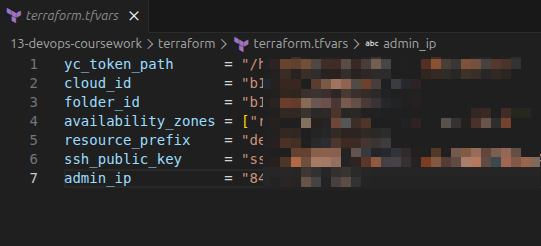

Необходимы .deb пакеты по причине блокировки в РФ

- elasticsearch-9.3.2-amd64.deb
- kibana-9.3.2-amd64.deb
- filebeat-9.3.2-amd64.deb
- grafana-enterprise_12.4.2_*.deb