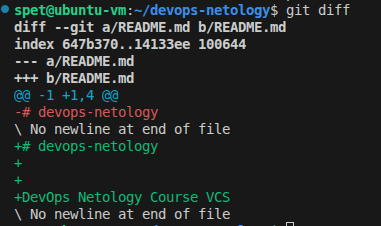
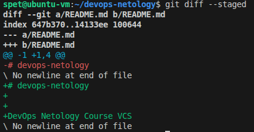
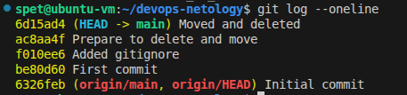

# Домашнее задание к занятию «Системы контроля версий» - Спетницкий Д.И.


## Задание

https://github.com/netology-code/sysadm-homeworks/blob/devsys10/02-git-01-vcs/README.md

---


## Решение


Все практические задания выполнены в отдельном репозитории:


### 👉 [songspeta/devops-netology](https://github.com/songspeta/devops-netology)


##  Результаты выполнения


### История коммитов (git log --oneline)

1. **Initial commit** — создан автоматически GitHub при инициализации репозитория
2. **First commit** — изменён файл README.md, изучены команды `git diff` и `git diff --staged`
3. **Added gitignore** — добавлены файлы `.gitignore` (корневой и для Terraform)
4. **Prepare to delete and move** — созданы временные файлы `will_be_deleted.txt` и `will_be_moved.txt`
5. **Moved and deleted** — файл удалён через `git rm`, файл переименован через `git mv`

### Разница между git diff и git diff --staged

#### git diff --staged
Показывает изменения, которые уже добавлены в индекс (staged) и готовы к коммиту:


#### git diff
Показывает изменения в рабочей директории, которые ещё не добавлены в индекс:


**Вывод:**
- `git diff` — показывает изменения между рабочей директорией и индексом
- `git diff --staged` — показывает изменения между индексом и последним коммитом (HEAD)

### Файл .gitignore для Terraform

Создан файл `terraform/.gitignore` со следующим содержимым:

```gitignore
# Terraform files
*.tfstate
*.tfstate.*
*.tfvars
*.tfvars.json

# Crash logs
.crash.log
.crash.*

# Directory for plugins
.terraform/
.terraform.lock.hcl

# CLI configuration files
.terraformrc
terraform.rc

# Override files
*.override.tf
*.override.tf.json

# Include tfplan files
*tfplan*

# Ignore CLI configuration files
~/.terraform.d/
```

**Какие файлы игнорируются:**

-   `*.tfstate` — файлы состояния Terraform (содержат чувствительные данные и инфраструктуру)
-   `*.tfvars` — файлы с переменными (могут содержать пароли и ключи)
-   `.terraform/` — директория с плагинами и провайдерами
-   `.crash.log` — логи аварийного завершения
-   `*.override.tf` — файлы переопределения конфигурации

##  Структура репозитория
```
devops-netology/
├── README.md           # Описание курса и модулей
├── .gitignore          # Глобальный gitignore
├── terraform/
│   └── .gitignore      # Gitignore для Terraform
└── has_been_moved.txt  # Переименованный файл
```


## Скриншоты





---

