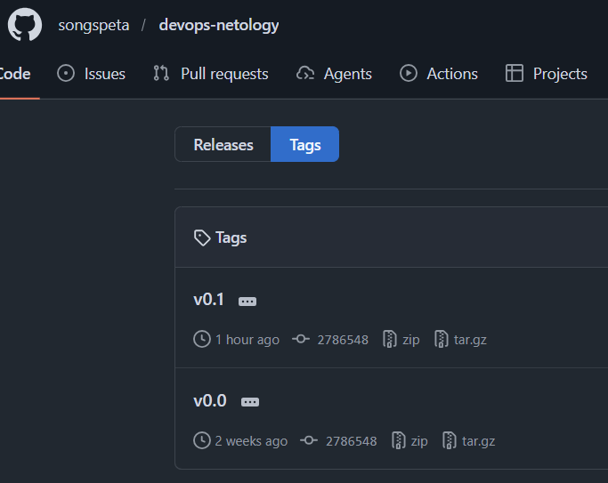
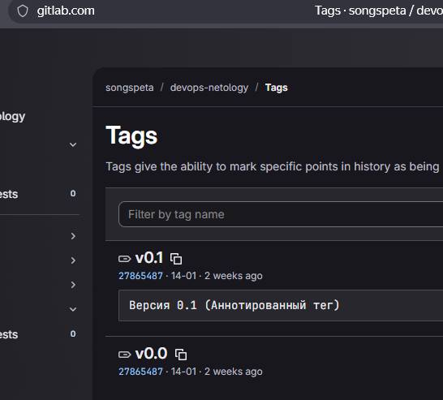
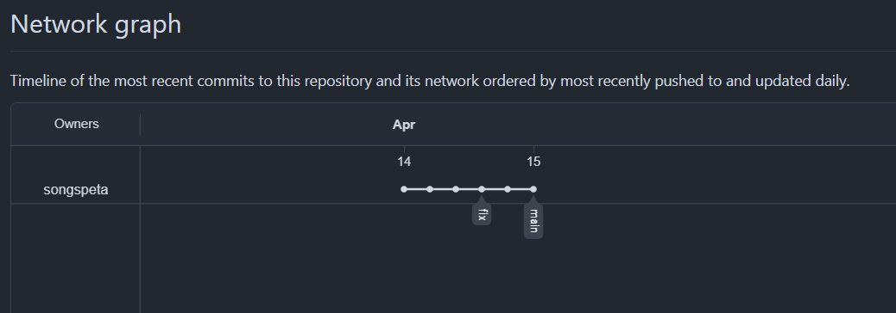
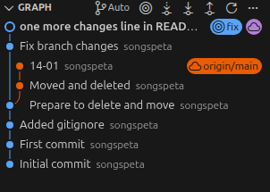

# Домашнее задание к занятию  «Основы Git» - Спетницкий Д.И.

GitHub: https://github.com/songspeta/devops-netology

GitLab: https://gitlab.com/songspeta/devops-netology

```
git remote -v

gitlab  git@gitlab.com:songspeta/devops-netology.git (fetch)
gitlab  git@gitlab.com:songspeta/devops-netology.git (push)
origin  https://github.com/songspeta/devops-netology.git (fetch)
origin  https://github.com/songspeta/devops-netology.git (push)

git branch -a

* fix
  main
  remotes/gitlab/fix
  remotes/origin/HEAD -> origin/main
  remotes/origin/fix
  remotes/origin/main

git tag -l

v0.0
v0.1

git log --oneline --graph --all

* 1eaf980 (HEAD -> fix, origin/fix, gitlab/fix) one more changes line in README.md
* 3726de2 Fix branch changes
| * 2786548 (tag: v0.1, tag: v0.0, origin/main, origin/HEAD, main) 14-01
| * 6d15ad4 Moved and deleted
|/  
* ac8aa4f Prepare to delete and move
* f010ee6 Added gitignore
* be80d60 First commit
* 6326feb Initial commit
```
## Скриншоты






Задание 1:

- Создан репозиторий в GitLab
- Добавлен как remote gitlab к локальному репозиторию
- Настроены origin (GitHub) и gitlab (GitLab)

Задание 2:

- Создан легковесный тег v0.0
- Создан аннотированный тег v0.1 с сообщением
- Теги отправлены в GitHub и GitLab

Задание 3:

- Создана ветка fix от коммита "Prepare to delete and move"
- Внесены изменения в README.md
- Ветка отправлена в GitHub

Задание 4:

- Выполнен коммит через GUI VS Code
- Изменения отправлены в репозиторий