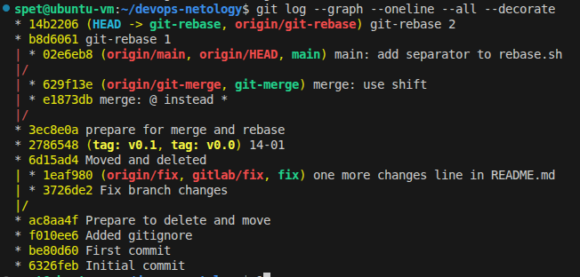
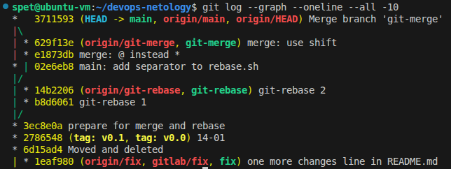
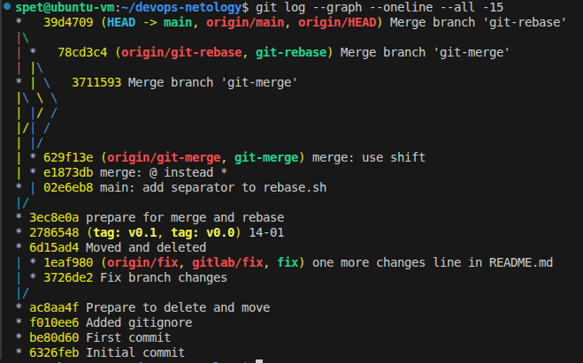

# Домашнее задание к занятию  «Ветвления в Git» - Спетницкий Д.И.

GitHub: https://github.com/songspeta/devops-netology

### Часть 1: Подготовка

```
# Создан каталог branching с двумя файлами
mkdir branching
# Созданы merge.sh и rebase.sh с начальным содержимым
git commit -m "prepare for merge and rebase"
```
### Часть 2: Работа с веткой git-merge

```
# Создана ветка git-merge
git switch -c git-merge

# Внесены 2 коммита с изменением merge.sh
git commit -m "merge: @ instead *"
git commit -m "merge: use shift"

# Отправлено в репозиторий
git push -u origin git-merge
```

### Часть 3: Изменение main

```
# Вернулись на main и внесли изменения
git checkout main
# Изменён rebase.sh (добавлена строка echo "=====")
git commit -m "main: add separator to rebase.sh"
git push origin main
```

### Часть 4: Работа с веткой git-rebase

```
# Создана ветка от старого коммита
git checkout <hash коммита "prepare for merge and rebase">
git switch -c git-rebase

# Внесены 2 коммита с изменением rebase.sh
git commit -m "git-rebase 1"
git commit -m "git-rebase 2"
git push -u origin git-rebase
```

### Часть 5: Merge git-merge в main

```
git checkout main
git merge git-merge
# Конфликтов нет
git push origin main
```

### Часть 6: Rebase git-rebase (с разрешением конфликтов)

```
# Переключаемся на git-rebase
git checkout git-rebase

# Интерактивный rebase с объединением коммитов
git rebase -i main
# Изменили второй коммит на fixup для объединения

# Разрешены конфликты в rebase.sh:
# 1 конфликт: оставлена версия из HEAD (main)
# 2 конфликт: оставлена версия из git-rebase ("Next parameter")

git add branching/rebase.sh
git rebase --continue

# Force push (история изменена!)
git push origin git-rebase -f
```

### Часть 7: Merge git-rebase в main

```
git checkout main
git merge git-rebase
git push origin main
```

## Скриншоты


