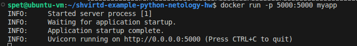
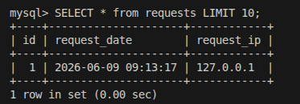
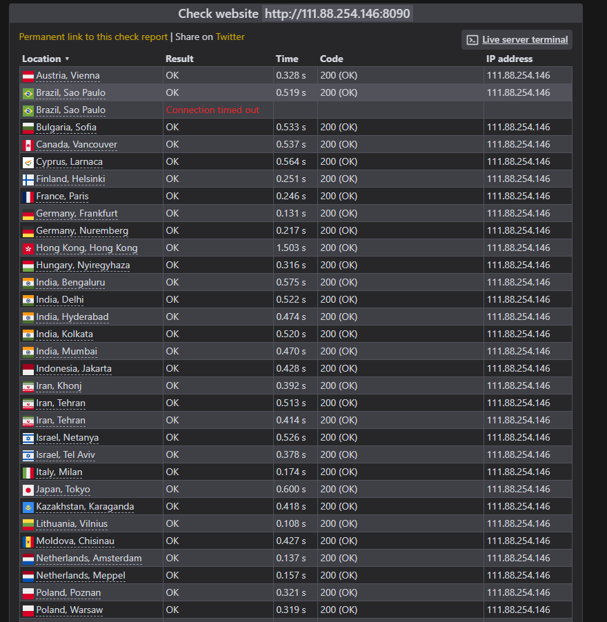
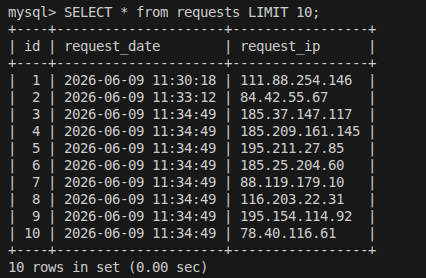
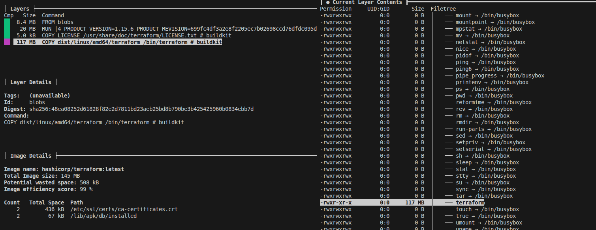
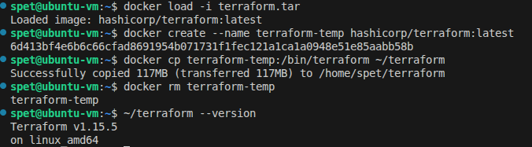
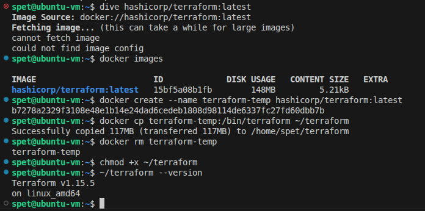

# Домашнее задание к занятию  «Практическое применение Docker» - Спетницкий Д.И.


**Репозиторий:** https://github.com/songspeta/shvirtd-example-python-netology-hw

---

## ЗАДАЧА 1.

### 1. Fork репозитория
Выполнен fork репозитория https://github.com/netology-code/shvirtd-example-python в пространство `songspeta`.

### 2. Создан файл `Dockerfile.python`

```dockerfile
FROM python:3.12-slim

WORKDIR /app

COPY . .

RUN pip install --no-cache-dir -r requirements.txt

CMD ["uvicorn", "main:app", "--host", "0.0.0.0", "--port", "5000"]
```

**Соответствие требованиям:**
- ✅ Базовый образ `python:3.12-slim`
- ✅ Используется `COPY . .`
- ✅ Используется `CMD ["uvicorn", "main:app", "--host", "0.0.0.0", "--port", "5000"]`

### 2.1. Multistage сборка

```dockerfile
# Stage 1: build
FROM python:3.12-slim AS builder
WORKDIR /app
COPY requirements.txt .
RUN pip install --no-cache-dir --prefix=/install -r requirements.txt

# Stage 2: runtime
FROM python:3.12-slim
WORKDIR /app
COPY --from=builder /install /usr/local
COPY . .
CMD ["uvicorn", "main:app", "--host", "0.0.0.0", "--port", "5000"]
```

### 3. Создан файл `.dockerignore`

```
.git
.gitignore
__pycache__
*.pyc
.env
.venv
venv
*.md
docker-compose.yaml
proxy.yaml
```

### 4. Тестирование сборки

```bash
docker build -f Dockerfile.python -t myapp .
docker run -p 5000:5000 myapp
```



---

## ЗАДАЧА 3. Docker Compose

### 1. Изучен файл `proxy.yaml`
Файл содержит описание двух сервисов:
- `reverse-proxy` (HAProxy на порту 8080)
- `ingress-proxy` (Nginx на порту 8090 через `network_mode: host`)

### 2. Создан файл `compose.yaml`

```yaml
include:
  - proxy.yaml

services:
  web:
    build:
      context: .
      dockerfile: Dockerfile.python
    networks:
      backend:
        ipv4_address: 172.20.0.5
    restart: always
    environment:
      DB_HOST: db
      DB_USER: ${MYSQL_USER}
      DB_PASSWORD: ${MYSQL_PASSWORD}
      DB_NAME: ${MYSQL_DATABASE}

  db:
    image: mysql:8
    networks:
      backend:
        ipv4_address: 172.20.0.10
    restart: on-failure
    env_file:
      - .env
```

**Соответствие требованиям:**
- ✅ Директива `include` для подключения `proxy.yaml`
- ✅ Сервис `web` с фиксированным IP `172.20.0.5` в сети `backend`
- ✅ Сервис `db` с фиксированным IP `172.20.0.10` в сети `backend`
- ✅ `restart: always` для web, `restart: on-failure` для db
- ✅ ENV-переменные для подключения к БД
- ✅ `.env` файл для секретных переменных

### 3. Запуск проекта и проверка работы

```bash
docker compose up -d
curl -L http://127.0.0.1:8090
```

**Результат:**
```
TIME: 2026-06-09 09:13:17, IP: 127.0.0.1
```


### 4. Проверка БД через SQL

```bash
docker exec -ti shvirtd-example-python-netology-hw-db-1 mysql -uroot -pYtReWq4321
```

```sql
show databases;
use virtd;
show tables;
SELECT * from requests LIMIT 10;
```



### 5. Остановка проекта

```bash
docker compose down
```

---

## ЗАДАЧА 4. Развёртывание в Yandex Cloud

### 1. Создание ВМ через Terraform

**ubuntu.tf:**
```hcl
resource "yandex_compute_instance" "machine-1" {
  name        = "machine-1"
  zone        = "ru-central1-a"
  platform_id = "standard-v3"

  resources {
    cores         = 2
    memory        = 2
    core_fraction = 20
  }

  boot_disk {
    initialize_params {
      image_id = data.yandex_compute_image.ubuntu.id
      type     = "network-ssd"
      size     = 20
    }
  }

  network_interface {
    subnet_id          = yandex_vpc_subnet.public_a.id
    nat                = true
    security_group_ids = [yandex_vpc_security_group.machine-1.id]
  }

  metadata = {
    ssh-keys = "ubuntu:${var.ssh_public_key}"
  }
}
```

**Security Group:**
- ✅ SSH (порт 22) — входящий
- ✅ HTTP (порт 8090) — входящий
- ✅ Весь исходящий трафик

**Результат:** ВМ создана с внешним IP **111.88.254.146**

##


# 2. Установка Docker
Использован образ `container-optimized-image` — Docker уже предустановлен.

### 3. Bash-скрипт `deploy.sh`

```bash
#!/bin/bash
REPO_URL="https://github.com/songspeta/shvirtd-example-python-netology-hw.git"
PROJECT_DIR="/opt/shvirtd-example-python-netology-hw"

echo "=== Начало развёртывания ==="

if [ ! -d "$PROJECT_DIR" ]; then
    sudo git clone "$REPO_URL" "$PROJECT_DIR"
fi

cd "$PROJECT_DIR" || exit 1
sudo usermod -aG docker ubuntu
sudo docker compose up -d
sleep 15

sudo docker ps -a
EXTERNAL_IP=$(curl -s https://api.ipify.org)
echo "Проект развёрнут: http://${EXTERNAL_IP}:8090"
```

### 4. Проверка через check-host.net

URL проверки: `http://111.88.254.146:8090`

**Цепочка прохождения трафика:**
Пользователь → Internet → Nginx → HAProxy → FastAPI (запись в БД) → HAProxy → Nginx → Internet → Пользователь




### 6. SQL-запрос на сервере

```bash
sudo docker exec -ti shvirtd-example-python-netology-hw-db-1 mysql -uroot -pYtReWq4321
```

```sql
use virtd;
SELECT * from requests LIMIT 10;
```



**Ссылка на fork:** https://github.com/songspeta/shvirtd-example-python-netology-hw

---

## ЗАДАЧА 6. Извлечение бинарника через dive и docker save

### 1. Скачивание образа

```bash
docker pull hashicorp/terraform:latest
```

### 2. Сохранение образа в tar

```bash
docker save hashicorp/terraform:latest -o terraform.tar
ls -lh terraform.tar
# -rw------- 1 spet spet 8.5K Jun  9 15:19 terraform.tar
```

### 3. Попытка использования dive

```bash
dive hashicorp/terraform:latest
```

**Проблема:** Образ `hashicorp/terraform:latest` использует containerd snapshotter, из-за чего dive не может прочитать конфигурацию образа:
```
cannot fetch image
could not find image config
```

### 4. Альтернативное извлечение бинарника

```bash
docker load -i terraform.tar
docker create --name terraform-temp hashicorp/terraform:latest
docker cp terraform-temp:/bin/terraform ~/terraform
docker rm terraform-temp
~/terraform --version
```

## DIVE




**Результат:** `Terraform v1.15.5 on linux amd64`



---

## ЗАДАЧА 6.1. Извлечение через docker cp

### 1. Создание контейнера

```bash
docker create --name terraform-temp hashicorp/terraform:latest
```

### 2. Копирование бинарника

```bash
docker cp terraform-temp:/bin/terraform ~/terraform-cp
```

### 3. Удаление временного контейнера

```bash
docker rm terraform-temp
```

### 4. Проверка

```bash
chmod +x ~/terraform-cp
~/terraform-cp --version
```

**Результат:** `Terraform v1.15.5 on linux amd64`



---

## ИТОГ

| Задание | Статус |
|---------|--------|
| Задача 1 (Dockerfile.python) | ✅ Выполнено |
| Задача 3 (Docker Compose) | ✅ Выполнено |
| Задача 4 (Yandex Cloud) | ✅ Выполнено |
| Задача 6 (dive + docker save) | ⚠️ Частично (dive не читает образ) |
| Задача 6.1 (docker cp) | ✅ Выполнено |
```