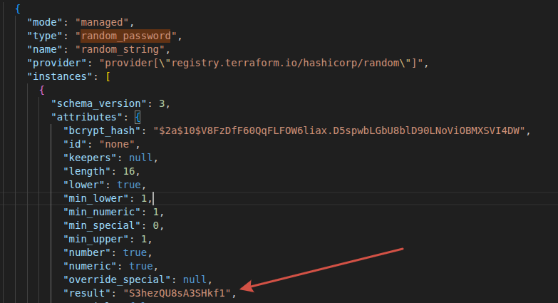
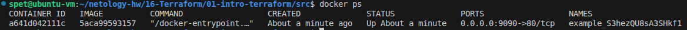
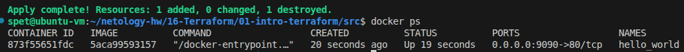

# Домашнее задание к занятию «Введение в Terraform» - Спетницкий Д.И.

## Задание 1

### 1.1 Инициализация проекта
Перейдено в каталог `/src`, выполнены команды для скачивания зависимостей:
```bash
terraform init
```
*Примечание: В файле `main.tf` ограничение версии `required_version = "~>1.12.0"` было изменено на `>= 1.12.0` для совместимости с установленной версией Terraform 1.15.5.*

---

### 1.2 Анализ .gitignore
Согласно файлу `.gitignore`, личную и секретную информацию (логины, пароли, ключи, токены) допустимо сохранять в файле:
**`personal.auto.tfvars`**

Этот файл явно указан в `.gitignore` с комментарием `# own secret vars store.` и не будет индексироваться Git. Terraform автоматически подхватывает переменные из файлов с суффиксом `.auto.tfvars`.

---

### 1.3 Секретное содержимое в state-файле
После выполнения кода в файле `terraform.tfstate` в ресурсе `random_password` секретное содержимое хранится в ключе **`result`**.

*   **Ключ:** `result`
*   **Значение:** `S3hezQU8sA3SHkf1`



---

### 1.4 Исправление ошибок в main.tf
После раскомментирования блока кода  и выполнения `terraform validate` были выявлены 3 намеренные ошибки:

1.  **Отсутствует имя ресурса `docker_image`.** Блок `resource` требует два label: тип и имя.
2.  **Имя ресурса `1nginx` начинается с цифры.** Идентификаторы в Terraform должны начинаться с буквы или символа подчеркивания.
3.  **Неверная ссылка на ресурс и опечатка в атрибуте.** Использован несуществующий ресурс `random_string_FAKE` и атрибут написан с заглавной буквы `resulT` (должно быть `result`).

**Исправленный фрагмент кода:**
```hcl
resource "docker_image" "nginx" {
  name         = "nginx:latest"
  keep_locally = true
}

resource "docker_container" "nginx" {
  image = docker_image.nginx.image_id
  name  = "example_${random_password.random_string.result}"

  ports {
    internal = 80
    external = 9090
  }
}
```

---

### 1.5 Выполнение кода
После применения исправленной конфигурации (`terraform apply`) был создан контейнер.

**Вывод команды `docker ps`:**



---

### 1.6 Переименование контейнера и ключ -auto-approve
Имя контейнера в блоке `docker_container` было изменено на `hello_world` (образ `nginx:latest` не менялся). Выполнена команда `terraform apply -auto-approve`.

**Вывод команды `docker ps`:**



**Опасность ключа `-auto-approve`:**
Ключ `-auto-approve` пропускает интерактивное подтверждение применения изменений. Terraform не показывает план (что будет добавлено, изменено или удалено) и не ждёт ввода `yes`. Это опасно тем, что при наличии ошибки в конфигурации можно случайно удалить критичные production-ресурсы без возможности остановиться.

**Зачем может пригодиться:**
*   **CI/CD пайплайны** (GitLab CI, GitHub Actions), где нет интерактивного терминала и некому ввести `yes`.
*   **Автоматизация** развёртывания тестовых сред, где изменения типовые и не несут рисков.
*   **Скрипты**, где план изменений уже был проверен на предыдущем шаге (например, через `terraform plan -out=tfplan`).

---

### 1.7 Уничтожение ресурсов
Ресурсы были уничтожены командой `terraform destroy -auto-approve`. Все контейнеры удалены.

**Содержимое файла `terraform.tfstate` после уничтожения:**
```json
{
  "version": 4,
  "terraform_version": "1.15.5",
  "serial": 11,
  "lineage": "9f3abca2-6d1a-a503-99b1-309f0ca1ebcb",
  "outputs": {},
  "resources": [],
  "check_results": null
}
```
*Массив `resources` пуст, что подтверждает удаление всех ресурсов из стейта.*

---

### 1.8 Сохранение docker-образа
При уничтожении ресурсов docker-образ `nginx:latest` **не был удалён** из локального хранилища.

**Причина в коде:**
В ресурсе `docker_image` явно указан параметр `keep_locally = true`:
```hcl
resource "docker_image" "nginx" {
  name         = "nginx:latest"
  keep_locally = true
}
```

**Подтверждение из документации провайдера `kreuzwerker/docker` (resource `docker_image`):**
> `keep_locally` (Boolean) If true, then the Docker image won't be deleted on destroy operation. If this is false, it will delete the image from the docker local storage on destroy operation.
