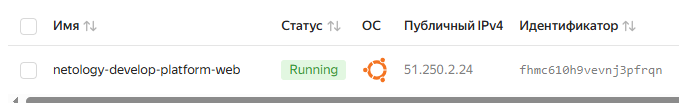
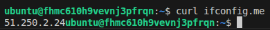
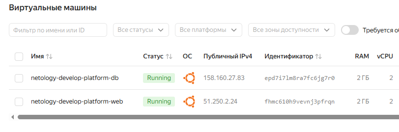
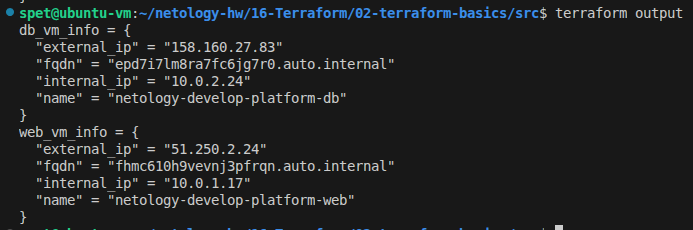

# Домашнее задание к занятию «Основы работы с Terraform» - Спетницкий Д.И.

## Задание 1

### Что было сделано:

1. Изучен проект, созданы сервисный аккаунт и ключ для Yandex Cloud
2. Сгенерирован SSH-ключ (ed25519), публичная часть добавлена в переменную `vms_ssh_root_key`
3. Инициализирован проект, исправлены синтаксические ошибки в коде
4. Создана виртуальная машина в Yandex Cloud
5. Выполнено подключение к ВМ через SSH и проверка внешнего IP-адреса

### Исправленные синтаксические ошибки:

1. **Кавычки в блоке metadata**: Ключи с дефисами (`serial-port-enable`, `ssh-keys`) должны быть заключены в двойные кавычки в HCL
2. **Опечатка в platform_id**: Было `"standart-v3"`, исправлено на `"standard-v3"`


### Ответы на вопросы:

**Как в процессе обучения могут пригодиться параметры `preemptible = true` и `core_fraction = 20`?**

- **`preemptible = true`** - создаёт прерываемую ВМ, которая стоит значительно дешевле. Яндекс.Облако может остановить такую ВМ в любой момент. Для выполнения домашних заданий и тестирования, где ВМ живёт 1-2 часа, это идеальный способ экономии.

- **`core_fraction = 20`** - гарантирует ВМ всего 20% производительности CPU. Этого достаточно для работы SSH, выполнения лёгких команд (`curl`, `ping`), запуска учебных скриптов, но абсолютно не подходит для production-нагрузок. В сочетании с `preemptible` делает аренду ВМ максимально бюджетной.

### Скриншоты:

**Рисунок 1 - Виртуальная машина в консоли Yandex Cloud**



*Рисунок 1 - Созданная ВМ с внешним IP-адресом в консоли Yandex Cloud*

**Рисунок 2 - Проверка внешнего IP-адреса из консоли ВМ**



*Рисунок 2 - Подключение по SSH и проверка внешнего IP через curl ifconfig.me*

---

## Задание 2

### Что было сделано:

1. Все хардкод-значения для ресурса `yandex_compute_instance` заменены на переменные
2. К названиям переменных ВМ добавлен префикс `vm_web_`
3. Созданы новые переменные в файле `variables.tf` с указанием типа и значениями по умолчанию:
   - `vm_web_name` - имя ВМ
   - `vm_web_platform_id` - идентификатор платформы
   - `vm_web_cores` - количество ядер CPU
   - `vm_web_memory` - объём памяти (GB)
   - `vm_web_core_fraction` - доля CPU
   - `vm_web_image_family` - семейство образа ОС

4. Проверено выполнение `terraform plan` - изменений нет

### Файлы:
- `variables.tf` - добавлены переменные с префиксом `vm_web_`
- `main.tf` - заменены хардкод-значения на переменные

---

## Задание 3

### Что было сделано:

1. Создан файл `vms_platform.tf` в корне проекта
2. Перенесён блок `data "yandex_compute_image"` в новый файл
3. Создана вторая подсеть `yandex_vpc_subnet.develop_db` в зоне `ru-central1-b` с CIDR `10.0.2.0/24`
4. Создана вторая ВМ `yandex_compute_instance.db` с параметрами:
   - Имя: `netology-develop-platform-db`
   - Зона: `ru-central1-b`
   - CPU: 2 ядра
   - RAM: 2 GB
   - Core fraction: 20
   - Preemptible: true

5. Объявлены переменные с префиксом `vm_db_` в файле `variables.tf`:
   - `vm_db_name`
   - `vm_db_platform_id`
   - `vm_db_cores`
   - `vm_db_memory`
   - `vm_db_core_fraction`
   - `vm_db_zone`
   - `vm_db_cidr`

### Скриншот:

**Рисунок 3 - Две виртуальные машины в консоли Yandex Cloud**



---

## Задание 4

### Что было сделано:

1. В файле `outputs.tf` создан output, содержащий информацию о каждой ВМ:
   - `instance_name` - имя ВМ
   - `external_ip` - внешний IP-адрес
   - `internal_ip` - внутренний IP-адрес
   - `fqdn` - полное доменное имя

2. Использованы интерполяции без хардкода

### Вывод terraform output:

```
db_vm_info = {
  "external_ip" = "158.160.27.83"
  "fqdn" = "epd7i7lm8ra7fc6jg7r0.auto.internal"
  "internal_ip" = "10.0.2.24"
  "name" = "netology-develop-platform-db"
}
web_vm_info = {
  "external_ip" = "51.250.2.24"
  "fqdn" = "fhmc610h9vevnj3pfrqn.auto.internal"
  "internal_ip" = "10.0.1.17"
  "name" = "netology-develop-platform-web"
}
```

### Скриншот:

**Рисунок 4 - Вывод terraform output**



*Рисунок 4 - Вывод команды terraform output с информацией о ВМ*

---

## Задание 5

### Что было сделано:

1. В файле `locals.tf` описан local-блок с именами ВМ с использованием интерполяции:

```hcl
locals {
  vm_web_full_name = "netology-${var.vpc_name}-${var.vm_web_name}"
  vm_db_full_name  = "netology-${var.vpc_name}-${var.vm_db_name}"
}
```

2. Использованы НЕСКОЛЬКИМИ переменными в интерполяции:
   - `var.vpc_name` (develop)
   - `var.vm_web_name` (platform-web)
   - `var.vm_db_name` (platform-db)

3. Заменены переменные внутри ресурсов ВМ на local-переменные:
   - В `main.tf`: `name = local.vm_web_full_name`
   - В `vms_platform.tf`: `name = local.vm_db_full_name`

4. Проверено выполнение `terraform plan` - изменений нет

### Преимущества:
- Упрощено управление именами ВМ
- При изменении одной переменной (`vpc_name`) автоматически обновляются все имена
- Код стал более читаемым и поддерживаемым

---

## Задание 6

### Что было сделано:

1. **Создана map-переменная `vms_resources`** в `variables.tf`:

```hcl
variable "vms_resources" {
  type = map(object({
    cores         = number
    memory        = number
    core_fraction = number
  }))

  default = {
    web = {
      cores         = 2
      memory        = 2
      core_fraction = 20
    }
    db = {
      cores         = 2
      memory        = 2
      core_fraction = 20
    }
  }
}
```

2. **Создана map-переменная `metadata`** для всех ВМ:

```hcl
variable "metadata" {
  type = map(string)

  default = {
    "serial-port-enable" = "1"
  }
}
```

3. **В переменнаую `vms_ssh_root_key`** добавлен флаг `sensitive = true` для безопасности

4. **Обновлены ресурсы ВМ** с использованием map-переменных:

```hcl
resources {
  cores         = var.vms_resources["web"].cores
  memory        = var.vms_resources["web"].memory
  core_fraction = var.vms_resources["web"].core_fraction
}

metadata = merge(var.metadata, {
  "ssh-keys" = "ubuntu:${var.vms_ssh_root_key}"
})
```

5. **Закомментированы неиспользуемые переменные**:
   - `vm_web_cores`
   - `vm_web_memory`
   - `vm_web_core_fraction`
   - `vm_db_cores`
   - `vm_db_memory`
   - `vm_db_core_fraction`

6. **Добавлен `terraform.tfvars` в `.gitignore`** для безопасности


