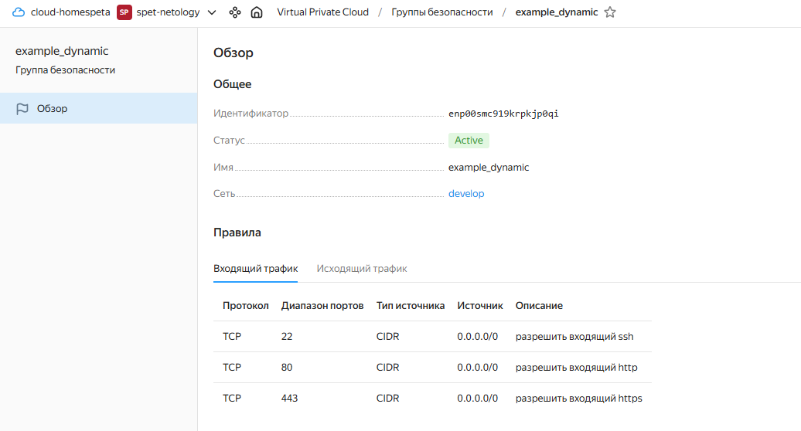
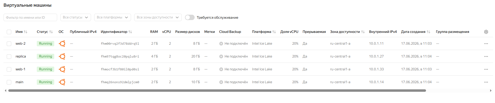
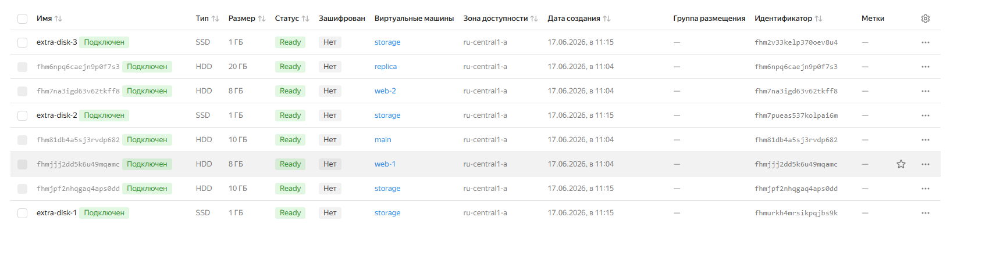
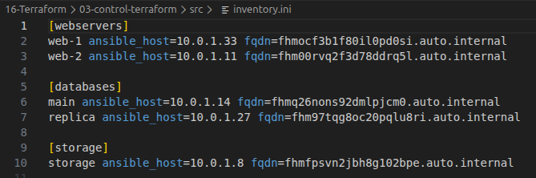

# Домашнее задание к занятию «Управляющие конструкции в коде Terraform» - Спетницкий Д.И.

## Задание 1.

### Что было сделано
1. Настроен файл переменных `personal.auto.tfvars` с учетными данными (токен сервисного аккаунта, ID облака и каталога).
2. Инициализирован проект (`terraform init`) и применена конфигурация (`terraform apply`).
3. Создана сеть `develop`, подсеть и динамическая группа безопасности `example_dynamic`.

### Результат
Группа безопасности создана успешно, правила ingress настроены согласно требованиям (SSH, HTTP, HTTPS).

---

## Задание 2.

### Что было сделано
1. **Файл `count-vm.tf`**: Созданы 2 идентичные веб-машины (`web-1`, `web-2`) с помощью `count = 2`.
2. **Файл `for_each-vm.tf`**: Созданы 2 машины для БД (`main`, `replica`) с разными характеристиками (RAM, Disk) через `for_each` и список объектов.
3. Настроена зависимость: ВМ баз данных создаются после веб-серверов (`depends_on`).
4. SSH-ключ внедрен через `metadata` с использованием функции `file()` в локальной переменной.

### Результат
Создано 4 виртуальные машины с заданными параметрами.

---

## Задание 3.

### Что было сделано
1. **Файл `disk_vm.tf`**:
   - Создан ресурс `yandex_compute_disk` с `count = 3` (диски по 1 Гб).
   - Создана одиночная ВМ `storage` (без count/for_each).
   - Использован блок `dynamic "secondary_disk"` с `for_each` по созданным дискам для их автоматического подключения к ВМ `storage`.

### Результат
ВМ `storage` успешно запущена с подключенными дополнительными дисками.

---

## Задание 4.

### Что было сделано
1. Создан шаблон `inventory.tpl` с синтаксисом HCL template.
2. В файле `ansible.tf` использована функция `templatefile` для рендеринга шаблона.
3. В шаблон переданы списки хостов (web, db, storage), полученные из атрибутов созданных ресурсов (IP, FQDN).
4. Сгенерирован файл `inventory.ini` с тремя группами хостов.

### Результат
Файл инвентаря сформирован корректно, содержит актуальные IP-адреса и полные доменные имена (FQDN) всех 5 машин.

---
