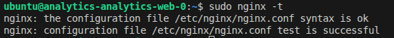
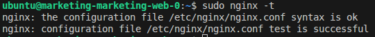
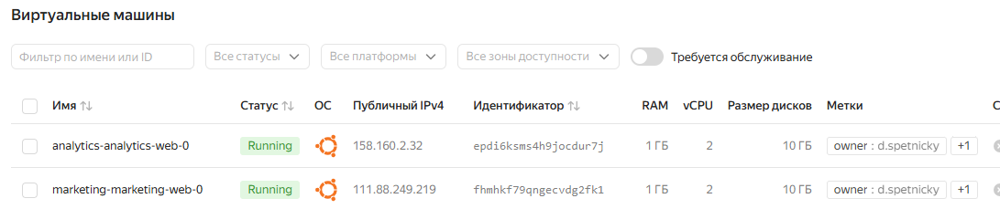
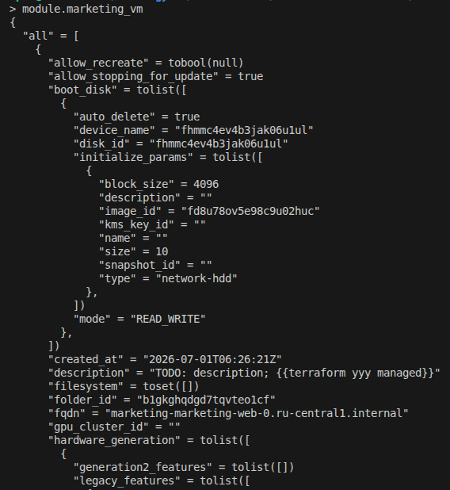
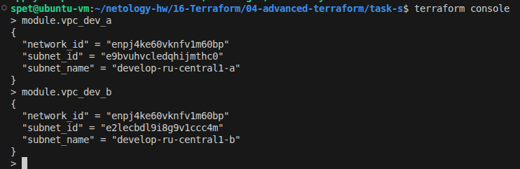
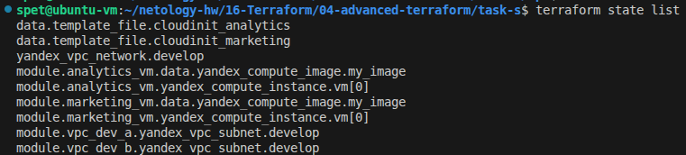
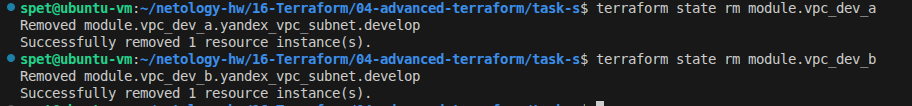
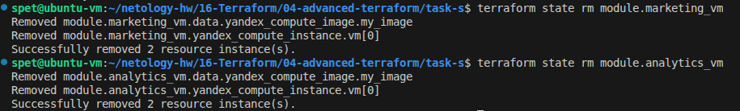
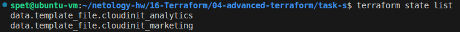

# Домашнее задание к занятию «Продвинутые методы работы с Terraform» - Спетницкий Д.И.


## Задание 1: Создание ВМ с помощью remote-модуля

### Описание
Созданы две виртуальные машины в разных проектах (marketing и analytics) с использованием remote-модуля. Настроены labels для обозначения принадлежности, установлен nginx.

### Выполненные шаги

1. **Настроена инфраструктура:**
   - Создана VPC сеть `develop`
   - Созданы две подсети в зонах `ru-central1-a` и `ru-central1-b`

2. **Развёрнуты ВМ:**
   - `marketing-marketing-web-0` (zone: ru-central1-a)
   - `analytics-analytics-web-0` (zone: ru-central1-b)

3. **Настроены параметры:**
   - SSH-ключ передан через переменную в `template_file`
   - Установлен nginx через cloud-init
   - Добавлены labels: `owner` и `project`

### Основные файлы

**cloud-init.yml:**
```yaml
#cloud-config
users:
  - name: ubuntu
    groups: sudo
    shell: /bin/bash
    sudo: ["ALL=(ALL) NOPASSWD:ALL"]
    ssh_authorized_keys:
      - ${ssh_key}

package_update: true
package_upgrade: false

packages:
  - nginx

runcmd:
  - systemctl enable nginx
  - systemctl start nginx
```

### Результаты

✅ nginx установлен на обеих ВМ
✅ Labels настроены корректно
✅ SSH-доступ работает

### Скриншоты

**Скриншот:** Проверка nginx на ВМ
> 

> 

**Скриншот:** Виртуальные машины в Yandex Cloud Console с метками
> 

**Скриншот:** Terraform console с модулями
> 

---

## Задание 2: Создание локального модуля VPC

### Описание
Создан локальный модуль VPC, который управляет сетью и подсетью. Модуль вызывается дважды для создания подсетей в разных зонах доступности.

### Структура модуля

```
vpc/
├── main.tf
├── variables.tf
├── outputs.tf
└── README.md
```


### Результаты

✅ Создан локальный модуль VPC
✅ Модуль вызван дважды для разных зон
✅ Сгенерирована документация через terraform-docs
✅ Параметры сети передаются в модули ВМ

### Скриншоты

**Скриншот:** Terraform console с module.vpc_dev_a и с module.vpc_dev_b
> 


---

## Задание 3: Работа с состоянием Terraform

### Описание
Выполнены операции по управлению состоянием Terraform: просмотр ресурсов, удаление из стейта, импорт обратно.

### Выполненные операции

#### 1. Просмотр списка ресурсов в стейте

```bash
terraform state list
```

**Результат:**
```
data.template_file.cloudinit_analytics
data.template_file.cloudinit_marketing
module.analytics_vm.data.yandex_compute_image.my_image
module.analytics_vm.yandex_compute_instance.vm[0]
module.marketing_vm.data.yandex_compute_image.my_image
module.marketing_vm.yandex_compute_instance.vm[0]
module.vpc_dev_a.yandex_vpc_subnet.develop
module.vpc_dev_b.yandex_vpc_subnet.develop
yandex_vpc_network.develop
```

#### 2. Удаление модулей из стейта

```bash
# Удаляем VPC модули
terraform state rm module.vpc_dev_a
terraform state rm module.vpc_dev_b

# Удаляем VM модули
terraform state rm module.marketing_vm
terraform state rm module.analytics_vm

# Удаляем сеть
terraform state rm yandex_vpc_network.develop
```

#### 3. Проверка пустого стейта

```bash
terraform state list
```

После удаления остались только data sources (не управляемые ресурсы).

#### 4. Импорт ресурсов обратно

```bash
# Импорт сети
terraform import yandex_vpc_network.develop enpj4ke60vknfv1m60bp

# Импорт подсетей
terraform import module.vpc_dev_a.yandex_vpc_subnet.develop e9bvuhvcledqhijmthc0
terraform import module.vpc_dev_b.yandex_vpc_subnet.develop e2lecbdl9i8g9v1ccc4m

# Импорт ВМ
terraform import module.marketing_vm.yandex_compute_instance.vm[0] fhmdgcc91gbvqbt61p6m
terraform import module.analytics_vm.yandex_compute_instance.vm[0] epd8nalrbuhfrl9g0njj
```

#### 5. Проверка terraform plan

```bash
terraform plan
```

**Результат:**
```
Plan: 0 to add, 2 to change, 0 to destroy.
```

Изменения: добавление атрибута `allow_stopping_for_update = true` для обеих ВМ.

**Вывод:** Значимых изменений нет! Все ресурсы успешно импортированы.

### Скриншоты

**Скриншот:** Начальный список ресурсов (terraform state list)
> 

**Скриншот:** Удаление модулей из стейта
> 
> 

**Скриншот:** Стейт после удаления
> 
