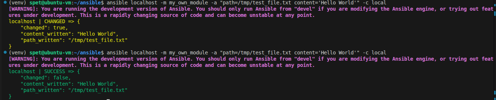
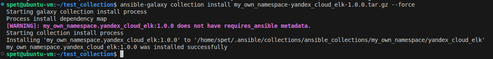
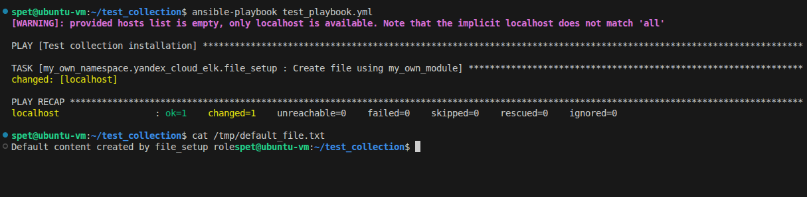

# Домашнее задание к занятию «Создание собственных модулей» - Спетницкий Д.И.

## ссылка https://github.com/songspeta/my_own_collection

## 📦 Содержание

- **Модули:**
  - `my_own_module` - создает текстовый файл с заданным содержимым на удаленном хосте с поддержкой идемпотентности

- **Роли:**
  - `file_setup` - использует `my_own_module` для создания файла с настраиваемыми параметрами

##  Требования

- Ansible 2.9+
- Python 3.8+

##  Установка

### Из локального архива:
```bash
ansible-galaxy collection install my_own_namespace_yandex_cloud_elk-1.0.0.tar.gz
```

## 📖 Использование

### Прямое использование модуля:

Создай playbook `test_module.yml`:
```yaml
---
- name: Test my own module
  hosts: localhost
  connection: local
  gather_facts: false

  tasks:
    - name: Create file with custom content
      my_own_namespace.yandex_cloud_elk.my_own_module:
        path: /tmp/my_custom_file.txt
        content: "Hello from my custom module!"
        force_change: false
```

Запуск:
```bash
ansible-playbook test_module.yml
```

### Использование роли:

Создай playbook `test_role.yml`:
```yaml
---
- name: Use file_setup role
  hosts: localhost
  connection: local
  gather_facts: false

  roles:
    - my_own_namespace.yandex_cloud_elk.file_setup
```

Запуск:
```bash
ansible-playbook test_role.yml
```

### Переопределение параметров роли:

```yaml
---
- name: Use file_setup role with custom params
  hosts: all
  become: true

  roles:
    - role: my_own_namespace.yandex_cloud_elk.file_setup
      file_setup_path: /etc/my_app/config.txt
      file_setup_content: "Custom configuration"
      file_setup_force_change: false
```

## 🔧 Параметры модуля my_own_module

| Параметр | Тип | Обязательный | Описание |
|----------|-----|--------------|----------|
| `path` | string | Да | Полный путь к файлу для создания |
| `content` | string | Да | Содержимое для записи в файл |
| `force_change` | boolean | Нет | Если `true`, всегда помечать как измененный (по умолчанию `false`) |

## 🔧 Параметры роли file_setup

| Переменная | Значение по умолчанию | Описание |
|------------|----------------------|----------|
| `file_setup_path` | `/tmp/default_file.txt` | Путь к файлу |
| `file_setup_content` | `Default content created by file_setup role` | Содержимое файла |
| `file_setup_force_change` | `false` | Принудительное изменение |

## ✨ Особенности

- **Идемпотентность**: Модуль проверяет существование файла и его содержимое перед внесением изменений
- **Check mode**: Поддерживается режим проверки (`--check`)
- **Обработка ошибок**: Корректная обработка исключений при записи файла
- **Создание директорий**: Автоматическое создание родительских директорий при необходимости

## 🧪 Тестирование

Для тестирования коллекции:

1. Установите коллекцию:
   ```bash
   ansible-galaxy collection install my_own_namespace_yandex_cloud_elk-1.0.0.tar.gz
   ```

2. Запустите тестовый playbook:
   ```bash
   ansible-playbook test_playbook.yml
   ```

3. Проверьте созданный файл:
   ```bash
   cat /tmp/default_file.txt
   ```

##  Скриншоты





