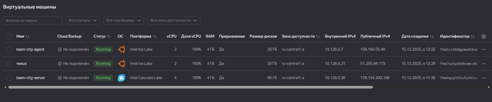
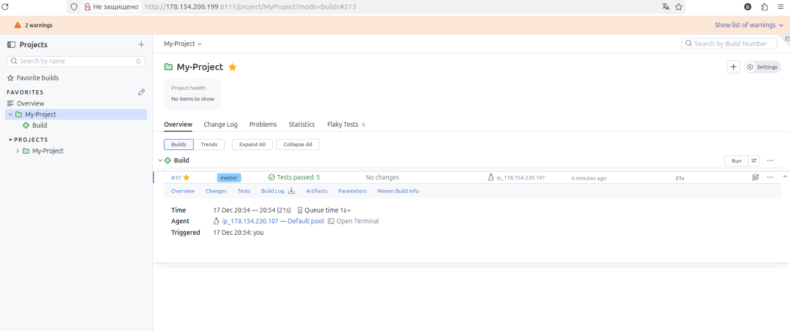
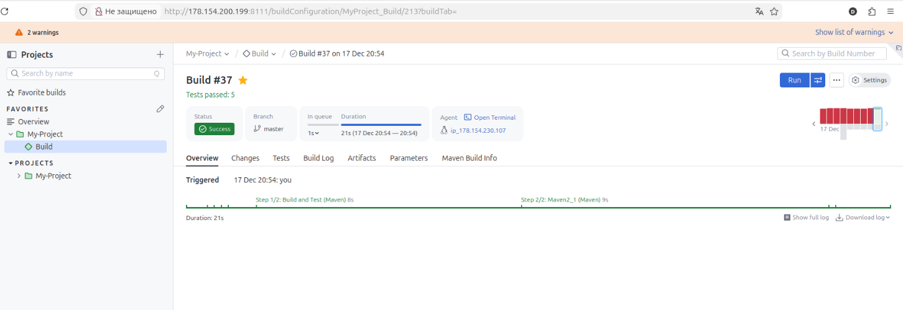
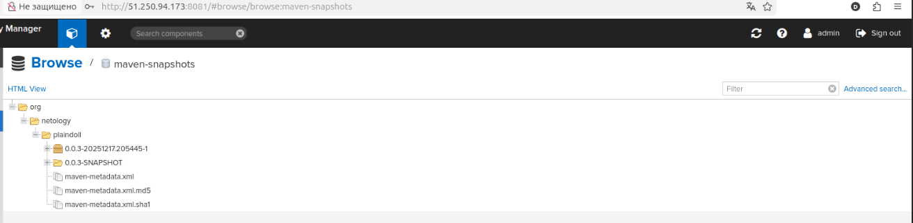
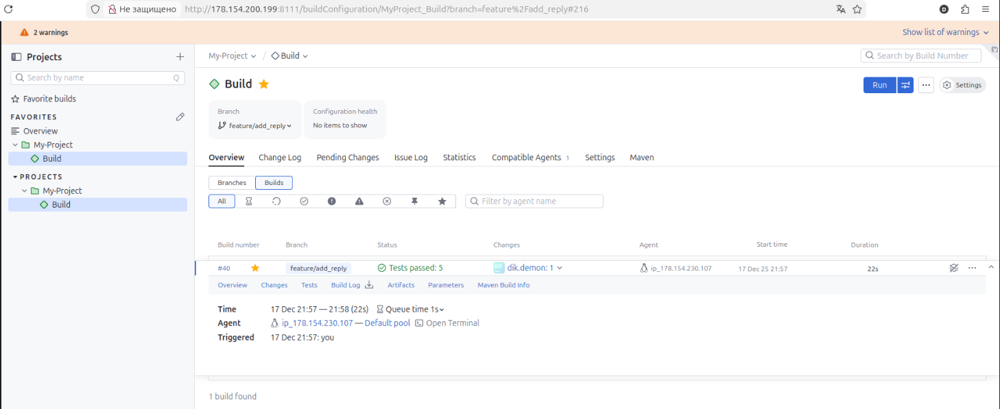
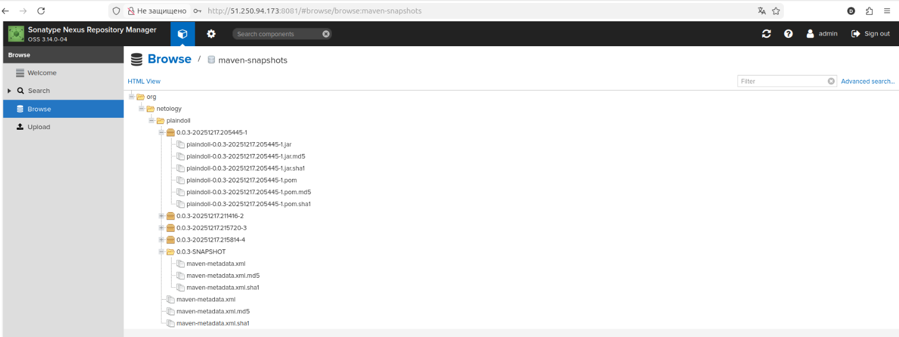
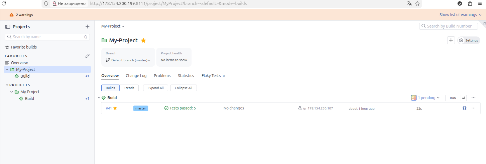
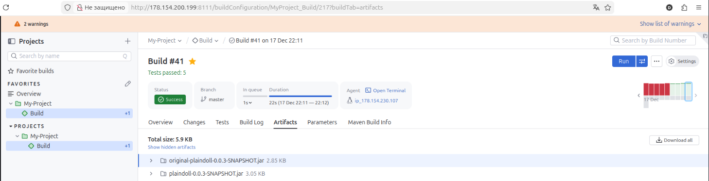

# Домашнее задание к занятию «Teamcity» - Спетницкий Д.И.


# Отчет по домашнему заданию:

## 1. Подготовка инфраструктуры

Все необходимые компоненты развернуты в Yandex Cloud:
1.  **TeamCity Server:** VM 4CPU/4RAM (образ `jetbrains/teamcity-server`).
2.  **TeamCity Agent:** VM 2CPU/4RAM (образ `jetbrains/teamcity-agent`, подключен к серверу через `SERVER_URL`).
3.  **Nexus Repository Manager:** VM 2CPU/4RAM, настроен через Ansible (версия Nexus 3.14.0-04).
4.  Сделан fork репозитория `example-teamcity` для работы.



## 2. Настройка проекта и CI-логики

### 2.1. Создание проекта и первая сборка

Проект создан в TeamCity на основе форка репозитория. Автодетектирование конфигурации позволило быстро создать первый шаг Maven.




### 2.2. Условная логика сборки

Настроены условные шаги (Build Steps) для реализации логики ветвления:
*   Ветка `master`: `mvn clean deploy` (с использованием `settings.xml`).
*   Остальные ветки: `mvn clean test`.

### 2.3. Решение проблемы аутентификации (401 Unauthorized) и Deploy

Для устранения постоянной ошибки 401, вызванной несовместимостью передачи пароля через System Parameters TeamCity, был применен метод прямого указания учетных данных.

1.  **Конфигурация pom.xml:** Изменена для деплоя SNAPSHOT-версии (`0.0.3-SNAPSHOT`) в репозиторий `maven-snapshots`.
2.  **settings.xml:** На агенте создан файл `/home/vm-2/deploy-settings.xml` с явным указанием `admin`/`Deploy123`.
3.  **TeamCity:** Все конфликтующие `system.maven.repo.*` параметры были удалены, а в Build Step Maven указан путь к `/home/vm-2/deploy-settings.xml`.

**Проверка деплоя по master:** Запущена сборка, выполнившая `mvn clean deploy` в Nexus.



**Проверка артефакта в Nexus:** Артефакт `plaindoll-0.0.3-SNAPSHOT.jar` успешно появился в репозитории `maven-snapshots`.



## 3. Ветвление, тестирование и Merge

### 3.1. Создание и тестирование новой ветки

1.  Создана ветка `feature/add_reply`.
2.  В класс `Welcomer.java` добавлен метод `getHunterReply()`, содержащий слово "hunter".
3.  В класс `WelcomerTest.java` добавлен новый модульный тест, проверяющий, что `getHunterReply()` содержит слово "hunter".
4.  Изменения запушены в `feature/add_reply`.

### `Welcomer.java`

```java
package plaindoll;

public class Welcomer{
	public String sayWelcome() {
		return "Welcome home, good hunter. What is it your desire?";
	}
	public String sayFarewell() {
		return "Farewell, good hunter. May you find your worth in waking world.";
	}
	public String sayNeedGold(){
		return "Not enough gold";
	}
	public String saySome(){
		return "something in the way";
	}
	public String getHunterReply() {
		return "Remember, every hunter has their price!";
	}
}
```

### `WelcomerTest.java`

```java

package plaindoll;

import static org.hamcrest.CoreMatchers.containsString;
import static org.junit.Assert.*;

import org.junit.Test;

public class WelcomerTest {

	private Welcomer welcomer = new Welcomer();

	@Test
	public void welcomerSaysWelcome() {
		assertThat(welcomer.sayWelcome(), containsString("Welcome"));
	}
	@Test
	public void welcomerSaysFarewell() {
		assertThat(welcomer.sayFarewell(), containsString("Farewell"));
	}

	@Test
	public void welcomerSaysNewHunterReply() {
		assertThat(welcomer.getHunterReply(), containsString("hunter"));
	}

	@Test
	public void welcomerSaysSilver(){
		assertThat(welcomer.sayNeedGold(), containsString("gold"));
	}
	@Test
	public void welcomerSaysSomething(){
		assertThat(welcomer.saySome(), containsString("something"));
	}
}
```

**Проверка в TeamCity:** Сборка `feature/add_reply` автоматически запустилась, выполнила `mvn clean test` и завершилась успешно.





### 3.2. Внесение изменений в master через Merge

Изменения из `feature/add_reply` были слиты в `master` (через Pull Request на GitHub). TeamCity автоматически запустил сборку `master`.

### 3.3. Настройка сбора артефактов

Настройка была выполнена до или во время мерджа. В Build Configuration Settings добавлено правило сбора артефактов:

### ` Artifact paths: target/*.jar `

### 3.4. Повторная сборка мастера и проверка артефактов

Проведена повторная сборка `master`. Сборка завершилась успешно.



Собранный `.jar` доступен на вкладке "Artifacts".




## 4. Миграция конфигурации в репозиторий

Процесс миграции (Versioned Settings / Configuration as Code) был активирован в настройках проекта TeamCity, что обеспечило хранение всех настроек (шаги сборки, правила артефактов, условная логика) в репозитории.

В файлах конфигурации, например, в `Build.kt` (Kotlin DSL), видно определение шагов:

```kotlin
object Build : BuildType({
    name = "Build"

    artifactRules = "target/*.jar" // Настройка сбора артефактов
    // ...
    steps {
        // Шаг clean install / test
        maven { goals = "clean install" }
        // Шаг deploy с настройкой settings.xml
        maven {
            goals = "clean deploy"
            userSettingsSelection = "userSettingsSelection:byPath"
            userSettingsPath = "/home/vm-2/deploy-settings.xml"
        }
    }
})
```
## 5. Ссылка: https://github.com/songspeta/example-teamcity/