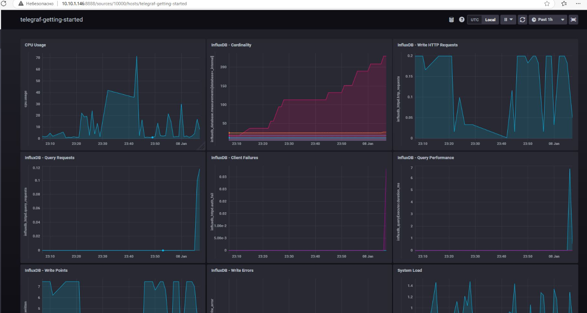
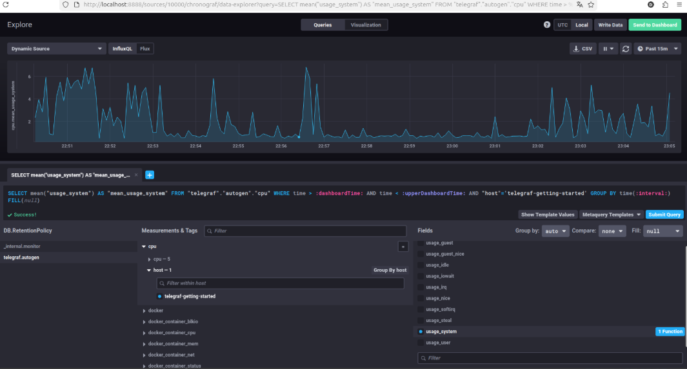
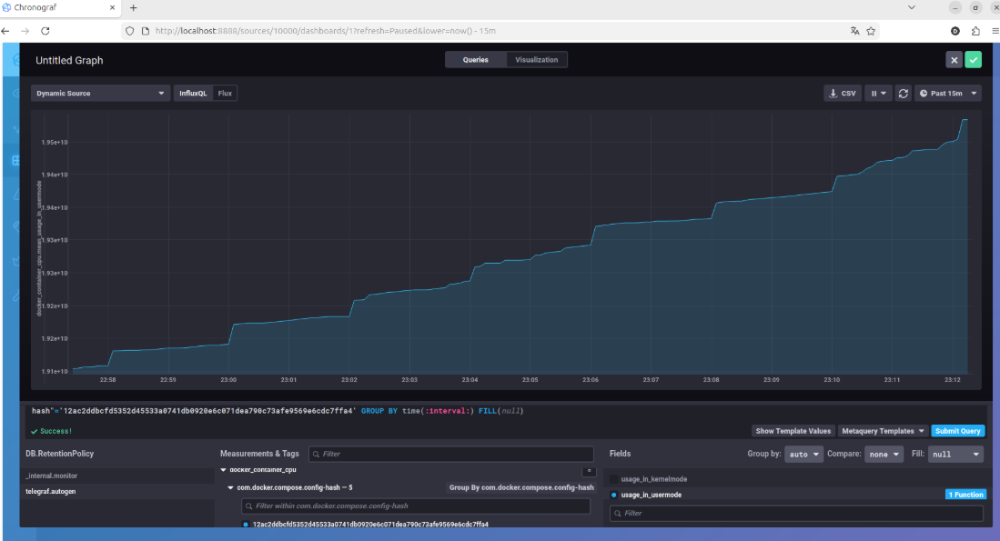
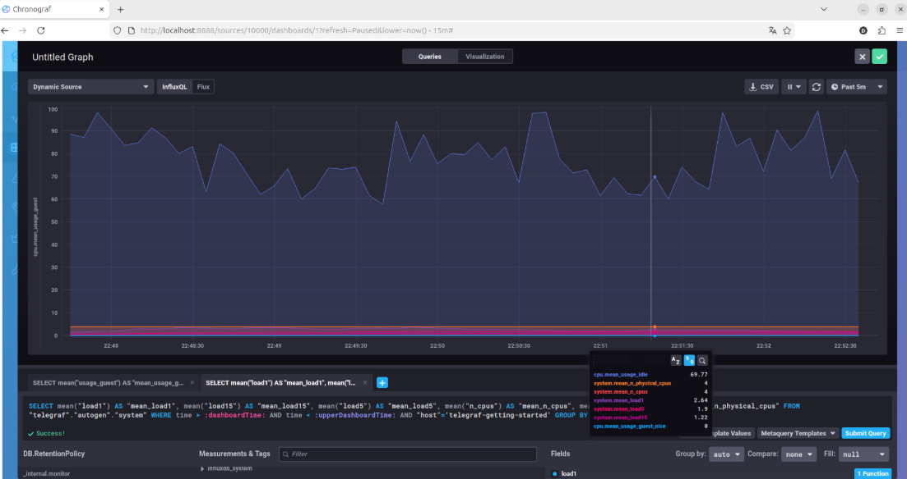

# Домашнее задание к занятию "Системы мониторинга" - Спетницкий Д.И.


## 1. Вас пригласили настроить мониторинг на проект. На онбординге вам рассказали, что проект представляет из себя платформу для       вычислений с выдачей текстовых отчетов, которые сохраняются на диск. Взаимодействие с платформой осуществляется по               протоколу     http. Также вам отметили, что вычисления загружают ЦПУ. Какой минимальный набор метрик вы выведите в               мониторинг и почему?

## Ответ:

# Минимальный набор метрик для мониторинга

## 1. CPU Usage (Использование ЦПУ)
**Причина:** "вычисления загружают ЦПУ" – это ключевая информация. Необходимо видеть, насколько сильно процессоры нагружены, чтобы выявить перегрузки или неэффективность.
*   **Что мониторить:** Процент занятости ЦПУ, средняя загрузка (Load Average).

## 2. Memory Usage (Использование ОЗУ)
**Причина:** Высокая нагрузка на ЦПУ часто сопровождается ростом потребления памяти. Избегаем замедления из-за использования свопа.
*   **Что мониторить:** Процент занятой ОЗУ, использование файла подкачки (swap).

## 3. Disk I/O (Операции ввода-вывода диска)
**Причина:** Отчеты сохраняются на диск. Нужно отслеживать скорость и задержки при записи/чтении.
*   **Что мониторить:** IOPS (операций в секунду), пропускная способность (МБ/с), задержка диска.

## 4. HTTP Request Rate (Частота HTTP-запросов)
**Причина:** Показывает, сколько работы выполняет платформа по HTTP-запросам.
*   **Что мониторить:** Количество запросов в секунду (RPS).

## 5. HTTP Error Rate (Частота ошибок HTTP)
**Причина:** Критично для оценки доступности и корректности работы сервиса.
*   **Что мониторить:** Доля ошибок 4xx и 5xx от общего числа запросов.

## 6. Computation Duration (Длительность вычислений)
**Причина:** Прямая метрика, показывающая, насколько быстро выполняются основные задачи платформы.
*   **Что мониторить:** Среднее, медианное, перцентили времени выполнения вычислений.

---
Этот набор метрик покрывает основные ресурсы (CPU, RAM, Disk), взаимодействие с сервисом (HTTP) и специфическую нагрузку (вычисления), что является достаточным минимумом для начальной настройки мониторинга.

## 2. Менеджер продукта посмотрев на ваши метрики сказал, что ему непонятно что такое RAM/inodes/CPUla. Также он сказал, что хочет понимать, насколько мы выполняем свои обязанности перед клиентами и какое качество обслуживания. Что вы можете ему предложить?

## Ответ:

# Предложение по улучшению мониторинга для Менеджера Продукта

**Цель:** Сделать мониторинг понятным и сфокусированным на бизнес-показателях.

---

## Предлагаемые метрики (бизнес-ориентированные):

1.  **"Скорость обработки"**
    *   **Что показывает:** Как быстро выполняются задачи клиентов (создание отчетов).
    *   **Связь с техникой:** Отвечает за производительность CPU, RAM, Disk. Низкая скорость = перегрузка системы.

2.  **"Доступность сервиса"**
    *   **Что показывает:** Процент времени, когда платформа работает и доступна клиентам.
    *   **Почему важно:** Обеспечивает непрерывность работы для клиентов.

3.  **"Успешность запросов"**
    *   **Что показывает:** Процент запросов клиентов, которые были успешно обработаны (вместо "Error Rate").
    *   **Почему важно:** Высокий процент ошибок напрямую указывает на плохое качество обслуживания.

## Метрики качества обслуживания:

4.  **"Время ожидания клиента"**
    *   **Что показывает:** Как долго клиент ждет готовности своего отчета.
    *   **Почему важно:** Прямое влияние на удовлетворенность пользователя.

5.  **"Выполнение обязательств" (SLA)**
    *   **Что показывает:** Насколько мы соблюдаем обещанное время выполнения задач (если есть SLA).
    *   **Почему важно:** Демонстрирует надежность и выполнение договоренностей.

---

## План действий:

*   **Создание понятного дашборда:** Разработаю дашборд с этими метриками, где будет четко видно текущее состояние и тренды.
*   **Объяснение взаимосвязи:** Объясню, как технические показатели (CPU, RAM, Disk) влияют на эти бизнес-метрики, чтобы менеджер понимал причинно-следственные связи.

---

## 3. Вашей DevOps команде в этом году не выделили финансирование на построение системы сбора логов. Разработчики в свою          очередь хотят видеть все ошибки, которые выдают их приложения. Какое решение вы можете предпринять в этой ситуации,         чтобы разработчики получали ошибки приложения?

## Ответ:

# Решения для получения ошибок приложений без бюджета на систему логов

## 1. Стандартный вывод (stdout/stderr) + Docker/Kubernetes
*   **Суть:** Приложения пишут ошибки в `stdout`/`stderr`. Kubernetes/Docker собирают их.
*   **Реализация:** Настроить приложения для вывода ошибок в `stdout`/`stderr`. Использовать `kubectl logs` / `docker logs` для доступа.
*   **Преимущества:** Использует существующую инфраструктуру.
*   **Недостатки:** Ограниченный поиск/анализ.

## 2. Email-уведомления об ошибках
*   **Суть:** Приложение отправляет email с ошибкой.
*   **Реализация:** Разработчики добавляют отправку email при ошибках.
*   **Преимущества:** Простота для отдельных приложений.
*   **Недостатки:** Неуправляемо при большом количестве ошибок, сложен поиск.

## 3. Бесплатные/условно-бесплатные сервисы мониторинга ошибок
*   **Примеры:** Sentry (free tier), Bugsnag (free tier).
*   **Реализация:** Интегрировать SDK сервиса в приложения.
*   **Преимущества:** Готовый UI, поиск, аналитика.
*   **Недостатки:** Ограничения бесплатного тарифа.

## 4. Webhooks в мессенджеры (Slack/Telegram)
*   **Суть:** Ошибки отправляются в канал мессенджера.
*   **Реализация:** Разработчики настраивают отправку ошибок через API мессенджера.
*   **Преимущества:** Мгновенное оповещение всей команды.
*   **Недостатки:** Канал может быстро засоряться, сложен поиск.

---
**Рекомендация:** Начать с **варианта 1**, если приложения в контейнерах. Если нет, рассмотреть **вариант 3** или **4** как быстрый старт. Важно договориться с разработчиками о выбранном решении.

## 4. Вы, как опытный SRE, сделали мониторинг, куда вывели отображения выполнения SLA=99% по http кодам ответов. Вычисляете       этот параметр по следующей формуле: summ_2xx_requests/summ_all_requests. Данный параметр не поднимается выше 70%, но        при этом в вашей системе нет кодов ответа 5xx и 4xx. Где у вас ошибка?

## Ответ:

## Анализ расхождения SLA: Ошибка в методологии расчета

**Проблема:** Расчет SLA по формуле `summ_2xx_requests / summ_all_requests` дает значение 70%, при отсутствии HTTP-кодов `5xx` и `4xx`. Требуемое значение SLA – 99%.

**Предполагаемая причина ошибки:**

Основная ошибка заключается в том, что **формула для расчета SLA не учитывает все возможные коды HTTP-ответов, влияющие на знаменатель (`summ_all_requests`), кроме `2xx` и явных ошибок (`4xx`/`5xx`)**.

Детали:

1.  **Неполный перечень кодов в знаменателе:** Формула предполагает, что `summ_all_requests` состоит только из `2xx`, `4xx` и `5xx`. Однако, в HTTP-протоколе существуют и другие классы кодов, например:
    *   **`3xx` (Коды перенаправления):** Клиентские ошибки, которые указывают на необходимость обратиться к другому URI. Хотя они не являются фатальными ошибками уровня `4xx` или `5xx`, они также не являются прямым успешным ответом (`2xx`) на запрос, который должен был вернуть ресурс. Если эти коды присутствуют в трафике и учитываются в `summ_all_requests`, но не исключаются из расчетов SLA, они будут снижать достигнутый процент.

2.  **Неверное определение "успешного" запроса для SLA:** Текущая формула, вероятно, определяет "успешный" запрос как любой запрос, который не является `4xx` или `5xx`. Однако, для целей SLA, перенаправления (`3xx`) могут также считаться "не полностью успешными" или требовать отдельной обработки в формуле.

**Пример:**
Предположим, за период было:
*   `100` запросов с кодом `2xx` (успешных).
*   `40` запросов с кодом `3xx` (перенаправление).
*   `0` запросов с кодами `4xx` или `5xx`.

Если `summ_all_requests` включает и `2xx`, и `3xx`, то:
`summ_all_requests` = `100` (2xx) + `40` (3xx) = `140`.
Расчет SLA: `100 / 140` ≈ `71.4%`.

**Вывод:**

Ошибка заключается в некорректном определении знаменателя (`summ_all_requests`) в формуле расчета SLA. Необходимо пересмотреть, какие HTTP-коды ответов должны включаться в знаменатель, чтобы точно отразить достижение целевого показателя SLA (99%) при отсутствии критических ошибок `4xx`/`5xx`. Вероятнее всего, требуется либо исключить `3xx` из общего числа запросов при расчете SLA, либо пересмотреть определение "успешного" запроса.

## 5. Опишите основные плюсы и минусы pull и push систем мониторинга.

## Ответ:

# Pull vs Push системы мониторинга: Краткий обзор

## Pull-системы (например, Prometheus)

**Принцип:** Сервер мониторинга сам запрашивает метрики у целевых систем.

**Плюсы:**
*   **Централизованное управление:** Конфигурация на сервере мониторинга.
*   **Простая настройка на клиенте:** Нужен эндпоинт для метрик.
*   **Service Discovery:** Легко интегрируется с Kubernetes, Consul.
*   **Стабильность:** Меньше проблем при временной недоступности клиента.

**Минусы:**
*   **Задержка метрик:** Собираются с заданным интервалом.
*   **Нагрузка на сервер мониторинга:** Активно опрашивает все системы.
*   **Сложности с доступом:** Требуется доступ к целевой системе.

## Push-системы (например, StatsD, Telegraf)

**Принцип:** Целевые системы сами отправляют метрики на сервер мониторинга.

**Плюсы:**
*   **Низкая задержка:** Метрики в реальном времени.
*   **Гибкость в сложных сетях:** Агент отправляет данные, когда есть доступ.
*   **Масштабирование:** Легко добавлять агенты.

**Минусы:**
*   **Управление агентами:** Нужно настраивать и обновлять на каждой системе.
*   **Безопасность:** Требует защиты передачи данных.
*   **Потеря метрик:** Если агент не буферизует и сеть нестабильна.

---
**Когда что использовать:**
*   **Pull:** Внутренняя сеть, централизованный контроль, допустима небольшая задержка.
*   **Push:** Распределенные/облачные системы, мониторинг в реальном времени, сложные сетевые конфигурации.

## 6. Какие из ниже перечисленных систем относятся к push модели, а какие к pull? А может есть гибридные?

   * Prometheus
   * TICK
   * Zabbix
   * VictoriaMetrics
   * Nagios

## Ответ:

# Сравнение систем мониторинга: Модель сбора метрик

| Система           | Модель сбора     | Описание                                                               |
| :---------------- | :--------------- | :----------------------------------------------------------------------- |
| **Prometheus**    | **Pull**         | Активно опрашивает HTTP-эндпоинты целевых систем.                        |
| **TICK**          | **Гибридная (Push)** | Telegraf (агент) **Push-ит** метрики на InfluxDB.                       |
| **Zabbix**        | **Гибридная**    | Может **Pull-ить** (сервер опрашивает) или **Push-ить** (агенты отправляют). |
| **VictoriaMetrics** | **Гибридная (Pull)** | Основной сбор – **Pull**, но есть поддержка **Push** (через Pushgateway). |
| **Nagios**        | **Pull**         | Опрашивает сервисы и хосты через плагины.                               |

## 7. Склонируйте себе репозиторий и запустите TICK-стэк, используя технологии docker и docker-compose.
В виде решения на это упражнение приведите скриншот веб-интерфейса ПО chronograf (http://localhost:8888).

P.S.: если при запуске некоторые контейнеры будут падать с ошибкой - проставьте им режим Z, например ./data:/var/lib:Z

## Ответ:



## 8. Перейдите в веб-интерфейс Chronograf (http://localhost:8888) и откройте вкладку Data explorer.

   * Нажмите на кнопку Add a query
   * Изучите вывод интерфейса и выберите БД telegraf.autogen
   * В measurments выберите cpu->host->telegraf-getting-started, а в fields выберите usage_system. Внизу появится график         утилизации cpu.
   * Вверху вы можете увидеть запрос, аналогичный SQL-синтаксису. Поэкспериментируйте с запросом, попробуйте изменить            группировку и интервал наблюдений.
   * Для выполнения задания приведите скриншот с отображением метрик утилизации cpu из веб-интерфейса.

## Ответ:



## 9. Изучите список telegraf inputs. Добавьте в конфигурацию telegraf следующий плагин - docker:
```yaml
[[inputs.docker]]
  endpoint = "unix:///var/run/docker.sock"
```
Дополнительно вам может потребоваться донастройка контейнера telegraf в docker-compose.yml дополнительного volume и режима privileged:
```yaml
  telegraf:
    image: telegraf:1.4.0
    privileged: true
    volumes:
      - ./etc/telegraf.conf:/etc/telegraf/telegraf.conf:Z
      - /var/run/docker.sock:/var/run/docker.sock:Z
    links:
      - influxdb
    ports:
      - "8092:8092/udp"
      - "8094:8094"
      - "8125:8125/udp"
```
После настройке перезапустите telegraf, обновите веб интерфейс и приведите скриншотом список measurments в веб-интерфейсе базы telegraf.autogen . Там должны появиться метрики, связанные с docker.

## Ответ:






