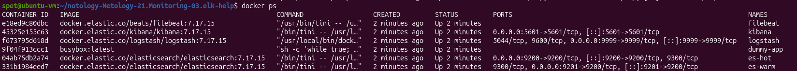
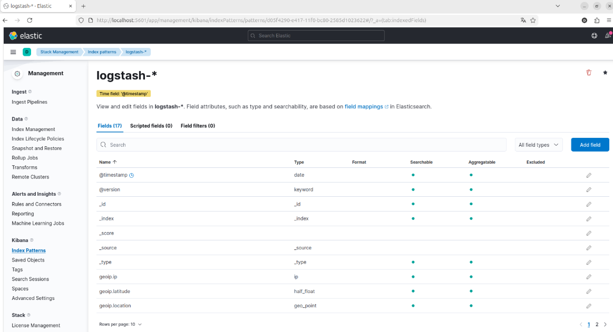
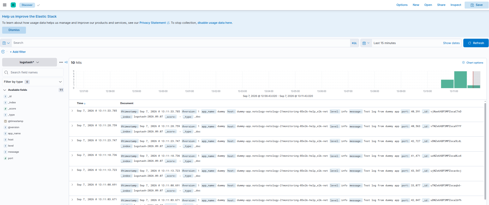

# Домашнее задание к занятию 15 «Система сбора логов Elastic Stack» - Спетницкий Д.И.


# Задание повышенной сложности

## Не используйте директорию help при выполнении домашнего задания.

## Задание 1

### Вам необходимо поднять в докере и связать между собой:

  * elasticsearch (hot и warm ноды);
  * logstash;
  * kibana;
  * filebeat.

### Logstash следует сконфигурировать для приёма по tcp json-сообщений.

### Filebeat следует сконфигурировать для отправки логов docker вашей системы в logstash.

В директории help находится манифест docker-compose и конфигурации filebeat/logstash для быстрого выполнения этого задания.

Результатом выполнения задания должны быть:

скриншот docker ps через 5 минут после старта всех контейнеров (их должно быть 5);
скриншот интерфейса kibana;
docker-compose манифест (если вы не использовали директорию help);
ваши yml-конфигурации для стека (если вы не использовали директорию help).

## Ответ:




 
##  ` docker-compose.yml `
```yml

version: '3.8'

services:
  es-hot:
    image: docker.elastic.co/elasticsearch/elasticsearch:7.17.15
    container_name: es-hot
    environment:
      - node.name=es-hot
      - cluster.name=elk-cluster
      - discovery.type=single-node
      - xpack.security.enabled=false
      - "ES_JAVA_OPTS=-Xms512m -Xmx512m"
    ulimits:
      memlock:
        soft: -1
        hard: -1
    volumes:
      - es_hot_data:/usr/share/elasticsearch/data
    ports:
      - "9200:9200"
    networks:
      - elk-net

  es-warm:
    image: docker.elastic.co/elasticsearch/elasticsearch:7.17.15
    container_name: es-warm
    environment:
      - node.name=es-warm
      - cluster.name=elk-cluster
      - discovery.type=single-node
      - xpack.security.enabled=false
      - "ES_JAVA_OPTS=-Xms512m -Xmx512m"
    volumes:
      - es_warm_data:/usr/share/elasticsearch/data
    ports:
      - "9201:9200"
    networks:
      - elk-net

  kibana:
    image: docker.elastic.co/kibana/kibana:7.17.15
    container_name: kibana
    ports:
      - "5601:5601"
    environment:
      ELASTICSEARCH_HOSTS: http://es-hot:9200
    depends_on:
      - es-hot
    networks:
      - elk-net

  logstash:
    image: docker.elastic.co/logstash/logstash:7.17.15
    container_name: logstash
    environment:
      - "LS_JAVA_OPTS=-Xms256m -Xmx256m"
      - "xpack.monitoring.enabled=false"
    volumes:
      - ./logstash/logstash.conf:/usr/share/logstash/pipeline/logstash.conf:ro
    ports:
      - "9999:9999"
    depends_on:
      - es-hot
    networks:
      - elk-net

  filebeat:
    image: docker.elastic.co/beats/filebeat:7.17.15
    container_name: filebeat
    user: root
    command: ["--strict.perms=false"]
    volumes:
      - ./filebeat/filebeat.yml:/usr/share/filebeat/filebeat.yml:ro
      - /var/run/docker.sock:/var/run/docker.sock:ro
      - /var/lib/docker/containers:/var/lib/docker/containers:ro
    depends_on:
      - logstash
    networks:
      - elk-net

  dummy-app:
    image: busybox:latest
    container_name: dummy-app
    command: >
      sh -c "while true; do 
      echo '{\"message\": \"Test log from dummy app\", \"level\": \"info\", \"app_name\": \"dummy\"}'; 
      sleep 5; 
      done"
    networks:
      - elk-net

networks:
  elk-net:
    driver: bridge

volumes:
  es_hot_data:
  es_warm_data:

```

## ` logstash.conf `

```yml

input {
  beats {
    port => 9999
  }
}

output {
  elasticsearch {
    hosts => ["http://es-hot:9200"]
    index => "logstash-%{+YYYY.MM.dd}"
  }
  stdout { codec => rubydebug }
}

```

## ` filebeat.yml `

```yml

filebeat.inputs:
- type: container
  paths:
    - '/var/lib/docker/containers/*/*.log'

processors:
  - add_docker_metadata: ~

output.logstash:
  hosts: ["logstash:9999"]

```

## Задание 2

### Перейдите в меню создания index-patterns в kibana и создайте несколько index-patterns из имеющихся.

Перейдите в меню просмотра логов в kibana (Discover) и самостоятельно изучите, как отображаются логи и как производить поиск по логам.

В манифесте директории help также приведенно dummy-приложение, которое генерирует рандомные события в stdout-контейнера. Эти логи должны порождать индекс logstash-* в elasticsearch. Если этого индекса нет — воспользуйтесь советами и источниками из раздела «Дополнительные ссылки» этого задания.

## Ответ:



